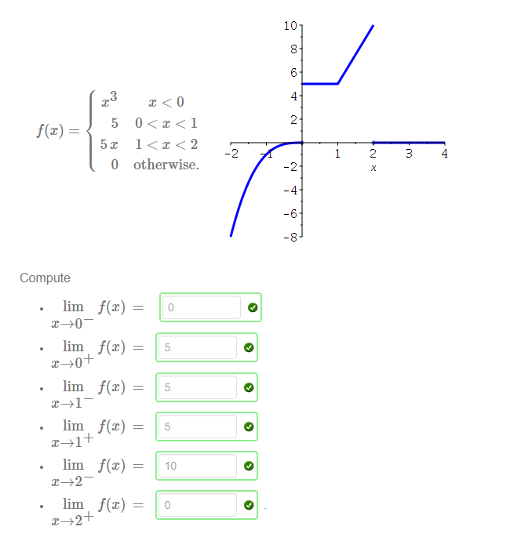
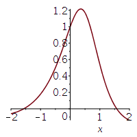
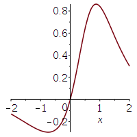
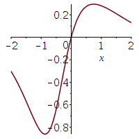

!>请以unsw学校官网为准，这里只提供参考！ 

>如信息有问题，请立即[与我联系](/help/?id=关于我)！

# Week 2

>数学一共需要做11个Week的作业，且取8个Week作为总成绩的12%（取分数最高的8个Week，这个指的是一个week中的总成绩，并不是某个week的其中一个课题(是所有课题哦！！！！)。所以我建议最好做满分吧！）

>课程：[数学课程](/DPST1013/)

## 一、题目在哪？

在这： https://unsw.mobius.cloud/class/DANUV 里选择 Week 2 ( [在mobius里找不到数学？](/DPST1013/?id=我没找到数学作业) )

## 二、如果你实在不会，可能这些能帮助到你：

### Alg1131W2T1 - Affine combinations

##### Question 1

  1. `[10]`
  2. `[0.5]`
  3. `[-1.5,7]`
  4. `[3.5,-1,6]`
  5. `[2,5]`

##### Question 2
  

?>_随机题！需要补全题目才可出答案！_ **题目：** The points $A=[x,x]$  and $B=[$ <input style="width: 30px" v-model="q1i1" v-on:input="calMonths()"> , <input style="width: 30px" v-model="q1i2" v-on:input="calMonths()"> $ ]$ have respective coordinate vectors
  
  b = <code><{{q1i1}},{{q1i2}}></code>

?>_随机题！需要补全题目才可出答案！_ **题目：** Similarly if  $A=[$ <input style="width: 30px" v-model="q2i1" v-on:input="calMonths()"> , <input style="width: 30px" v-model="q2i2" v-on:input="calMonths()"> $]$   and  $B=[$ <input style="width: 30px" v-model="q2i3" v-on:input="calMonths()"> , <input style="width: 30px" v-model="q2i4" v-on:input="calMonths()"> $]$
  
   then $\mathbf{v}=\overrightarrow{AB}=$ <code><{{q2i5}},{{q2i6}}></code>

   $\mathbf{m}=\mathbf{a}+\frac{1}{2}\mathbf{v}=\mathbf{a}+\frac{1}{2\left( \mathbf{b-a}\right)} =$ <code><{{q2i7}},{{q2i8}}></code>

##### Question 3

   $t=$ `1/3`
 - [x] $\overrightarrow{AB}=\overrightarrow{OB}-\overrightarrow{OA}$

  $\overrightarrow{OP}=$ `(1-t)` $\overrightarrow{OA}+$ `t` $\overrightarrow{OB}$

##### Question 4

   $a+b=$ `1`

 - [x] $\frac{1}{4}A+\frac{3}{4}B$
 - [x] $\frac{5}{4}A-\frac{1}{4}B$
 - [x] $\frac{2}{5}A+\frac{3}{5}B$
 - [x] $\frac{1}{k}A+\frac{k-1}{k}B$

##### Question 5

 - X=4/3 A- 1/3 B 
   

 - X=-1/3 A + 4/3B 
   

 - X=2/3 A + 1/3 B 
   

 - X=1/3 A + 2/3 B 
   

---
### Alg1131W2T2 - Lines and planes
 

##### Question 1

?>_随机题！需要补全题目才可出答案！_ **题目：** So the length of the vector  $\mathbf{u}=$ < <input style="width: 30px" v-model="q3i1" v-on:input="calMonths()">,<input style="width: 30px" v-model="q3i2" v-on:input="calMonths()"> >is  then $|u|= $ <code>sqrt({{q3i3}})</code>. And the distance between the points  $A=[$ <input style="width: 30px" v-model="q3i4" v-on:input="calMonths()">,<input style="width: 30px" v-model="q3i5" v-on:input="calMonths()"> $]$  and  $B=[$ <input style="width: 30px" v-model="q3i6" v-on:input="calMonths()">,<input style="width: 30px" v-model="q3i7" v-on:input="calMonths()"> $]$  is  $dist(A,B)=$ <code>sqrt({{q3i8}})</code> .

?>_随机题！需要补全题目才可出答案！_ **题目：** So the length of  $w=$ < <input style="width: 30px" v-model="q4i1" v-on:input="calMonths()">,<input style="width: 30px" v-model="q4i2" v-on:input="calMonths()">,<input style="width: 30px" v-model="q4i3" v-on:input="calMonths()"> > is  $|w|=$ <code>sqrt({{q4i4}})</code> and the distance between the points  $C=[$ <input style="width: 30px" v-model="q4i5" v-on:input="calMonths()">, <input style="width: 30px" v-model="q4i6" v-on:input="calMonths()">, <input style="width: 30px" v-model="q4i7" v-on:input="calMonths()"> $]$ and  $D=[$ <input style="width: 30px" v-model="q4i8" v-on:input="calMonths()">, <input style="width: 30px" v-model="q4i9" v-on:input="calMonths()">, <input style="width: 30px" v-model="q4i10" v-on:input="calMonths()"> $]$ is  <code>sqrt({{q4i11}})</code> .

 5. `15`
 6. [x] **the quadrance $Q(v)$**

##### Question 2
 
  1. 
 - [x] $\overrightarrow{OA}$
 - [x] $\overrightarrow{OD}$
 - [x] $\overrightarrow{CB}$
 - [x] $\overrightarrow{CF}$
 - [x] $\overrightarrow{DA}$
  2. 
 - [x] **$x=0$**
 - [x] **$x=1$**

##### Question 3

  i) The point  P  is `[1/2,1/2,1/2]`

  ii)
  $\overrightarrow{{PA}}=$ `<1/2,-1/2,-1/2>`,   $\overrightarrow{{PB}}=$ `<1/2,1/2,-1/2>`  and  $\overrightarrow{{PC}}=$ `<-1/2,1/2,-1/2>` .  

  iii)
  $\overrightarrow{{PA}}\cdot\overrightarrow{{PA}}=$ `0.75` ,$\overrightarrow{{PA}}\cdot\overrightarrow{{PB}}=$ `0.25`  and $\overrightarrow{{BC}}\cdot\overrightarrow{{BE}}=$ `0`
  

- [x] **$\overrightarrow{BC}\perp\overrightarrow{BE}$**

##### Question 4

  i)
  $\angle{ADC}$ is `0.5`
  
  ii)
  The triangle  $△ADC$  is `equilateral`

  iii)
  The angle  $∠BEG$  is `60`

  iv)
  The triangle  $△EBG$  is `equilateral`

  5. - [x] **congruent**
     - [x] **parallel**

##### Question 5

 1. `5`
 2. `sqrt(2)/2`
 3. `45`
 4. `sqrt(2)/2`
 5. `45`
 6. - [x] **a right triangle**
    - [x] **isosceles**

---
### Calc1131W2T3 - Left-hand and right-hand limits
 

##### Question 1

 1. `not part`
 2. `1`
 3. `1`
 4. `1`
 5. `1`
 6. `0`
 7. `is not defined`

##### Question 2

 1. `-2`
 2. `2`
 3. `no, because the left and right hand limits are not equal` 

##### Question 3  
 `可能会随机`

 -  $\lim\limits_{x\rightarrow0^{-}}\frac{4 x}{\left\vert x\right\vert } \,=\, $ `-4`

 - $ \lim\limits_{x\rightarrow0^{+}}\frac{x}{\left\vert 4 x\right\vert }\,=\, $ `1/4`

 - $ \lim\limits_{x\rightarrow- 4^{-}}\frac{x^{2}-16 }{\left\vert x+4\right\vert }\,=\, $ `8`

 - $ \lim\limits_{x\rightarrow- 4 ^{+}}\frac{x^{2}-16}{\left\vert x+4\right\vert }\,=\, $ `-8`

 - $ \lim\limits_{x\rightarrow 9^{-}}\frac{\left\vert x-9\right\vert }{x-9}\,=\, $ `-1`

##### Question 4
  `！！！这道题是随机出题,不会的话可以直接微信问我` 
  
  
##### Question 5
 
  1. `-x`
  2. `0`
  3. `x`
  4. `x`
  5. `is`
  6. `are`

---
### Calc1131W2T4 - The pinching theorem
 

##### Question 1

 1. `0`
 2. `0`
 3. `all x, except x=0`
 4. `0`

##### Question 2

?>_随机题！需要补全题目才可出答案！_ **题目：** $g(x) = x$ ^( <input style="width: 30px" v-model="q5i1" v-on:input="calMonths()"> ) $\cos(x)$

 1. `-1` $≤cos(x)≤$ `1`
 2. <code>x^{{q5i1}}</code>
 3. Let  $f(x)=$ <code>-x^{{q5i1}}</code>  and  $h(x)=$ <code>x^{{q5i1}}</code> 
 4. `0`
 5. `0`
 6. `0`

##### Question 3

?>_随机题！需要补全题目才可出答案！_

|$g(x)$|$f(x)$|$h(x)$|
|--|--|--|
|$cos(x)$/<input style="width: 30px" v-model="q6i1" v-on:input="calMonths()">$x$|<code>-1/({{q6i1}}*x)</code>|<code>abs (1/({{q6i1}}*x))</code>|
|$1+e$^( <input style="width: 30px" v-model="q6i2" v-on:input="calMonths()"> $x$)$sin(x)$|<code>1-e^({{q6i2}}x)</code>|<code>abs (1+e^({{q6i2}}x))</code>|

 - `0`
 - `1`

##### Question 4

  1. `abs (2sin(t))/2`
  2. `abs (t)`
  3. `0`

##### Question 5

 1. `(-π/2,π/2)`
 2. `0`
 3. `1`
 4. `1`

---
### Maple1131W2T5 - Introduction to Maple
 

##### Question 1
  

?>_随机题！需要补全题目才可出答案！_ **题目：** Use Maple to calculate <input style="width: 30px" v-model="q7i1" v-on:input="calMonths()"> to the power of <input style="width: 30px" v-model="q7i2" v-on:input="calMonths()"> ( ie <input style="width: 30px" v-model="q7i1" v-on:input="calMonths()">^<input style="width: 30px" v-model="q7i2" v-on:input="calMonths()"> ).

 1. <code>{{q7i3}}</code>

?>_随机题！需要补全题目才可出答案！_ **题目：** Find  cos( <input style="width: 30px" v-model="q8i1" v-on:input="calMonths()"> )  correct to <input style="width: 30px" v-model="q8i2" v-on:input="calMonths()"> significant figures. Enter the last digit in the box below. _(如果这道题的答案计算错误了，请跟我说一声！)_

 2. <code>{{q8i3}}</code>

##### Question 2

 1. $y={\frac {\cos \left( x \right) }{{x}^{2}-x+1}}$ 
  
 2. $y={\frac {\cos \left( x \right) }{{x}^{2}+x+1}}$ 
  
 3. $y={\frac {\sin \left( x \right) }{{x}^{2}-x+1}}$ 
  
 4. $y={\frac {\sin \left( x \right) }{{x}^{2}+x+1}}$ 
  

##### Question 3
  - [x] **$3*x*exp(I*Pi)$**

##### Question 4

  |||
  |--|--|
  |diff(sin(2*x),x)|Differentiate  $sin(2x)$  with respect to $x$ .|
  |simplify(sin(x)^2+cos(x)^2)|Simplify $\sin^2x+\cos^2x$|
  |f := x^2 + 3*x + 1|Assign $x^2+3x+1$ to the variable $f$.|
  |factor(x^3-7*x+6)|Factorise $x^3-7x+6$|
  |int(sin(x/2),x=0..2*Pi)|Find the definite integral of  $sin(x/2)$  with respect to  $x$  from  $0$  or  $2π$ |
  |int(sin(3x),x)|Find the indefinite integral of  $sin(3x)$  with respect to  $x$ .|

##### Question 5

  |||
  |--|--|
  |sin^2(x)|The written form  $\sin^2x$  means the square of  $\sin x$  and so this should be sin(x)^2.|
  |[2*x-1]/[x^3+1]|Square brackets are used for lists in Maple. This should be (2*x-1)/(x^3+1).|
  |pi|In Maple  $π$  is Pi not pi.|
  |i|In Maple the imaginary unit  $i=\sqrt-1$  is I (ie a capital i).|
  |e^(3*x)|In Maple, e is just a variable name.  For  $e^3x$  use exp(3*x).|
  |x-1/2*x+3|You must use brackets in Maple.  This expression should be (x-1)/(2*x+3) if it is to mean  $\fracx−12x+3$ .|
  |2*x + 3*X|Maple is case sensitive, x and X are different!  This expression does not simplify to  $5x$ .|
  |sin(3x)|Missing multiplication sign * between the 3 and the x.|

