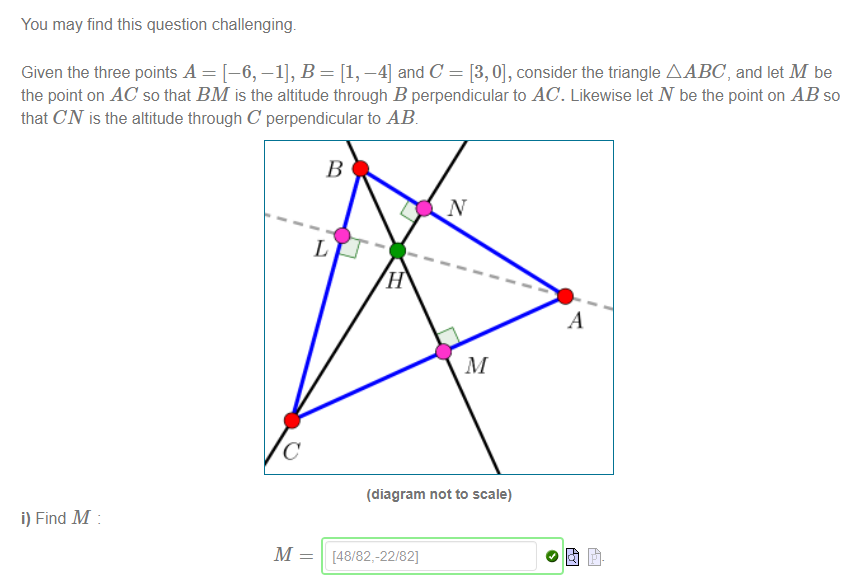
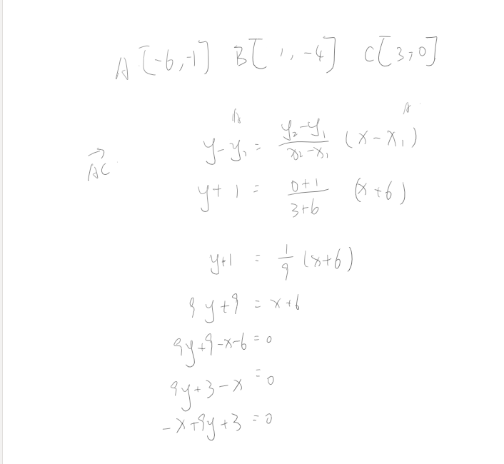
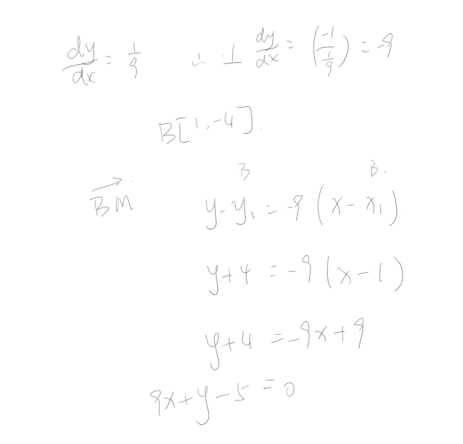
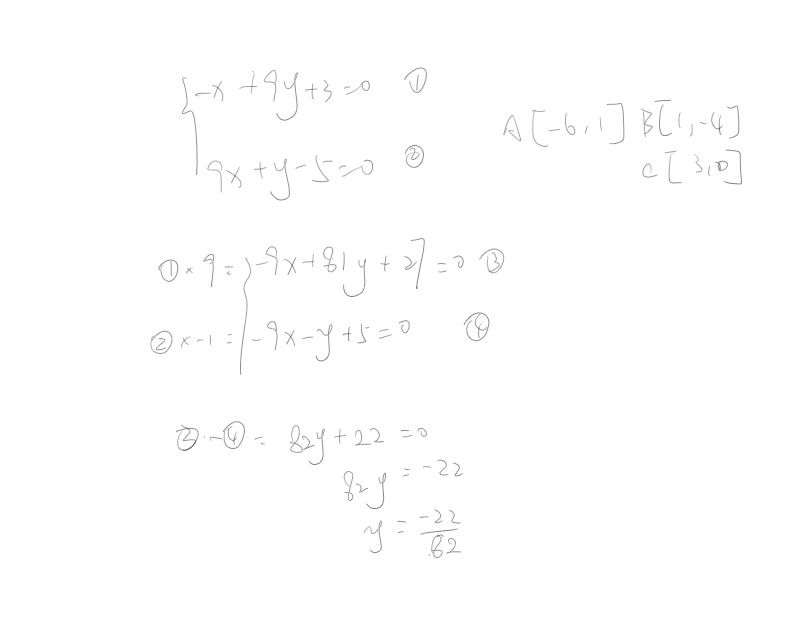
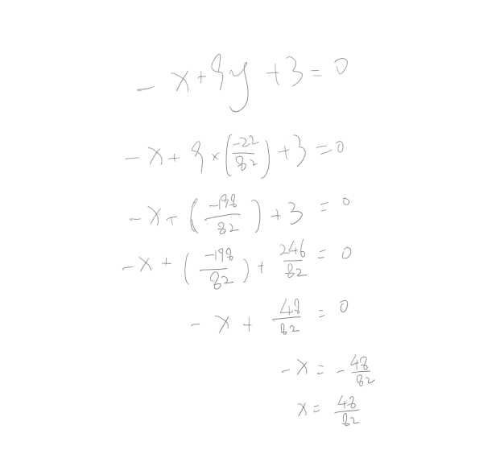

!>请以unsw学校官网为准，这里只提供参考！ 

>如信息有问题，请立即[与我联系](/help/?id=关于我)！

# Week 3 T2 Q5 Example

>下面信息更新于2022年06月03日18:00

[点我返回 week 3 页](/homework/DPST1013/work/week03/?id=question-5-1)

?>_因为我做完一遍已经交了，所以我第二遍就浅浅只做个M点吧（做这题好头疼啊），你们还是不会问我_

#### 这是我的题目

  

#### 1.第一步先算AC的解析式

  

#### 2.第二步算BM的解析式

  

#### 3.俩解析式合到一起算出M点坐标

  * 算y

  

  * 算x

  

#### 4.剩下的你们自己弄

 * N点和M点算法一样的，可以套用。
 * H点就是把BM的解析式和CN的解析式合到一起算出H点的坐标。

[点我返回 week 3 页](/homework/DPST1013/work/week03/?id=question-5-1)