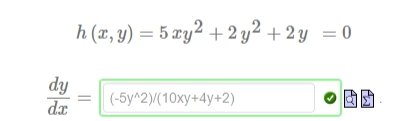
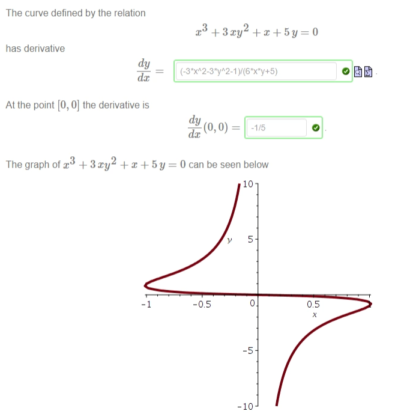
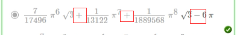

!>请以unsw学校官网为准，这里只提供参考！ 

>如信息有问题，请立即[与我联系](/help/?id=关于我)！

# Week 4

>数学一共需要做11个Week的作业，且取8个Week作为总成绩的12%（取分数最高的8个Week，这个指的是一个week中的总成绩，并不是某个week的其中一个课题(是所有课题哦！！！！)。所以我建议最好做满分吧！）

>课程：[数学课程](/DPST1013/)

## 一、题目在哪？
_(*若提示登录：需要登录后再点才能跳转)_
  
  1. [Alg1131W4T1 - Complex arithmetic](https://unsw.mobius.cloud/1179/4494/assignments/23492)
  1. [Calc1131W4T2 - Implicit differentiation](https://unsw.mobius.cloud/1179/4494/assignments/23468)
  1. [Calc1131W4T3 - Linear approximation](https://unsw.mobius.cloud/1179/4494/assignments/23444)
  1. [Calc1131W4T4 - The chain rule](https://unsw.mobius.cloud/1179/4494/assignments/23443)
  1. [Maple1131W4T5 - Maple functions](https://unsw.mobius.cloud/1179/4494/assignments/23480)

  * [在mobius里找不到数学？](/DPST1013/?id=cannotfindmathHomwork)

## 二、如果你实在不会，可能这些能帮助到你：

!>需要解题步骤、需要修正、需要帮助微信找我

!>我建议你们每次看前刷新两下，以获取最新更新过的答案。

### Alg1131W4T1 - Complex arithmetic

##### Question 1

?>_随机题！需要补全题目才可出答案！_

  * <select><option>real numbers</option></select>
  * $ i^{2}= $ `-1`

  

  &emsp;$($ <input style="width: 30px" v-model="i1" v-on:input="calsq1()"> $+$ <input style="width: 30px" v-model="i2" v-on:input="calsq1()"> $) + ($ <input style="width: 30px" v-model="i3" v-on:input="calsq1()"> $+$ <input style="width: 30px" v-model="i4" v-on:input="calsq1()"> $ i) =$&emsp;<code>{{a1}}</code>&emsp; $+$ &emsp; $i$ &emsp;<code>{{a2}}</code>&emsp;and&emsp;$($ <input style="width: 30px" v-model="i5" v-on:input="calsq2()"> $-$ <input style="width: 30px" v-model="i6" v-on:input="calsq2()"> $) - (-$ <input style="width: 30px" v-model="i7" v-on:input="calsq2()"> $+$ <input style="width: 30px" v-model="i8" v-on:input="calsq2()"> $ i) =$&emsp;<code>{{a3}}</code>&emsp; $+$ &emsp; $i$ &emsp;<code>{{a4}}</code>

  * $ i^{2}= $ `-1`

  $($ <input style="width: 30px" v-model="i9" v-on:input="calsq3()"> $+$ <input style="width: 30px" v-model="i10" v-on:input="calsq3()"> $) ($ <input style="width: 30px" v-model="i11" v-on:input="calsq3()"> $+$ <input style="width: 30px" v-model="i12" v-on:input="calsq3()"> $ i) =$&emsp;<code>{{a5}}</code>&emsp; $+$ &emsp; $i$ &emsp;<code>{{a6}}</code>

  * $ \operatorname{Re}\left( z\right) = $ `a` and $ \operatorname{Im}\left( z\right) = $ `b`
  * $ \operatorname{Re}\left(zw\right)=$ <select><option> Re(z) Re(w)-Im(z) Im(w) </option></select>
  * $ \operatorname{Im}\left(zw\right)=$ <select><option> Re(z) Im(w)+Im(z) Re(w) </option></select>

  *  $\overline{z}=$ <select><option>  a-bi </option></select>

  *  $\overline{a-bi}=$ &emsp;<code>{{a7}}+{{a8}}I</code>  【补全题目：a= <input style="width: 30px" v-model="i13" v-on:input="calsq4()"> , b= <input style="width: 30px" v-model="i14" v-on:input="calsq4()">】

  *  $\frac{c+d\,i}{a-b\,i}=$&emsp;<code>{{a9}}</code>&emsp; $+$ &emsp; $i$ &emsp;<code>{{a10}}</code>  【补全题目：c= <input style="width: 30px" v-model="i15" v-on:input="calsq5()"> , d= <input style="width: 30px" v-model="i16" v-on:input="calsq5()">】

##### Question 2

?>_随机题！需要补全题目才可出答案！_  **题目：** $z =$ <input style="width: 30px" v-model="i1" v-on:input="calsq1()"> $+$ <input style="width: 30px" v-model="i2" v-on:input="calsq1()"> $ i$ and $w =$ <input style="width: 30px" v-model="i3" v-on:input="calsq1()"> $+$ <input style="width: 30px" v-model="i4" v-on:input="calsq1()"> $ i$

  * <input style="width: 30px" v-model="i5" v-on:input="calsq1()"> $z =$ <code>({{a1}})+({{a2}})*I</code>
  * <input style="width: 30px" v-model="i10" v-on:input="calsq1()"> $w =$ <code>({{a17}})+({{a18}})*I</code>
  * $w^2 =$ <code>({{a3}})+({{a4}})*I</code>
  * $z^2 =$ <code>({{a5}})+({{a6}})*I</code>
  * $zw =$ <code>({{a7}})+({{a8}})*I</code>
  * <input style="width: 30px" v-model="i6" v-on:input="calsq1()"> $z + $ <input style="width: 30px" v-model="i7" v-on:input="calsq1()"> $w =$ <code>({{a9}})+({{a10}})*I</code>
  * $z(w +$ <input style="width: 30px" v-model="i8" v-on:input="calsq1()"> $)$ <code>({{a11}})+({{a12}})*I</code>
  * $w(z +$ <input style="width: 30px" v-model="i9" v-on:input="calsq1()"> $)$ <code>({{a13}})+({{a14}})*I</code>
  * $\frac{z}{w} =$ <code>({{a15}})+({{a16}})*I</code>

##### Question 3

  - [x] $z+w$
  - [x] $z-w$
  - [x] $-z+w$

##### Question 4

  1. `{z,v}`
  
  2. `-63/65-16/65*I`

  3. $ Q\left( y\right) = y\,\overline{y} = $ `1`

  4. <select><option>right</option></select>

  5. [x] $Q(zw)=Q(z)Q(w)$

##### Question 5
  * $z+w = $ <select><option>p</option></select>
  * $z-w = $ <select><option>u</option></select>
  * $2z - w - 3 = $ <select><option>r</option></select>
  * $zw = $ <select><option>q</option></select>
  * $\frac{z}{w} = $ <select><option>t</option></select>

### Calc1131W4T2 - Implicit differentiation

##### Question 1
 
  * $g\left(x,y\right)$ → $\frac{dy}{dx} = $ `-(3x^2)/(3y^2)`

  * $h\left( x,y\right)$ → $\frac{dy}{dx} =$ `这题随机题！可以问我`
   _(下面这是我的题,你们可以参考一下)_ 

##### Question 2

  * $\frac{dy}{dx} = $ `-x/y`

?>_随机题！需要补全题目才可出答案！_ 

$m_B = \frac{dy}{dx}($ <input style="width: 30px" v-model="i1" v-on:input="calsq1()">  $/$ <input style="width: 30px" v-model="i2" v-on:input="calsq1()"> $,$ <input style="width: 30px" v-model="i3" v-on:input="calsq1()">  $/$ <input style="width: 30px" v-model="i4" v-on:input="calsq1()"> $) = $ <code>{{a1}}</code>

  * $y =$ <code>{{a2}}</code>

##### Question 3

  * $\frac{dy}{dx} = $ `(-x^2)/(y^2)`

  * $[1,0]$ `x=1`
  
  * $[0,1]$ `y=1`

##### Question 4

  `随机题，不会的话可以问我` _(下面这是我的题,你们可以参考一下)_ 

##### Question 5

  * $\frac{dy}{dx} = $ `(-3x^2+3y)/(3y^2-3x)`

  * $m = \frac{dy}{dx}(3/2,3/2) = $ `-1`

  * $ y = $ `6/2-x`

### Calc1131W4T3 - Linear approximation

##### Question 1

?>_随机题！需要补全题目才可出答案！_  **题目：** If you zoom in on the graph of a differentiable function  $f(x)$  at the point  $[a,f(a)]$ , then eventually it looks like a straight line. For example, if you look really closely at the function $f(x) = \sqrt{x}$ near the point  $[$ <input style="width: 30px" v-model="i1" v-on:input="calsq1()"> $,$ <input style="width: 30px" v-model="i2" v-on:input="calsq1()"> $]$  then it looks like 

  * $f^\prime(${{i1}}$)$ = <code>{{a1}}</code>

  * $y = \ell(x) = $ <code>{{a2}}</code>

  * $\ell(0) = $ <code>{{a3}}</code>

  * $f(0) = $ `0`

##### Question 2

  * $\sin \left(\frac{\pi}{6}\right) = $ `0.5`

  * `sqrt(3)/2`

  * $\ell(x) =$ `(sqrt(3)/2*x)-((sqrt(3)*pi)/12)+0.5`

?>_随机题！需要补全题目才可出答案！_  **题目：** So we may approximate $\sin(\frac{\pi}{6} +$ <input style="width: 40px" v-model="i3" v-on:input="calsq1()"> $)$ by evaluating $\ell(x)$ at

  *  $x=$ <code>pi/6+{{i3}}</code>

##### Question 3

?>_随机题！需要补全题目才可出答案！_

  * $f($ <input style="width: 50px" v-model="i1" v-on:input="calsq1()"> $) \approx f($ <input style="width: 30px" v-model="i2" v-on:input="calsq1()"> $) =$ <code>{{a1}}</code>
  * $f^\prime(${{i2}}$) =$ <code>{{a2}}</code>

?>**题目：** the tangent line to  $y=f(x)$  at the point  $[$ <input style="width: 30px" v-model="i3" v-on:input="calsq2()"> $,$ <input style="width: 30px" v-model="i4" v-on:input="calsq2()"> $]$

  * $\ell(x) = $ <code>{{a3}}</code>
  
  * $\approx \ell(${{i1}}$)$ = <code>{{a4}}</code>

##### Question 4

  * $f^\prime(x) = $ `1/x`

  * $y = \ell_1(x) = $ `1/1x-1/1*1+ln(1)`

  * $y = \ell_2(x) = $ `1/2x-1/2*2+ln(2)`

  * $y = \ell_3(x) = $ `1/3x-1/3*3+ln(3)`

  * [x] $\ell_2(1.6)$

##### Question 5

  * $A=$ `3`

  * $ \frac{dy}{dx}= $ `(-4x-3y)/(6y^2+3x)`

  * At the point $[2,−1]$ , $\frac {dy}{dx}=$ `-5/12`

  * $y= \ell(x) = $ `-5/12(x-2)-1`

?>_随机题！需要补全题目才可出答案！_  **题目：**$f($ <input style="width: 50px" v-model="i5" v-on:input="calsq3()"> $) \approx \ell(${{i5}}$)=$ <code>{{a5}}</code>

### Calc1131W4T4 - The chain rule

##### Question 1

?>_随机题！需要补全题目才可出答案！_  **题目：**and that we know $\frac{dy}{dt}=$ <input style="width: 30px" v-model="i1" v-on:input="calsq1()">.

  * $\frac{dQ}{dy}=$ `6y^2+5`

  * $\frac{dQ}{dt}=$ <code>{{a1}}</code>

?>_随机题！需要补全题目才可出答案！_  **题目：**When  $y=$ <input style="width: 30px" v-model="i2" v-on:input="calsq1()"> we may compute that 

  * $\frac{dQ}{dt}=$ <code>{{a2}}</code>

##### Question 2

?>_随机题！需要补全题目才可出答案！_  **题目：**A 2m ladder leans against a wall. If the base slides out at a rate of <input style="width: 30px" v-model="i3" v-on:input="calsq1()"> m/sec

  * $ \frac{dx}{dt}= $ <code>{{i3}}</code>

  * [x] $\frac{dA}{dt}$ when $x=1$

  * $A=$ `sqrt(4-x^2)*x/2`

  * $\frac{dA}{dx}(1)= $ `1/sqrt(3)`

  * $\frac{dA}{dt}=$ <code>{{i3}}/sqrt(3)</code>

##### Question 3

?>_随机题！需要补全题目才可出答案！_  **题目：** $\frac{dm}{dt} =$ <input style="width: 30px" v-model="i4" v-on:input="calsq2()">

  * $\frac{dp}{dm} = $ `1/m`
  * $\frac{dp}{dt} = $ <code>{{i4}}/m</code>
  
?>**题目：**$\frac{dp}{dt} = 1/$ <input style="width: 30px" v-model="i5" v-on:input="calsq2()">

  * $m =$ <code>{{a3}}</code> dollars.

##### Question 4

?>_随机题！需要补全题目才可出答案！_  **题目：** $V=$ <input style="width: 30px" v-model="i6" v-on:input="calsq3()"> , $R=$ <input style="width: 30px" v-model="i7" v-on:input="calsq3()">.

  * $I=$ <code>{{i6}}/{{i7}}</code>

  * $t:R=$ <code>{{i7}}+0.01t</code>

  * when $I =$ <input style="width: 30px" v-model="i8" v-on:input="calsq3()"> / <input style="width: 30px" v-model="i9" v-on:input="calsq3()"> amps are $R = $ <code>{{a4}}</code> $t = $ <code>{{a5}}</code>

  * $\frac{dI}{dt} = $ <code>{{a6}}</code>  amps/sec.

##### Question 5

  * $r^2 =\, $ `h^2/3`
  * $V = \,$ `pi*h^3/9`

?>_随机题！需要补全题目才可出答案！_  **题目：**Suppose the height  h  increases at the constant rate of <input style="width: 30px" v-model="i10" v-on:input="calsq4()"> / <input style="width: 30px" v-model="i11" v-on:input="calsq4()"> m/s . How fast is the volume increasing when  $h=$ <input style="width: 30px" v-model="i12" v-on:input="calsq4()"> ? 

  * $\frac{dV}{dt} =\frac{dV}{dh}\frac{dh}{dt} = $ <code>{{a7}}</code>  $m^3/sec$

> _本页编写不易, 如果对你有帮助的话请我喝杯_ 🥤 _叭_ o(TヘTo) 

### Maple1131W4T5 - Maple functions

##### Question 1

?>_随机题！需要补全题目才可出答案！_  **题目：** $f(x)= Ax^B - Cx^D + E$  【补全题目：A= <input style="width: 30px" v-model="i1" v-on:input="calsq1()"> , B= <input style="width: 30px" v-model="i2" v-on:input="calsq1()"> , C= <input style="width: 30px" v-model="i3" v-on:input="calsq1()"> , D= <input style="width: 30px" v-model="i4" v-on:input="calsq1()"> , E= <input style="width: 30px" v-model="i5" v-on:input="calsq1()"> 】

  * <code>f := x -> {{i1}}*x^{{i2}} - {{i3}}*x^{{i4}} + {{i5}}</code>

##### Question 2

  * <select><option>assign the expression to a variable named f.</option></select>
  * <select><option>subs(x= ,f);</option></select>
  * <select><option>define a function named f.</option></select>
  * <select><option>f( );</option></select>

##### Question 3

?>_随机题！需要补全题目才可出答案！_  **题目：** $\cos^{-1}($ <input style="width: 30px" v-model="i6" v-on:input="calsq2()"> $)$

  * <code>{{a6}}</code>

?>_随机题！需要补全题目才可出答案！_  **1. 请输入(b)中给你的Maple代码：**  <input style="width: 80%" v-model="i7" v-on:input="calsq2()">  

  * 2. 然后将下方的文本复制到Maple即可出答案： 

  <code>{{a7}}</code>

##### Question 4

  * 选择 `A+B+C-D`

  _像这样：_ 

##### Question 5

?>_随机题！需要补全题目才可出答案！_  **1. 请输入题目中给你的第二行Maple代码：**  <input style="width: 80%" v-model="i8" v-on:input="calsq3()">  

  * where &emsp; $a =$ <code>{{a8}}</code> , $b =$ <code>{{a9}}</code>

  * <select><option>{{a10}}</option></select> $g(x)$ <select><option>{{a11}}</option></select> $h(x)$ <select><option>{{a12}}</option></select> $p(x)$

  * Enter the value of $f($ <input style="width: 30px" v-model="i9" v-on:input="calsq3()"> $)$ in the box below.  <code>{{a13}}</code>

