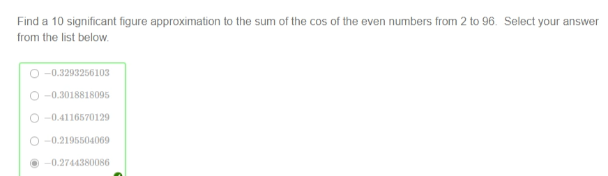
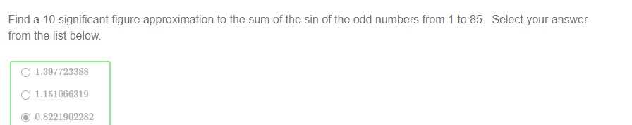

!>请以unsw学校官网为准，这里只提供参考！ 

>如信息有问题，请立即[与我联系](/help/?id=关于我)！

# Week 6

>数学一共需要做11个Week的作业，且取8个Week作为总成绩的12%（取分数最高的8个Week，这个指的是一个week中的总成绩，并不是某个week的其中一个课题(是所有课题哦！！！！)。所以我建议最好做满分吧！）

>课程：[数学课程](/DPST1013/)

## 一、题目在哪？

  1. [Calc1131W6T1 - Sketching a rational function](https://unsw.mobius.cloud/1179/4497/assignments/23441)
  1. [Calc1131W6T2 - Antiderivatives](https://unsw.mobius.cloud/1179/4497/assignments/23457)
  1. [Calc1131W6T3 - Piecewise differentiable curves](https://unsw.mobius.cloud/1179/4497/assignments/23455)
  1. [ Calc1131W6T4 - L\`Hopital\`s rule](https://unsw.mobius.cloud/1179/4497/assignments/23454)
  1. [Maple1131W6T5 - Collections of Expressions](https://unsw.mobius.cloud/1179/4497/assignments/23504)

  * [在mobius里找不到数学？](/DPST1013/?id=cannotfindmathHomwork)

## 二、如果你实在不会，可能这些能帮助到你：

### Calc1131W6T1 - Sketching a rational function

##### Question 1

 - [x] $y={\frac {x+3}{x-2}}$  
   

 - [x] $y={\frac {5\,x-3}{x+1}}$  
   

 - [x] $y=5+ \left( 3\,x-2 \right) ^{-1}$  
   

 - [x] $y=x+{\frac {x+2}{x-2}}$  
   

  **Note:** as these can all be expressed in the form $\frac {ax+b}{cx+d}$  they are examples of fractional linear transformations - with the exception of

 - [x] $y=x+{\frac {x+2}{x-2}}$  

 

##### Question 2

?>_随机题！需要补全题目才可出答案！_ **题目：** $f(x) = ($ <input style="width: 30px" v-model="i1" v-on:input="calsq1()"> $x+$ <input style="width: 30px" v-model="i2" v-on:input="calsq1()"> $) / ($ <input style="width: 30px" v-model="i3" v-on:input="calsq1()"> $x+$ <input style="width: 30px" v-model="i4" v-on:input="calsq1()"> $)$

  * $x = $ <code>{{i4*(-1) + '/' + i3}}</code>
  * $\lim\limits_{x\to\infty}f(x) = \lim\limits_{x\to-\infty}f(x) = $ <code>{{i1 + '/' + i3}}</code>
  * <select disabled><option>vertical</option></select>
  * <select disabled><option>horizontal</option></select>

##### Question 3

  * `{4,-4}`
  * <select disabled><option>vertical</option></select>
  * <select disabled><option>horizontal</option></select>
  * `0`

##### Question 4

 - [x] $y={\frac {x}{{x}^{2}-5}}$  
   

 - [x] $y={\frac {{x}^{2}}{{x}^{2}-5}}$  
   

 - [x] $y={\frac {{x}^{2}}{{x}^{2}+5}}$  
   

 - [x] $y={\frac {x}{{x}^{2}+5}}$  
   

##### Question 5

?>_随机题！需要补全题目才可出答案！_ **题目：** and $\lim\limits_{x\to\pm\infty} (h(x) - ($ <input style="width: 50px" v-model="i1" v-on:input="calsq1()"> $))$ 

  * $y = $ <code>{{i1}}</code>

  * <input style="width: 50px" v-model="i2" v-on:input="calsq1()"> $+($ <input style="width: 50px" v-model="i3" v-on:input="calsq1()"> $)^{-1}$ has equation  $y= $  <code>{{i2}}</code>
  * $($ <input style="width: 30px" v-model="i4" v-on:input="calsq1()"> $x^2 +$ <input style="width: 30px" v-model="i5" v-on:input="calsq1()"> $x +$ <input style="width: 30px" v-model="i6" v-on:input="calsq1()"> $) / ($ <input style="width: 30px" v-model="i7" v-on:input="calsq1()"> $x +$ <input style="width: 30px" v-model="i8" v-on:input="calsq1()"> $)$ has equation  $y= $  <code>{{a1}}</code>

### Calc1131W6T2 - Antiderivatives

##### Question 1

?>_随机题！需要补全题目才可出答案！_ **题目：** $\displaystyle\frac{d}{dx}($ <input style="width: 40px" v-model="i1" v-on:input="calsq1()"> $x$ <input style="width: 30px" v-model="i2" v-on:input="calsq1()"> $/$ <input style="width: 20px" v-model="i3" v-on:input="calsq1()"> $ln($ <input style="width: 20px" v-model="i4" v-on:input="calsq1()"> $x+$ <input style="width: 20px" v-model="i5" v-on:input="calsq1()"> $))= $ <code>{{i1+"x"+i2+"/("+i3+"("+i4+"x+"+i5+"))*"+i4}}</code>

  * - [x] $\frac{x^2}{2}$
    - [x] $\frac{x^{2}}{2} + 1$

?>_随机题！需要补全题目才可出答案！_ **题目：**  $F(x) = {\frac {a\,x+b}{c\,x+d}} $ and $G(x) = {\frac {e\,x+f}{c\,x+d}} $ 【补全：$a=$ <input style="width: 30px" v-model="i6" v-on:input="calsq1()"> , $b=$ <input style="width: 30px" v-model="i7" v-on:input="calsq1()"> , $c=$ <input style="width: 30px" v-model="i8" v-on:input="calsq1()"> , $d=$ <input style="width: 30px" v-model="i9" v-on:input="calsq1()"> , $e=$ <input style="width: 30px" v-model="i10" v-on:input="calsq1()"> , $f=$ <input style="width: 30px" v-model="i11" v-on:input="calsq1()"> 】

  * $h(x)=$ <code>{{(2*i5-i4)+"/"+"("+i4+"x+"+i5+")^2"}}</code>
  * $F(x) - G(x) = $ <code>{{(i7-i11)/i9}}</code>

##### Question 2

?>_随机题！需要补全题目才可出答案！_

  * **i) & ii)** If $f(x)=$ <input style="width: 30px" v-model="i1" v-on:input="calsq1()"> $x$^ <input style="width: 30px" v-model="i2" v-on:input="calsq1()"> then  $F(x)=$ <code>{{i1+"*x^"+(parseInt(i2)+1)+"/"+(parseInt(i2)+1)}}</code>
  * **iii)** If $f(x)=$ <input style="width: 30px" v-model="i3" v-on:input="calsq1()"> $x$^ <input style="width: 30px" v-model="i4" v-on:input="calsq1()"> $+$ <input style="width: 30px" v-model="i5" v-on:input="calsq1()"> $x$^ <input style="width: 30px" v-model="i6" v-on:input="calsq1()"> then  $F(x)=$ <code>{{i3+"\*x^"+(parseInt(i4)+1)+"/"+(parseInt(i4)+1)+"+"+i5+"\*x^"+(parseInt(i6)+1)+"/"+(parseInt(i6)+1)}}</code>
  * `x^(n+1)/(n+1)`
  * `ln(abs(x))`

##### Question 3

?>_随机题！需要补全题目才可出答案！_ **题目：** $v(t) =$ <input style="width: 30px" v-model="i7" v-on:input="calsq1()"> $t^2 +$ <input style="width: 30px" v-model="i8" v-on:input="calsq1()">

  * $y(t) =$  <code>{{i7+"t^3/3+"+i8+"t"}}</code>
  * when  $t=$ <code>{{Math.sqrt(i8)}}</code>
  * <code>{{i7\*Math.pow(Math.sqrt(i8),3)+"/3+"+i8\*Math.sqrt(i8)}}</code>
  * <code>{{"2("+i7\*Math.pow(Math.sqrt(i8),3)+"/3+"+i8\*Math.sqrt(i8)+")"}}</code>

##### Question 4

?>_随机题！需要补全题目才可出答案！_ **题目：** $\frac{dy}{dx}= $ <input style="width: 30px" v-model="i9" v-on:input="calsq1()"> $x$ ^ <input style="width: 30px" v-model="i10" v-on:input="calsq1()">

  * $y(x) = $ <code>{{i9+"x^"+(parseInt(i10)+1)+"/"+(parseInt(i10)+1)}}</code>  $ +\, C$
  * $y\left(0\right)=$ <input style="width: 30px" v-model="i11" v-on:input="calsq1()"> , $C=$ <code>{{i11}}</code>
  * $y\left( 1\right) =$ <input style="width: 30px" v-model="i12" v-on:input="calsq1()"> , $C=$ <code>{{i12 +"-("+i9+"*1^"+(parseInt(i10)+1)+"/"+(parseInt(i10)+1)+")"}}</code>

##### Question 5

?>_随机题！需要补全题目才可出答案！_ **题目：** A car is travelling along a straight road with velocity  <input style="width: 30px" v-model="i13" v-on:input="calsq1()">  metres per second at time  $t=0$   and with a constant acceleration of  $a=$  <input style="width: 30px" v-model="i14" v-on:input="calsq1()">   metres per second per second.

  * <select disabled><option>antiderivatice</option></select>
  * $v(t) = $ <code>{{i14+"t+"+i13}}</code>

?>_随机题！需要补全题目才可出答案！_ **题目：**Now suppose in addition we know that the displacement  $s(t)$   of the car at time  $t=0$  is  $s(0)=$ <input style="width: 30px" v-model="i15" v-on:input="calsq1()"> .

  * <select disabled><option>derivative</option></select>
  * $ s(t)= $ <code>{{i14+"/2t^2+"+i13+"t+"+i15}}</code>

### Calc1131W6T3 - Piecewise differentiable curves

##### Question 1

 * $\lim\limits_{x\rightarrow2^{-}}f\left( x\right) =$ `1`
 * $\lim\limits_{x\rightarrow2^{+}}f\left( x\right) =$ `1`
 * $f(2) = $ `1`
 * So the function  $f$ <select disabled><option>is</option></select> continuous at  $x=2$.
 * $\lim\limits_{h\rightarrow0^{-}}\frac{f(2+h) - f(2)}{h} = g^\prime(2) = $ `1`
 * $\lim\limits_{h\rightarrow0^{+}} \frac{f(2+h) - f(2)}{h}=h^{\prime}\left(2\right) =$ `-1`
 * The limit $\lim\limits_{h\to 0}\frac{f(2+h)-f(2)}{h} $ <select disabled><option>does not</option></select> exist.

##### Question 2

  * $f(1) = $ `1`
  * $f(4) = $ `0`
  * $f^\prime(1) = $ `1/2`
  * $a = $ `-5/18`
  * $b = $ `19/18`
  * $c = $ `4/18`

##### Question 3

  * [x] $f$ and $l$
  * [x] $h$ and $k$

##### Question 4

?>_随机题！需要补全题目才可出答案！_ **题目：** $D=[$ <input style="width: 30px" v-model="i1" v-on:input="calsq1()"> $,$ <input style="width: 30px" v-model="i2" v-on:input="calsq1()"> $]$
  
  * $g(x) = $ `-4x^2+12x-5`
  * $h(x) = $ <code>{{a1}}</code>

##### Question 5

  * $p^\prime(1) = q^\prime(1) = $ `1`
  * $p^{\prime\prime}(1) =q^{\prime\prime}(1) = $ `-4`
  * $r(x) = $ `7x^3-44x^2+89x-56`

### Calc1131W6T4 - L\`Hopital\`s rule

##### Question 1

  * $\lim\limits_{x\rightarrow 1}f\left(x\right)  =\lim\limits_{x\rightarrow 1}g\left(x\right)  =$ `0`
  * $ \lim\limits_{x\to 1} \frac{f^\prime(x)}{g^\prime(x)} = $ `-2`
  * $\lim\limits_{x\rightarrow1}\frac{{x}^{-1}-1}{\sqrt {x}-1}=$ `-2`

  * $\lim\limits_{x\to\infty} \frac{f^\prime(x)}{g^\prime(x)} = $ `0`
  * $\lim\limits_{x \to \infty}\frac{x}{e^x} = $ `0`

##### Question 2

?>_随机题！需要补全题目才可出答案！_

  * i) `这题不会的话题目发给我`
  * ii) $\lim\limits_{x\rightarrow0} {\frac { \left( 1-x \right) ^{A}-1}{x}} =$  <code>{{-i3}}</code> 【补全：A= <input style="width: 30px" v-model="i3" v-on:input="calsq1()"> 】

##### Question 3

  _. $$ \lim\limits_{x\rightarrow1}\frac{ \left( 1+x \right) ^{-1}+x/4-3/4}{ \left( x-1 \right) ^{2}}\tag{1}. $$ ._

 _Let $f(x) =  \left( 1+x \right) ^{-1}+x/4-3/4$ and $g(x) =  \left( x-1 \right) ^{2}$ . Then_

 * $\lim\limits_{x\to 1} f(x) = \lim\limits_{x\to 1} g(x) =$ `0`
 * $\frac{f^\prime(x)}{g^\prime(x)} = $ `(-(1+x)^-2+1/4)/(2x-2)`

 * $\lim\limits_{x\to 1} f^\prime(x) = \lim\limits_{x\to 1} g^\prime(x) = $ `0`
 * $\frac{f^{\prime\prime}(x)}{g^{\prime\prime}(x)} = $ `(2/(1+x)^3)/2`
 * $L = \lim\limits_{x\to 1} \frac{f^{\prime\prime}(x)}{g^{\prime\prime}(x)} = $ `1/8`

##### Question 4

?>_随机题！需要补全题目才可出答案！_ **题目：** $\lim\limits_{x\to \infty} \frac{\sin \left( x \right) +A\,x}{x} = L_1$ 【补全：A= <input style="width: 30px" v-model="i4" v-on:input="calsq1()"> 】

 * $\lim\limits_{x\rightarrow \infty}f\left(x\right)  =\lim\limits_{x\rightarrow \infty}g\left(x\right)  =$ <select disabled><option> ∞ </option></select>
 * But  $\frac{f^\prime(x)}{g^\prime(x)} = $ <code>{{"cos(x)+"+i4}}</code>
 * $L_1 = $ <code>{{i4}}</code>

 * $\lim\limits_{x \to \pi} \frac{f^\prime(x)}{g^\prime(x)} = $ <code>{{i4-1}}</code>
 * $L_2 = $ <code>{{i4}}</code>

##### Question 5

 * $\lim\limits_{x\to \infty} \frac{x+2}{x-3} = $ `1`
 * [x] L'Hopital's rule

### Maple1131W6T5 - Collections of Expressions

##### Question 1

|||
|--|--|
|A set|{a,b,c}|
|A list|[a,b,c]|
|A sequence|a,b,c|

##### Question 2

 - [x] S3=S4
 - [x] S2=S3
 - [x] S1=S2
 - [x] S5=S6

##### Question 3

?>_随机题！需要补全题目才可出答案！_

  * (a) Enter the sum of the first <input style="width: 30px" v-model="i1" v-on:input="calsq1()"> prime numbers in the box below.  <code>{{a1}}</code>

  * (b) Enter the sum of squares of the prime numbers from the <input style="width: 30px" v-model="i2" v-on:input="calsq2()"> th prime to the <input style="width: 30px" v-model="i3" v-on:input="calsq2()"> th prime inclusive in the box below <code>{{a2}}</code>

  * (c) Enter the product  the prime numbers from the <input style="width: 30px" v-model="i4" v-on:input="calsq3()"> th prime to the <input style="width: 30px" v-model="i5" v-on:input="calsq3()"> th prime inclusive in the box below. <code>{{a3}}</code>

##### Question 4

  
  

##### Question 5

  
  

