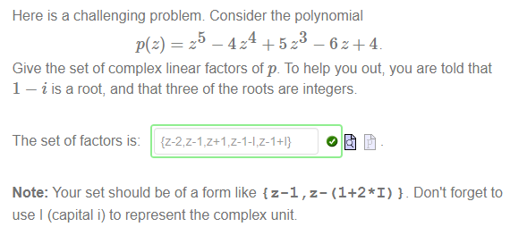

!>请以unsw学校官网为准，这里只提供参考！ 

>如信息有问题，请立即[与我联系](/help/?id=关于我)！

# Week 8

>数学一共需要做11个Week的作业，且取8个Week作为总成绩的12%（取分数最高的8个Week，这个指的是一个week中的总成绩，并不是某个week的其中一个课题(是所有课题哦！！！！)。所以我建议最好做满分吧！）

>课程：[数学课程](/DPST1013/) &nbsp; [数学作业](/homework/DPST1013/)

## 一、题目在哪？

  * [mobius - Week 8 ](https://unsw.mobius.cloud/1179?gid=4498)

  * [在mobius里找不到数学？](/DPST1013/?id=cannotfindmathHomwork)

## 二、如果你实在不会，可能这些能帮助到你：

### Alg1131W8T1 - Multiple angle formulas

##### Question 1

<!--div>
_4 points_

#### **原题**

De Moivre's theorem gives that

$$\Big[r(\cos t + i\sin t)\Big]^n= r^n \left(\cos nt + i\sin nt\right)$$

The meaning of this is that the modulus of  $z^n$   is the  nth  power of the modulus of  $z$  , and that the argument of  $z^n$   is  $n$   times the argument of  $z$ .

In the following diagram you can manipulate a complex number  z , and see what happens to its powers  $z^2$ ,  $z^3$ ,  $z^4$ ,  $z^5$  and  $z^6$ . You can zoom and pan the diagram for a closer look.

<iframe scrolling="no" src="https://www.geogebra.org/material/iframe/id/jZczpzAn/width/600/height/600/border/888888/rc/false/ai/false/sdz/true/smb/false/stb/false/stbh/true/ld/false/sri/false/at/auto" style="border:0px;" height="600px" width="600px"></iframe>

Answer the following by using the worksheet:

 * If $z=\frac{2}{3}+\frac{4}{5}i=$ ,then $z^6$  is approximately <select><option></option><option>\(6.6+1.1i\)</option><option>\(6.6-1.1i\)</option><option>\(1.1+6.6i\)</option><option>\(0.66+1.1i\)</option><option>\(0.66-1.1i\)</option></select>
 * If $z=\frac{1}{3}-\frac{1}{2}i=$ ,then $z^6$  is approximately <select><option></option><option>\(0.4+0.2i\)</option><option>\(0.04-0.02i\)</option><option>\(0.04+0.2i\)</option><option>\(0.4-0.2i\)</option><option>\(0.04+0.02i\)</option></select>
 * If $z=\frac{-5}{13}+\frac{12}{13}i=$ ,then $z^6$  is approximately <select><option></option><option>\(-0.25-0.97i\)</option><option>\(-0.72+0.70i\)</option><option>\(0.25+0.97i\)</option><option>\(-0.96-0.27i\)</option><option>\(0.72-0.70i\)</option><option>\(0.96+0.27i\)</option></select>

 <b>Note:</b> When zooming in on the diagram the upper the coordinates of the upper lefthand corner and lower righthand corner are shown when the coordinate axes cannot be seen.

#### **解析**

<div-->

 * If $z=\frac{2}{3}+\frac{4}{5}i=$ ,then $z^6$  is approximately <select disabled><option><option selected>\(0.66-1.1i\)</option></select>
 * If $z=\frac{1}{3}-\frac{1}{2}i=$ ,then $z^6$  is approximately <select disabled><option><option selected>\(0.04+0.02i\)</option></select>
 * If $z=\frac{-5}{13}+\frac{12}{13}i=$ ,then $z^6$  is approximately  <select disabled><option><option selected>\(0.72-0.70i\)</option></select>

##### Question 2

  * $ \operatorname{Re}\left(\left( \cos t+i\sin t\right) ^{2}\right)=$ <select disabled><option><option selected>cos(t)^2-sin(t)^2</option></select>
  * $\operatorname{Im}\left(\left( \cos t+i\sin t\right) ^{2}\right)= $ <select disabled><option><option selected>2\*cos(t)\*sin(t)</option></select>
  * [x] $ \cos2t= \cos^{2}t-\sin^{2}t $
  * [x] $ \sin2t= 2\cos{t}\sin{t} $
  * $a =$ `2` and $b=$ `-1`

##### Question 3

_$ \sin3t= a\cos^{2}t\sin t+b\sin^{3}t. $_

  * where $a =$ `3` and $b =$ `-1`

_$ \sin3t=c \sin t+d\sin^{3}t $_

  * where $c =$ `3` and $d =$ `-4`

##### Question 4

  * <select disabled><option><option selected>cubic</option></select>

?>_随机题！需要补全题目才可出答案！_

  * $ T_{3}($  <input style="width: 30px" v-model="i1" v-on:input="calsq1()"> $) =$ <code>{{a1}}</code>

##### Question 5

  * where $a =$ `1` , $b =$ `-6` and $c =$ `1` 
  * where $d =$ `8` , $e =$ `-8` and $f =$ `1` 
  * $ T_{4}\left( x\right) = $ `8 x^(4)-8 x^(2)+1`

?>_随机题！需要补全题目才可出答案！_**题目：** Use the plot to determine   $\cos 4t$   if   $\cos t=$ <input style="width: 30px" v-model="i2" v-on:input="calsq2()"> , to two decimal places. 
  * The answer is  $\cos 4t =$  <code>{{a2}}</code>

### Alg1131W8T2 - Powers of sine and cosine

##### Question 1

 * where $a =$ `1` and $b =$ `-I`
 * $ \sin t=$ `(e^(It)-e^(-It))/(2I)`

##### Question 2

 * where $a =$ `1/16` , $b =$ `5/16` , $c =$ `5/8` 

##### Question 3

 * where $a =$ `1/8` , $b =$ `-1/2` , $c =$ `3/8`

##### Question 4

 * My best values were $a =$ `0.63` , $b =$ `0.31` , $c =$ `0.06`

##### Question 5

 * My best values were $a =$ `0.39` , $b =$ `-0.51` , $c =$ `0.13`

### Alg1131W8T3 - Graphing regions in the complex plane

##### Question 1

 * i) $ \left\{ z\in\mathbb{C}:\left\vert z-3\right\vert <2\right\} $ is the region <select disabled><option><option selected>D</option></select>
 * ii) $ \left\{ z\in\mathbb{C}:\operatorname{Im}z\geq4\right\} $ is the region <select disabled><option><option selected>A</option></select>
 * iii) $ \left\{ z\in\mathbb{C}:\left\vert z-i\right\vert =\left\vert z-2i\right\vert \right\} $ is the region <select disabled><option><option selected>B</option></select>
 * iv) $\left\{ z\in\mathbb{C}:0< \mathrm{arg}\left( z-2-i\right)\leq \frac {\pi}{4}\right\}$ is the region <select disabled><option><option selected>C</option></select>

##### Question 2

 * [x] $0\leq\arg(z-1-i)<\frac{\pi}{4}$

 * [x] $\operatorname{Im}(z)+\operatorname{Re}(z)< 0$

 * [x] $|z+1-i|\leq1$

##### Question 3

<table>
<tr>
<td> 
<input type="checkbox" checked disabled> $1.5 \lt \mathrm{Re}(z) \leq 2$ 
</td>
<td><select disabled><option><option selected>and</option></select></td>
<td>
<input type="checkbox" checked disabled> $|\mathrm{Im}(z)| \leq 1$
</td>
</tr>
</table>

<table>
<tr>
<td> 
<input type="checkbox" checked disabled> $|z+1|=|z-2i|$
</td>
<td><select disabled><option><option selected>and</option></select></td>
<td><input type="checkbox" checked disabled> $0 \leq \mathrm{arg}(z) \leq \frac{3\pi}{4}$
</td>
</tr>
</table>

##### Question 4

 * i) `140`
 * ii) `134`
 * iii) <select disabled><option><option selected>yes.</option></select>
 * iv) <select disabled><option><option selected>no.</option></select>

##### Question 5

 * $||z-i|-|z+i||=1$  is hyperbola <select disabled><option><option selected>A</option></select>
 * $||z-2|-|z-i||=2$  is hyperbola <select disabled><option><option selected>B</option></select>
 * $||z+2i|-|z+i||=\frac{1}{2}$   is hyperbola <select disabled><option><option selected>C</option></select>

### Alg1131W8T4 - Roots of unity

##### Question 1
 
 * i) If $p(z)={z}^{2}-2\,z+1$ then $p(1)=$ `0` , which shows that <select disabled><option><option selected>(z-1)</option></select> is <select disabled><option><option selected>a factor of </option></select> $p(z)$.
 * ii) If $p(z)=z^2-(1+i) z + i $ then $p(i)=$ `0` , which shows that <select disabled><option><option selected>(z-i)</option></select> is <select disabled><option><option selected>a factor of </option></select> $p(z)$.
 * iii) If $p(z)=z^2-2 z + 1 $ then $p(-2)=$ `9` , which shows that <select disabled><option><option selected>(z+2)</option></select> is <select disabled><option><option selected>not a factor of </option></select> $p(z)$.

?>_随机题！需要补全题目才可出答案！_**题目：iv) v) vi)** If we divide  $p(z)={z}^{2}+$ <input style="width: 30px" v-model="i3" v-on:input="calsq3()"> $z+$ <input style="width: 30px" v-model="i4" v-on:input="calsq3()"> by $z+$ <input style="width: 30px" v-model="i5" v-on:input="calsq3()"> , we get a remainder of <code>{{a3}}</code>

##### Question 2

 * $z^5=$ `-1`
 * `-1`
 * <select disabled><option><option selected>differ by an integer multiple of 2π</option></select>
 * <select disabled><option><option selected>an integer</option></select>
 * `{1,3,5,7,9}`

##### Question 3

 * $w^3 =$ `I`
 * $w^4 =$ `(-1+sqrt(3)I)/2`
 * $w^5 =$ `(I-sqrt(3))/2`
 * $w^6 =$ `-1`
 * $w^7 =$ `(-I-sqrt(3))/2`
 * $w^8 =$ `(-1-sqrt(3)I)/2`
 * $w^9 =$ `-I`
 * $w^{10} =$ `(1-sqrt(3)I)/2`
 * $w^{11} =$ `(-I+sqrt(3))/2`
 * $w^{12} =$ `1`

##### Question 4

|the solutions to  $z^6=-1$ are:|the solutions to  $z^3=i$ are:|the solutions to  $z^4=\frac{-1+i\sqrt{3}}{2}$ are:|the solutions to  $z^4=\frac{-1-i\sqrt{3}}{2}$ are:|
|:--|:--|:--|:--|
|<input type="checkbox" checked disabled>$w$ <input type="checkbox" checked disabled>$w^3$ <input type="checkbox" checked disabled>$w^5$ <input type="checkbox" checked disabled>$w^7$ <input type="checkbox" checked disabled>$w^9$ <input type="checkbox" checked disabled>$w^{11}$|<input type="checkbox" checked disabled>$w$ <input type="checkbox" checked disabled>$w^5$ <input type="checkbox" checked disabled>$w^9$|<input type="checkbox" checked disabled>$w$ <input type="checkbox" checked disabled>$w^4$ <input type="checkbox" checked disabled>$w^7$ <input type="checkbox" checked disabled>$w^{10}$|<input type="checkbox" checked disabled>$w$ <input type="checkbox" checked disabled>$w^2$ <input type="checkbox" checked disabled>$w^5$ <input type="checkbox" checked disabled>$w^8$ <input type="checkbox" checked disabled>$w^{11}$|

##### Question 5

 

