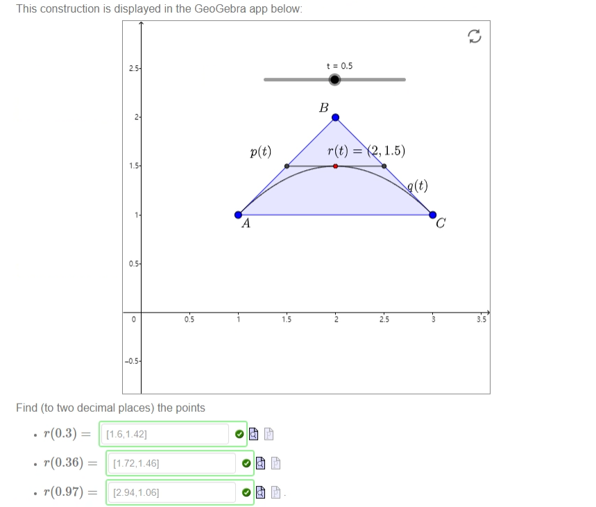
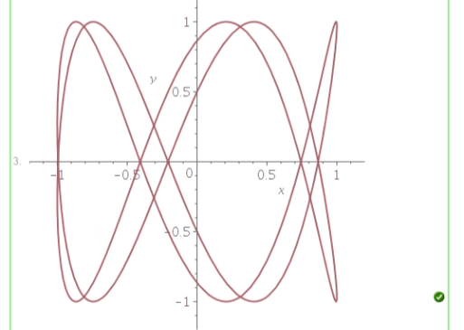
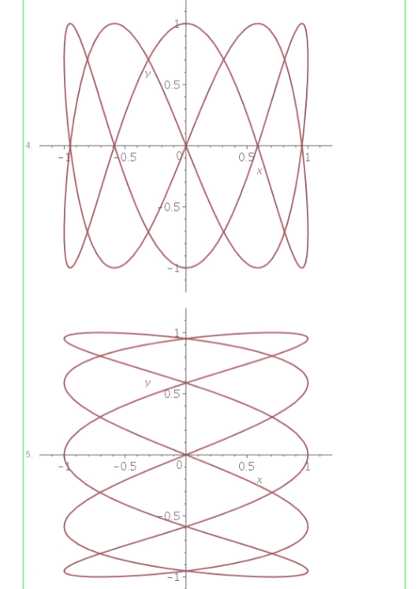
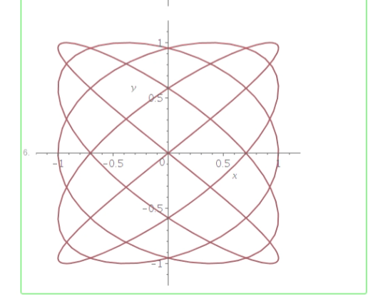
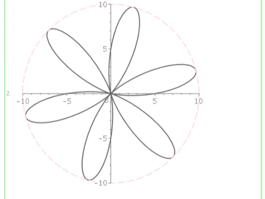
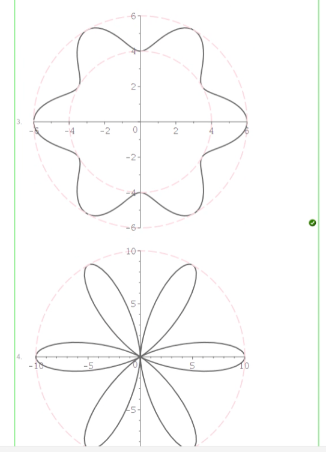

!>请以unsw学校官网为准，这里只提供参考！ 

>如信息有问题，请立即[与我联系](/help/?id=关于我)！

# Week 9

>数学一共需要做11个Week的作业，且取8个Week作为总成绩的12%（取分数最高的8个Week，这个指的是一个week中的总成绩，并不是某个week的其中一个课题(是所有课题哦！！！！)。所以我建议最好做满分吧！）

>课程：[数学课程](/DPST1013/) &nbsp; [数学作业](/homework/DPST1013/)

## 一、题目在哪？

  * [mobius - Week 9 ](https://unsw.mobius.cloud/1179?gid=4499)

## 二、如果你实在不会，可能这些能帮助到你：

### Alg1131W9T1 - Gaussian elimination and back substitution

##### Question 1

 - [x] R3 = R3 - 4 R1
 - [x] R2 = R2 - 2 R1
 - [x] R2 = R2 / 3
 - [x] R3 = R3 - 9 R2
 - $x_3=$ `2`
 - $x_2=$ `3`
 - $x_1=$ `1`

##### Question 2

 * A **leading row** of a matrix is
  - [x] a row which is not all zeros.
 * A **leading entry** of a leading row is
  - [x] the left-most non-zero entry
 * A **leading column** of a matrix is
  - [x] a column which contains a leading entry

##### Question 3

 - [x] any all-zero rows are at the bottom of the matrix
 - [x] in every leading row, the leading entry is further to the right than the leading entry in any higher row
 - [x] all entries below a leading entry are zero.

##### Question 4

 - $A =$ `<<1|-1|1>,<2|-1|3>,<1|-2|2>>`
 - $b =$ `<0,4,2>`
 - where $a =$ `1` , $b =$ `4` and $c =$ `6`
 - Now we may work backwards to find that $z =$ `3` , then $y =$ `1` and finally $x =$ `-2`

##### Question 5

?> _随机题！需要补全题目才可出答案！_**题目：**  <input style="width: 30px" v-model="i1" v-on:input="calsq1()"> $x +$ <input style="width: 30px" v-model="i2" v-on:input="calsq1()"> $y =$ <input style="width: 30px" v-model="i3" v-on:input="calsq1()"> <input style="width: 30px" v-model="i4" v-on:input="calsq1()"> $x +$ <input style="width: 30px" v-model="i5" v-on:input="calsq1()"> $y =$ <input style="width: 30px" v-model="i6" v-on:input="calsq1()">

 - Written as the vector, the solution is $\begin{pmatrix}x \\ y \end{pmatrix}=$ <code><{{a2}},{{a1}}></code>

 - **ii)** Use the matrix approach to solve the following system of equations

 $x+y+z+w=-1$

 $x+2y+z+2w=-1$

 $x+2y+3w=3$

 $x+3y+2z+4w=-1$

 Write your solution as the vector $\begin{pmatrix} x \\ y \\ z \\ w \end{pmatrix}=$ `<1,-2,-2,2>`

### Calc1131W9T2 - Parameterisation

##### Question 1

?> _随机题！需要补全题目才可出答案！_

 - $a(0) = $ `[1,0]`
 - $a\left(-\frac{1}{3}\right) = $ `[72/90,-18/30]`
 - $a($ <input style="width: 30px" v-model="i7" v-on:input="calsq2()"> $) = $ <code>{{a3}}</code>
 - $\frac{dy}{dt}($ <input style="width: 30px" v-model="i7" v-on:input="calsq2()"> $) = $ <code>{{a4}}</code>
 - $\frac{dx}{dt}($ <input style="width: 30px" v-model="i7" v-on:input="calsq2()"> $) = $ <code>{{a5}}</code>
 - $\frac{dy}{dx}($ <input style="width: 30px" v-model="i7" v-on:input="calsq2()"> $) = $ <code>{{a6}}</code>
 - $-\frac{dx}{dy}($ <input style="width: 30px" v-model="i7" v-on:input="calsq2()"> $) = $ <code>{{a7}}</code>

##### Question 2

?> _随机题！需要补全题目才可出答案！_

 - The equation of the tangent (displayed above in blue) at $a($ <input style="width: 30px" v-model="i8" v-on:input="calsq3()"> $) $ is

 $y =$ <code>{{a8}}</code>

The equation of the normal (displayed above in red) at  $a($ <input style="width: 30px" v-model="i8" v-on:input="calsq3()"> $)$  is

 $y= $ <code>{{a9}}</code>

##### Question 3

 

##### Question 4

 

##### Question 5

 

### Calc1131W9T3 - de Casteljau Bezier curves

##### Question 1

?> _随机题！需要补全题目才可出答案！_

 - $p($ <input style="width: 30px" v-model="i1" v-on:input="calsq1()"> $) = $ <code>{{a1}}</code>

##### Question 2

 

 

##### Question 3

?> _随机题！需要补全题目才可出答案！_

 - $\overrightarrow{OC} = $ <select disabled><option selected > (1-t) </option></select> $\overrightarrow{OA} + $ <select disabled><option selected > t </option></select> $\overrightarrow{OB}$.
 - Given the points $A = [1,1], B=[2,2]$ with respective masses $a = $ <input style="width: 30px" v-model="i2" v-on:input="calsq2()"> and $b = $ <input style="width: 30px" v-model="i3" v-on:input="calsq2()"> ,the centre of mass is at the point   $C = $ <code>{{a2}}</code>

##### Question 4

?> _随机题！需要补全题目才可出答案！_**题目：** Let  $A=[$ <input style="width: 30px" v-model="i3" v-on:input="calsq2()"> $,$ <input style="width: 30px" v-model="i4" v-on:input="calsq2()"> $]$ , $B=[$ <input style="width: 30px" v-model="i5" v-on:input="calsq2()"> $,$ <input style="width: 30px" v-model="i6" v-on:input="calsq2()"> $]$ and $C=[$ <input style="width: 30px" v-model="i7" v-on:input="calsq2()"> $,$ <input style="width: 30px" v-model="i8" v-on:input="calsq2()"> $]$

 - $r(0) = $ <select disabled><option selected > A </option></select>
 - $r(1) = $ <select disabled><option selected > C </option></select>
 - $r\left(\frac{1}{5}\right) = $ <code>\[16\/25\*({{i3}})\+8/25\*({{i5}})\+1\/25\*({{i7}}),16\/25\*({{i4}})\+8/25\*({{i6}})\+1\/25\*({{i8}})\]</code>

##### Question 5

 - <select disabled><option selected > continuous </option></select>
 - <select disabled><option selected > B1C1 </option></select>
 - <select disabled><option selected > A2B2 </option></select>
 - [x] $B_1$
 - [x] $C_1$
 - [x] $A_2$
 - [x] $B_2$

### Calc1131W9T4 - Polar curves

##### Question 1

?> _随机题！需要补全题目才可出答案！_

 - $\frac{d\theta}{dt} = $ <input style="width: 30px" v-model="i9" v-on:input="calsq3()">  $\theta = $ <code>{{i9}}t</code>
 - $\frac{dr}{dt} = $ <input style="width: 30px" v-model="i10" v-on:input="calsq3()">  Initially,  $r=$ <input style="width: 30px" v-model="i11" v-on:input="calsq3()"> . So we can integrate this expression to find $r = $ <code>{{i10}}t+{{i11}}</code>
 - $r = $ <code>{{i10/i9}}*theta+{{i11}}</code>

##### Question 2

?> _随机题！需要补全题目才可出答案！_**题目：** Consider the Archimedian Spiral $r =$ <input style="width: 30px" v-model="i12" v-on:input="calsq3()"> $\theta +$ <input style="width: 30px" v-model="i13" v-on:input="calsq3()"> $, \theta \in [0,2\pi] $

 - Find the point  $a(\pi) = $ <code>[-({{i13}}+{{i12}}*Pi),0]</code>
 - $y = $ <code>({{i13}}+{{i12}}Pi)/{{i12}}x+({{i13}}+{{i12}}Pi)^2/{{i12}}</code>
 - $y = $ <code>-{{i12}}/({{i13}}+{{i12}}Pi)x-{{i12}}</code>

##### Question 3

 - $x = $ `r*cos(theta)`
 - $y = $ `r*sin(theta)`
 - $x^2 + y^2 = $ `16/theta^2`
 - $(x^2 + y^2) \left(\tan^{-1}\left(\frac{y}{x}\right)\right)^2 = $ `16`

##### Question 4

?> _随机题！需要补全题目才可出答案！_

 - seed number <input style="width: 60px" v-model="i1" v-on:input="calsq1()"> : <code>[{{a1}},{{a2}}]</code>

 - $\theta = $ `0`

##### Question 5

 - <select disabled><option selected > Rene Descartes </option></select>
 - <select disabled><option selected > George Berkeley </option></select>
 - <select disabled><option selected > Carl Friedrich Gauss </option></select>
 - <select disabled><option selected > Archimedes </option></select>
 - <select disabled><option selected > Fibonacci </option></select>
 - <select disabled><option selected > Leonhard Euler </option></select>
 - Which mathematician do you think has the best hat? <select disabled><option selected > Carl Friedrich Gauss </option></select>

### Maple1131W9T5 - Plotting

##### Question 1

 _(这题有可能是随机的)_

 - The quantity  $y$  is approximatly <select disabled><option selected > neither increasing no decreasing </option></select> in  $x  $.
 - Approximately, the relationship between the two variables is <select disabled><option selected > not linear </option></select>

##### Question 2

 

 

 

 

 

##### Question 3

 

 

 

 

##### Question 4

 - `1`

##### Question 5

 - `3`

