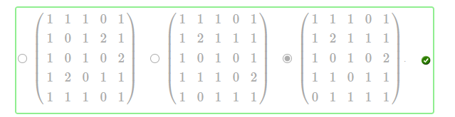
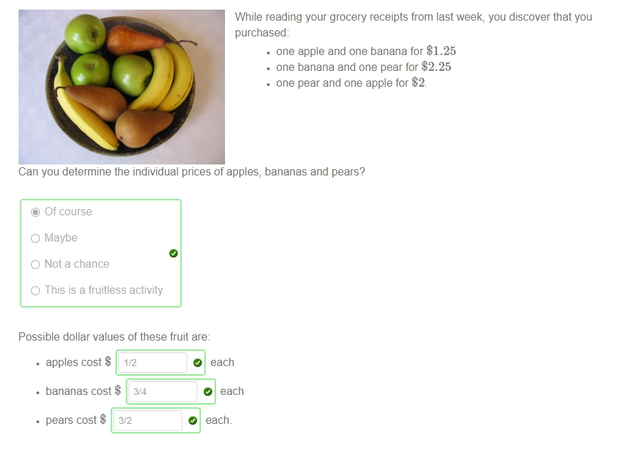

!>请以unsw学校官网为准，这里只提供参考！ 

>如信息有问题，请立即[与我联系](/help/?id=关于我)！

# Week 10

>数学一共需要做11个Week的作业，且取8个Week作为总成绩的12%（取分数最高的8个Week，这个指的是一个week中的总成绩，并不是某个week的其中一个课题(是所有课题哦！！！！)。所以我建议最好做满分吧！）

>课程：[数学课程](/DPST1013/) &nbsp; [数学作业](/homework/DPST1013/)

## 一、题目在哪？

  * [mobius - Week 10 ](https://unsw.mobius.cloud/1179?gid=4500)

## 二、如果你实在不会，可能这些能帮助到你：

### Calc1131W10T1 - Integration by parts

##### Question 1

 - <select disabled><option selected > product rule </option></select>
 - [x] $\displaystyle\int_a^b{u\frac{dv}{dx}dx}=[uv]_a^b-\int_a^b{v\frac{du}{dx}dx}$

 - [x] $\displaystyle\int_a^b{uv'dx}=[uv]_a^b-\int_a^b{vu'dx}$

##### Question 2

?> _随机题！需要补全题目才可出答案！_

 **i)** $\displaystyle\int x e^{A x}dx=$ <code>{{a1}}</code> ${}+C$ 【补全：$A =$ <input style="width: 30px" v-model="i1" v-on:input="calsq1()"> 】

 **ii)** $\displaystyle\int x \cos(A x) dx=$ <code>{{a2}}</code> ${}+C$ 【补全：$A =$ <input style="width: 30px" v-model="i2" v-on:input="calsq1()"> 】 

##### Question 3

 - $\displaystyle\int_{16}^{49} \sqrt{x}\ln x \,dx=$ `1372*ln(7)/3-512*ln(2)/3-124`

##### Question 4

 - **i)** $\displaystyle\int {x}^{2}\sin \left( 6\,x \right) \, dx=$ `-x^2*cos(6x)/6+x*sin(6x)/18+cos(6x)/108` ${}+C$

##### Question 5

 - **i)** $\displaystyle\int\sin\sqrt{x}\,\,dx=$ `-2sqrt(x)cos(sqrt(x))+2sin(sqrt(x))` ${}+C$

 - **ii)** $\displaystyle\int _1^{16} e^{\sqrt{x}}\,dx=$ `4e^(3)`

### Alg1131W10T2 - Deductions based on row-echelon form

##### Question 1

?> _随机题！需要补全题目才可出答案！_

 - * [x] every leading entry is  $1$
   * [x] every entry below a leading entry is zero
   * [x] every entry above a leading entry is zero
   * [x] all fully zero rows are at the bottom

 - <input type="radio" checked disabled> here is a one-parameter family of solution

 - * [x] $[1,1]$
   * [x] $[2,2]$
   * [x] $[3,4]$

 - <select disabled><option selected > is not </option></select> <select disabled><option selected > has </option></select>

 - <input type="radio" checked disabled> $4 - 3 = 1$

 - <select disabled><option selected > 1 </option></select>

##### Question 2

 - <input type="radio" checked disabled> unique solution

 - <input type="radio" checked disabled> infinitely many solutions.

 - <input type="radio" checked disabled> no solution

 - <input type="radio" checked disabled>	unique solution

##### Question 3

Solve the system of linear equations 
$x-y+z=7$ 
$3x+4z=11$ 
$3x+9y+6z=-18$

The solution is $x=$ `-4` , $y=$ `4` , $z=$ `1`

##### Question 4

Solve the system of linear equations 
 $y+5z=5$ 
 $2x-z=4$ 
 $2x+4y+5z=5$ 
for  $x$ , $ y $ and $ z $ . We get

 - $x=$ `75/28`
 - $y=$ `-25/14`
 - $z=$ `19/14`

##### Question 5

 - `D+R+G=500`
 - `G=1/4*(D+R)`
 - `D+R=450`
 - * [x] the predictions of the political pundits is inconsistent
   * [x] we cannot predict a winner

### Alg1131W10T3 - Applications

##### Question 1

 - <input type="radio" checked disabled> a system of linear equations in  $a$ ,  $b$  and  $c$
 - `<<1|1|1>,<4|2|1>,<1|-1|1>>`
 - `<4,9,6>`
 - `<2,-1,3>`
 - `2x^2-x+3`

##### Question 2

 

##### Question 3

 - 
 - where  $x=$  `1`, $y=$  `-1` and  $w=$  `0`.
 - <input type="radio" checked disabled> she can determine none of the lengths of the highways

##### Question 4

 

##### Question 5

 - [x] not a chance.
 - [x] no.

### Alg1131W10T4 - Unknown right hand side

##### Question 1

 - <select disabled><option selected > 3b1-b2+b3 </option></select>
 - `-1/2*b[1]+1/3*b[2]+1/6*b[3]`
 - `-1/2*b[1]-1/2*b[3]`
 - `b[1]-1/3*b[2]+1/3*b[3]`
 - <input type="radio" checked disabled> there is always a unique solution

##### Question 2

Determine  $x$  and  $y$  in terms of  $b_1$  and  $b_2$  if 
$7x+5y=b_1$ 
$-17x-12y=b_2$

 - The result is $x =$ `-12*b[1]-5*b[2]` and $y =$ `17*b[1]+7*b[2]`

 - <input type="radio" checked disabled> a unique solution whatever  $b_1$  and  $b_2$  are

##### Question 3

Determine  $x$ , $y$ and  $z$  in terms of  $b_1$ , $b_2$ and  $b_3$  if 
$x-2y+2z=b_1$ 
$-x+3y-3z=b_2$ 
$3x-y+2y=b_3$

 

 - The result is
   * $x= $ `3*b[1]+2*b[2]`
   * $y= $ `-7*b[1]-4*b[2]+b[3]`
   * $z= $ `-8*b[1]-5*b[2]+b[3]`

 - <input type="radio" checked disabled> a unique solution whatever  $b_1$  and  $b_2$  are

##### Question 4

 - <input type="radio" checked disabled> the left hand side will have a non-leading column, which corresponds to a parameter

 - <select disabled><option selected > -4b1+3b2=0 </option></select>

##### Question 5

Find the linear condition on the vector  $b$  which ensures that the following system has a solution: 
$x+2z=b_1$ 
$x+y=b_2$ 
$5x+y+8z=b_3$

 

 - The condition should be a linear condition, i.e. something of the form  $ 2b_1-17b_2+35b_3=0$  . In fact the condition is  `-4*b[1]-b[2]+b[3]=0`

 - <input type="radio" checked disabled> a plane through the origin in three-dimensional space.

### Maple1131W10T5 - Linear Algebra

##### Question 1

 

##### Question 2
 
 - <input type="radio" checked disabled> RowOperation(M,[2, 4])
 - <input type="radio" checked disabled> RowOperation(M,3,4)
 - <input type="radio" checked disabled> RowOperation(M,[5, 4],-2)

##### Question 3

?> _随机题！需要补全题目才可出答案！_ **题目：** Let $ \mathbf u = \ \begin{pmatrix} u_1 \\ u_2 \\ u_3  \end{pmatrix}$ and $ \mathbf v = \ \begin{pmatrix} v_1 \\ v_2 \\ v_3  \end{pmatrix}$   【补齐：$u_1=$ <input style="width: 30px" v-model="i1" v-on:input="calsq1()"> , $u_2=$ <input style="width: 30px" v-model="i2" v-on:input="calsq1()"> , $u_3=$ <input style="width: 30px" v-model="i3" v-on:input="calsq1()"> , $v_1=$ <input style="width: 30px" v-model="i4" v-on:input="calsq1()"> , $v_2=$ <input style="width: 30px" v-model="i5" v-on:input="calsq1()"> , $v_3=$ <input style="width: 30px" v-model="i6" v-on:input="calsq1()">  】

 - (a) $\mathbf u \cdot \mathbf v = $ <code>{{a1}}</code>
 - (b) The area of the parallelogram spanned by   $ u $   and  $ v $  is <code>{{a2}}</code>

##### Question 4

?> _随机题！需要补全题目才可出答案！_ **题目：** Let $ \mathbf a = \ \begin{pmatrix} a_1 \\ a_2 \\ a_3  \end{pmatrix}$ and $ \mathbf v = \ \begin{pmatrix} v_1 \\ v_2 \\ v_3  \end{pmatrix}$   【补齐：$a_1=$ <input style="width: 30px" v-model="i4" v-on:input="calsq1()"> , $a_2=$ <input style="width: 30px" v-model="i5" v-on:input="calsq1()"> , $a_3=$ <input style="width: 30px" v-model="i6" v-on:input="calsq1()"> , $v_1=$ <input style="width: 30px" v-model="i1" v-on:input="calsq1()"> , $v_2=$ <input style="width: 30px" v-model="i2" v-on:input="calsq1()"> , $v_3=$ <input style="width: 30px" v-model="i3" v-on:input="calsq1()">  】

 - $\text{proj}_{\mathbf v} \mathbf a =$ <code>{{a1}}</code>

 - <code>{{a2}}</code>

##### Question 5

?> _随机题！需要补全题目才可出答案！_   **1.粘贴题目里的Maple代码**  <input style="width: 80%" v-model="i9" v-on:input="calsq2()">  _粘贴类似这样的内容： A := Matrix([[3, 3, 7, 6, 1, 8, 5, 3, 4, 4, 7], [2, 9, 9, 2, 8, 7, 1, 2, 4, 2, 5], [7, 9, 9, 8, 3, 9, 4, 9, 8, 1, 4], [3, 5, 3, 5, 8, 2, 8, 9, 9, 9, 1], [6, 4, 6, 2, 7, 9, 9, 6, 9, 2, 5], [5, 8, 9, 3, 3, 6, 3, 6, 8, 5, 9], [8, 7, 8, 5, 7, 6, 4, 5, 2, 9, 4], [5, 6, 7, 4, 9, 7, 5, 4, 4, 6, 1], [7, 6, 5, 6, 1, 6, 2, 2, 3, 1, 1], [1, 6, 7, 3, 5, 9, 4, 9, 3, 1, 8]]);_   **2.补全题目：** Use Maple to create the vector $b$ that is column <input style="width: 30px" v-model="i10" v-on:input="calsq2()"> from A and the matrix C that is made from columns <input style="width: 30px" v-model="i11" v-on:input="calsq2()"> to <input style="width: 30px" v-model="i12" v-on:input="calsq2()"> and <input style="width: 30px" v-model="i13" v-on:input="calsq2()"> to <input style="width: 30px" v-model="i14" v-on:input="calsq2()"> of A (in the same order as the columns of A).  and enter the <input style="width: 30px" v-model="i15" v-on:input="calsq2()"> th component of the unique vector solution for $x$ in the box below.  (Your answer should be an exact fraction, not a decimal.)

 * 3.然后将下方文本全部一次性完整复制到Maple中即可出答案。

<code>{{a3}}</code>

