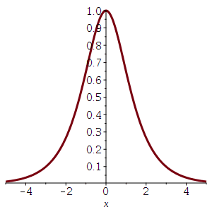
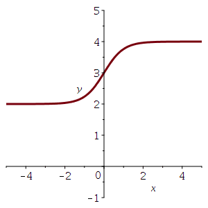
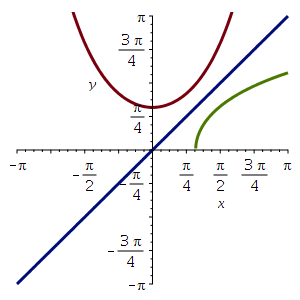

!>请以unsw学校官网为准，这里只提供参考！ 

>如信息有问题，请立即[与我联系](/help/?id=关于我)！

# Week 12

>数学一共需要做11个Week的作业，且取8个Week作为总成绩的12%（取分数最高的8个Week，这个指的是一个week中的总成绩，并不是某个week的其中一个课题(是所有课题哦！！！！)。所以我建议最好做满分吧！）

>课程：[数学课程](/DPST1013/) &nbsp; [数学作业](/homework/DPST1013/)

## 一、题目在哪？

  * [mobius - Week 12 ](https://unsw.mobius.cloud/1179?gid=4502)

## 二、如果你实在不会，可能这些能帮助到你：

### Calc1131W12T1 - Introduction to hyperbolic trig

##### Question 1

 - $y=\sinh(x)$ 

 - $y=\cosh(x)$ 

 - $y=\tanh(x)$ 

##### Question 2

 - $e^{-x} > $ `0`
 - $e^x + e^{-x} > $ `e^x`
 - $\ln(e^x + e^{-x}) > $ `ln(e^x)`
 - $\ln(2\cosh(x)) > $ `x-ln(1)`
 - $\ln(\cosh(x)) > $ `x-ln(2)`
 - <select disabled><option selected > QED </option></select>

##### Question 3

 - $y=\frac{1}{\cosh(x)}$ 

 - $y=4 - \cosh(x)$ 

 - $y=\sinh(x - 1)$ 

 - $y=3 + \tanh(x)$ 

##### Question 4

|Hyperbolic Trig|Circle Trig|
|:--|:--|
|$\frac{d}{dt}\sinh(t) = $ `cosh(t)`|$\frac{d}{dt}\sin(t) = $ `cos(t)`|
|$\frac{d}{dt}\cosh(t) = $ `sinh(t)`|$\frac{d}{dt}\cos(t) = $ `-sin(t)`|
|$\cosh^2(t) - \sinh^2(t) = $ `1`|$\cos^2(t) + \sin^2(t) = $ `1`|

##### Question 5

 - $\lim\limits_{t\to\infty} a(1+\tanh(bt+c)) = $ `2a`
 - $\lim\limits_{t\to\infty} B(t) = $ `88`
 - $\lim\limits_{t\to\infty} P(t) = $ `106`
 - [x] Perry will always be the Queen of Twitter. Long live the Twitter Queen!

---

### Calc1131W12T2 - Parametrisation of the hyperbola

##### Question 1

 - `x^2-y^2=1`
 - `x^2+y^2=1`
 - `t/2`

##### Question 2

 - The parametrisation $[\tanh(t),\operatorname{sech}(t)]$  is one side of <select disabled><option selected > C </option></select>
 - The parametrisation $[\operatorname{sech}(t),\tanh(t)]$  is one side of <select disabled><option selected > C </option></select>
 - The parametrisation $[\sinh(t),\cosh(t)]$  is one side of <select disabled><option selected > B </option></select>
 - The parametrisation $[\cosh(t),\sinh(t)]$  is one side of <select disabled><option selected > A </option></select>
 - The parametrisation $[-\cosh(t),\sinh(t)]$  is one side of <select disabled><option selected > A </option></select>

##### Question 3

 - `y = tx+t`
 - $x={}$ `(t^2+1)/(-t^2+1)`
 - $y={}$ `2t/(1-t^2)`
 - if $-1 \lt t \lt 1$ then  $x$ is <select disabled><option selected > positive </option></select>
 - if $t =\pm 1$ then $x$ is <select disabled><option selected > undefined </option></select>
 - otherwise $x$ is <select disabled><option selected > negative </option></select>

##### Question 4

?>_随机题！需要补全题目才可出答案！_

 - $e(0) = $ `[1,0]`
 - $e($ <input style="width: 30px" v-model="i1" v-on:input="calsq1()"> $) = $ <code>[-{{1+i1\*i1}}/{{i1\*i1-1}},-{{2\*i1}}/{{i1\*i1-1}}]</code>
 - $e(0) = $ `[1,0]`
 - $e(-$ <input style="width: 30px" v-model="i1" v-on:input="calsq1()"> $) = $ <code>[-{{1+i1\*i1}}/{{i1\*i1-1}},{{2\*i1}}/{{i1\*i1-1}}]</code>
 - $e(1/$ <input style="width: 30px" v-model="i1" v-on:input="calsq1()"> $) = $ <code>[{{1+i1\*i1}}/{{i1\*i1-1}},{{2\*i1\*i1}}/{{i1\*(i1\*i1-1)}}]</code>

##### Question 5

 - $2 \cosh(x) \sinh(x) = $ `sinh(2*x)`
 - $\cosh^2(x) + \sinh^2(x) = $ `cosh(2*x)`

---

### Calc1131W12T3 - A relation between inverse hyperbolic trig and ln

##### Question 1

 - <input type="radio" disabled checked> Hyperbole

##### Question 2

?>_随机题！需要补全题目才可出答案！_

 - $\tanh^{-1}(0) = $ `0`
 - $\tanh^{-1}(1/$ <input style="width: 30px" v-model="i2" v-on:input="calsq1()"> $) = $ <code>ln({{i2*(parseInt(i2)+1)}}/{{i2*(i2-1)}})/2</code>
 - $\tanh^{-1}(-1/$ <input style="width: 30px" v-model="i2" v-on:input="calsq1()"> $) = $ <code>-ln({{i2*(parseInt(i2)+1)}}/{{i2*(i2-1)}})/2</code>
 - $\tanh^{-1}\left(\frac{1}{\sqrt{2}}\right) = $ `ln(sqrt(2)+1)`

##### Question 3

 - <select disabled><option selected > one-to-one </option></select>
 - $\cosh(x)$ is `sinh(x)`
 - $x={}$ `0`
 - $\cosh(x)$ is <select disabled><option selected > monotonic decreasing </option></select> for $x \lt 0$
 - $\cosh(x)$ is <select disabled><option selected > monotonic increasing </option></select> for $x \gt 0$

|Function|Graph (green)|
|:--|:--|
|<input type="radio" disabled checked> Inverse of right branch||
|<input type="radio" disabled checked> Inverse of left branch||

##### Question 4

 - $0={}$ `u^2-2ux+1`
 - $u={}$ `x+sqrt(x^2-1)`
 - $\ln(u) = y = \cosh^{-1}(x) = $ `ln(x+sqrt(x^2-1))`

##### Question 5

 - From this graph it is easy to see that  $\tanh^{-1}(x)$  is an odd function. We can see this directly from the definition of  $\tanh(x)$  too. Since  $\sinh(x)$  is an <select disabled><option selected > odd </option></select> function, and  $\cosh(x)$  is an <select disabled><option selected > even </option></select> function, it follows that  tanh(x)  must be an <select disabled><option selected > odd </option></select> function.

 - If we replace  $x$  with  $−x$  then  $\frac{1+x}{1-x}$  changes to its <select disabled><option selected > reciprocal </option></select>
 . So the natural log of it changes by <select disabled><option selected > a negative sign </option></select>. Hence $\tanh^{-1}(-x) = - \tanh^{-1}(x)$

---

### Calc1131W12T4 - Integration with hyperbolic trig substitution

##### Question 1

 - $\frac{dx}{du} = $ `cos(u)`
 - $I = \displaystyle \int\frac{\cos(u)}{\sqrt{1-\sin^2(u)}} du\, = $ `u` $\,+ \,C$
 - $I = $ `arcsin(x)` $\, +\, C$

##### Question 2

 - $\frac{dx}{du} = $ `cosh(u)`
 - $I = \displaystyle \int\frac{\cosh(u)}{\sqrt{1+\sinh^2(u)}} du\, = $ `u` $\,+ \,C$
 - $I = $ `arcsinh(x)` $\, +\, C$

##### Question 3
 
 - $\frac{dx}{du} = $ `1+tan(u)^2`
 - <select disabled><option selected > clever </option></select>
 - $\frac{d}{du}\left({\sec(u) + \tan(u)}\right) = $ `(sin(u)+1)/cos(u)^2`
 - $I = $ `ln(x+sqrt(1+x^2))` $\,+\,C.$

##### Question 4

?>_随机题！需要补全题目才可出答案！_  【补全: $A=$ <input style="width: 30px" v-model="i3" v-on:input="calsq1()"> 】

 - $ \displaystyle \int \frac{1}{\sqrt{(A x)^2 - 1}} dx= $ <code>1/{{i3}}\*arccosh(x/sqrt(1/{{i3*i3}}))</code> $\,+\,C$
 - $ \displaystyle \int \frac{1}{\sqrt{x^2 + {A}^2}} dx = $ <code>arcsinh(x/{{i3}})</code> $\,+\,C$
 - $ \displaystyle \int \frac{1}{\sqrt{x^2 - {A}^2}} dx= $ <code>arccosh(x/{{i3}})</code> $\,+\,C$
 - $ \displaystyle \int \frac{A}{\sqrt{(A x)^2 + 1}} dx= $ <code>arcsinh(x/sqrt(1/{{i3*i3}}))</code> $\,+\,C$

##### Question 5

 - $\sinh(\sinh^{-1}(x)) = $ `x`
 - $\cosh(\sinh^{-1}(x)) \frac{d}{dx}\left(\sinh^{-1}(x)\right) = $ `1`
 - $\cosh(\sinh^{-1}(x)) = \sqrt{1 + \sinh^2(\sinh^{-1}(x))} = $ `sqrt(x^2+1)`
 - $\frac{d}{dx}\left(\sinh^{-1}(x)\right) = $ `1/sqrt(x^2+1)`

##### Question 6

 -  不错！

---

### Alg1131W12T5 - Transposes

##### Question 1

?>_随机题！需要补全题目才可出答案！_  **题目：** If $A=\begin{pmatrix}A_1 & A_2 & A_3 \\ A_4 & A_5 & A_6 \end{pmatrix}$ and $B=\begin{pmatrix}B_1 & B_2 \\ B_3 & B_4 \end{pmatrix}$ then  【补全：$A_1=$ <input style="width: 30px" v-model="i1" v-on:input="calsq1()"> $, A_2=$ <input style="width: 30px" v-model="i2" v-on:input="calsq1()"> $, A_3=$ <input style="width: 30px" v-model="i3" v-on:input="calsq1()"> $,$  $A_4=$ <input style="width: 30px" v-model="i4" v-on:input="calsq1()"> $, A_5=$ <input style="width: 30px" v-model="i5" v-on:input="calsq1()"> $, A_6=$ <input style="width: 30px" v-model="i6" v-on:input="calsq1()"> $,$  $B_1=$ <input style="width: 30px" v-model="i7" v-on:input="calsq1()"> $, B_2=$ <input style="width: 30px" v-model="i8" v-on:input="calsq1()"> $, B_3=$ <input style="width: 30px" v-model="i9" v-on:input="calsq1()"> $, B_4=$ <input style="width: 30px" v-model="i10" v-on:input="calsq1()"> 】

 - $A^T={}$ <code><<{{i1}}|{{i4}}>,<{{i2}}|{{i5}}>,<{{i3}}|{{i6}}>></code>
 - $B^T={}$ <code><<{{i7}}|{{i9}}>,<{{i8}}|{{i10}}>></code>
 - $B+B^T={}$ <code><<{{i7\*2}}|{{parseInt(i9)+parseInt(i8)}}>,<{{parseInt(i9)+i8}}|{{i10*2}}>></code> is <select disabled><option selected > symmetric </option></select>
 - $BB^T={}$ <code><<{{i7\*i7+i8\*i8}}|{{i7\*i9+i8\*i10}}>,<{{i9\*i7+i10\*i8}}|{{i9\*i9+i10\*i10}}>></code> is <select disabled><option selected > symmetric </option></select>
 - $B-B^T={}$ <code><<0|{{i8-parseInt(i9)}}>,<{{parseInt(i9)-i8}}|0>></code> is <select disabled><option selected > skew-symmetric </option></select>

##### Question 2

?>_随机题！需要补全题目才可出答案！_

 - If $A=\begin{pmatrix}0 & -1 \\ 8 & -6 \end{pmatrix}$ then $(A^T)^T={}$ `<<0|-1>,<8|-6>>`
 - <input type="radio" disabled checked> equal to $B^TA^T$
 - If $C={} ($ <input style="width: 30px" v-model="i1" v-on:input="calsq1()"> <input style="width: 30px" v-model="i2" v-on:input="calsq1()"> $)$ then the matrix $CC^T={}$ <code><<{{i1\*i1+i2\*i2}}>></code>
 - <input type="radio" disabled checked> a square matrix

##### Question 3

 - $A+A^T={}$ `<<a+a|b+c>,<b+c|d+d>>` is a <select disabled><option selected > symmetric </option></select> matrix; while $A-A^T={}$ `<<0|b-c>,<c-b|0>>` is a <select disabled><option selected > skew-symmetric </option></select>
 - <input type="radio" disabled checked> the sum of a symmetric and a skew-symmetric matrix

##### Question 4

 - `<<0|0>,<0|0>>`

##### Question 5

 - The product of $2 \times 2$ symmetric matricies is itself symmetric.  <select disabled><option selected > False </option></select>
 - The product of a symmetric matrix and a skew-symmetic matrix is skew-symmetric.  <select disabled><option selected > False </option></select>
 - A skew-symmetric square matrix always has zeros along its diagonal.  <select disabled><option selected > True </option></select>
 - For any two square matricies  $A$  and  $B$ , the matrix  $AB-B^TA^T$   is skew-symmetric.  <select disabled><option selected > True </option></select>
 - If $ A $ and  $B$  are symmetric matrices, then so is  $AB-BA$.  <select disabled><option selected > False </option></select>
 - If  $A $ and  $B$  are skew-symmetric matrices, then so is  $AB−BA$ .  <select disabled><option selected > True </option></select>
 - If  $A$  and  $B$  are symmetric matrices, then  $AB−BA$  is skew symmetric.  <select disabled><option selected > True </option></select>

