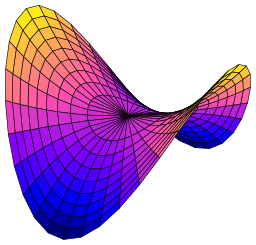

## Week 1 Calculus

>课程：[数学课程](/DPST1014/) &nbsp; [数学作业](/homework/DPST1014/)

?> mobius: [Week 1 Calculus](https://unsw.mobius.cloud/1520?gid=5446)

---

### Calc1231W1T1 - Total Differential Approximation

##### Question 1

 _video_

##### Question 2

?>_随机题！需要补全题目才可出答案！_

Let  $\ell(x)$  be the tangent line to the function

 $y=p(x)=$ <input style="width: 30px" v-model="i1" v-on:input="calsq1()"> $x^2+$ <input style="width: 30px" v-model="i2" v-on:input="calsq1()"> $x+$ <input style="width: 30px" v-model="ia1" v-on:input="calsq1()">

 at the point $[$ <input style="width: 30px" v-model="i3" v-on:input="calsq1()"> $,$ <input style="width: 30px" v-model="i4" v-on:input="calsq1()"> $]$. The equation of this tangent is

   $y = \ell(x) = \,$ <code>{{a1}}</code>

Now evaluate

  * $p($ <input style="width: 30px" v-model="i5" v-on:input="calsq1()"> $) =$ <code>{{a2}}</code>
  * $\ell($ <input style="width: 30px" v-model="i5" v-on:input="calsq1()"> $) = \,$ <code>{{a3}}</code>

The closeness between these values matches our expectation that the tangent line is close to the parabola for points near $ [1, 11 ] $. Below, the graph of  $p(x)$ is plotted in red, and the tangent $ \ell(x) $ is plotted in blue dots.

 

##### Question 3

?>_随机题！需要补全题目才可出答案！_

Evaluating integrals can be difficult. So let's instead use the total differential approximation to approximate the [Sine Integral](https://en.wikipedia.org/wiki/Trigonometric_integral#Sine_integral)

 $$\operatorname{Si}(x) = {\displaystyle\int\limits_0^x \frac{\sin(t)}{t}\, dt }$$

 near the point $A=[$ <input style="width: 30px" v-model="iq3a1" v-on:input="calsq1()"> $,\operatorname{Si}($ <input style="width: 30px" v-model="iq3a1" v-on:input="calsq1()"> $)] \approx [$ <input style="width: 30px" v-model="iq3a1" v-on:input="calsq1()"> $,$ <input style="width: 60px" v-model="iq3a2" v-on:input="calsq1()"> $].$

The differential approximation to  $Si$ near {{iq3a1}} is given by the formula

 $\operatorname{Si}(x) \approx $ {{iq3a2}} $ + \operatorname{Si}^\prime($ {{iq3a1}} $)(x-$ {{iq3a1}} $) $

 Since $\operatorname{Si}^\prime($ {{iq3a1}} $) =\,$ <code> sin({{iq3a1}})/{{iq3a1}} </code> , we have the linear approximation to $\operatorname{Si}(x)$ near $x = $ {{iq3a1}}

 $ \operatorname{Si}(x) \approx \,$ <code> {{iq3a2}}+sin({{iq3a1}})/{{iq3a1}}*(x-{{iq3a1}}) </code>

 * Use the linear approximation to evaluate (to 3 decimal places) 

 $\operatorname{Si}($ <input style="width: 40px" v-model="iq3a3" v-on:input="calsq1()"> $) \approx \,$ <code> {{aq3a1}} </code>

 * Use the plot below (drag the slider to the appropriate value) to evaluate (to 3 decimal places)

<iframe scrolling="no" title="Calc1231W1T1 - Total Differential Approximation Q3" src="https://www.geogebra.org/material/iframe/id/qk2vm3mh/width/300/height/300/border/888888/sfsb/true/smb/false/stb/false/stbh/false/ai/false/asb/false/sri/false/rc/false/ld/false/sdz/true/ctl/false" width="300px" height="300px" style="border:0px;"> </iframe>

##### Question 4

?>_随机题！需要补全题目才可出答案！_

The total differential approximation works in three-dimensional space, too. For example, consider the paraboloid

$z = F(x,y) = \frac{x^2}{A^2} + \frac{y^2}{B^2}$ 
 【补充：$A=$ <input style="width: 30px" v-model="i9" v-on:input="calsq2()"> $, B=$ <input style="width: 30px" v-model="i10" v-on:input="calsq2()">  】

 at the poin $[$ <input style="width: 30px" v-model="i6" v-on:input="calsq2()"> $,$ <input style="width: 30px" v-model="i7" v-on:input="calsq2()"> $,$ <input style="width: 50px" v-model="i8" v-on:input="calsq2()"> $]$

 The total differential approximation to  $z=F(x,y)$ near  [{{i6}},{{i7}}] is given by the formula

$ F(x,y) \approx $ {{i8}} $ + \frac{\partial F}{\partial x}($ {{i6}} $,$ {{i7}} $) (x-$ {{i6}} $) + \frac{\partial F}{\partial y}($ {{i6}} $,$ {{i7}} $)(y-$ {{i7}} $)$

In fact, this gives the equation of the tangent plane to the surface at the point  [{{i6}},{{i7}},{{i8}}] . Now

 * $\frac{\partial F}{\partial x} = \,$ ({{i6}},{{i7}}) <code> {{a4}} </code>

 * $\frac{\partial F}{\partial y} = \,$ ({{i6}},{{i7}}) <code> {{a5}} </code>

So we have the linear approximation to $z=F(x,y)$ near  [{{i6}},{{i7}}] :

$F(x,y) \approx \, $ <code>{{a6}}</code>

 * Use this formula to approximate (to 3 decimal places)

$ F($ <input style="width: 30px" v-model="i11" v-on:input="calsq2()"> $,$ <input style="width: 30px" v-model="i12" v-on:input="calsq2()"> $) \approx$ <code>{{a7}}</code>

 * Compute directly from the definition (to 3 decimal places) the value

$ F($ <input style="width: 30px" v-model="i11" v-on:input="calsq2()"> $,$ <input style="width: 30px" v-model="i12" v-on:input="calsq2()"> $) \approx$ <code>{{a8}}</code>

 

##### Question 5

?>_随机题！需要补全题目才可出答案！_

In the previous questions, it was possible to calculate the value of the function exactly. But it is also possible to make mathematical deductions without knowing the function (which might be impossible or expensive to obtain), and instead only knowing the partial derivatives.

---

Assume that the approval rating of a Prime Minister is given by the function  $A(d,e)$, where  $d$ is defence spending (in billions) and  $e$ is education spending (in billions). The output of the approval rating  $A(d,e)$ itself is a percentage between  $0$ and  $100$.

It is desirable to predict how changes to defence and education spending impact upon the PM's approval. With current spending at  $d_0$  and  $e_0$ , the rate that approval (in percentage) changes with respect to defence spending (in billions) is measured by Newspoll to be the partial derivative  $ \frac{\partial A}{\partial d}(d_0,e_0) = $ <input style="width: 30px" v-model="i1" v-on:input="calsq1()"> , so an increase in defence spending of  $1$ billion dollars will translate to an increase in approval of <input style="width: 30px" v-model="i1" v-on:input="calsq1()"> $\%$ .

Similarly the rate that approval changes with respect to education spending is measured to be the partial derivative   $ \frac{\partial A}{\partial e}(d_0,e_0) = $ <input style="width: 30px" v-model="i2" v-on:input="calsq1()"> . Hence by the total differential approximation, for  $[d,e]$  in the neighbourhood of $[d_0,e_0]$

$$A(d,e) \approx A(d_0,e_0) + \frac{\partial A}{\partial d}(d_0,e_0) (d-d_0) + \frac{\partial A}{\partial e}(d_0,e_0) (e-e_0)$$

The current approval rating is $ A(d_0, e_0) = $ <input style="width: 30px" v-model="i3" v-on:input="calsq1()"> . If defence spending is decreased by  <input style="width: 30px" v-model="i4" v-on:input="calsq1()">  billion and education spending increased by  <input style="width: 30px" v-model="i5" v-on:input="calsq1()">  billion, then the approval rating approximately changes to <code> {{a1}} </code> $\%$.

**Note:** do not round your answer, approval rating is too important to be rounded.

##### Question 6

?>_随机题！需要补全题目才可出答案！_

How much toilet paper is left on the roll? The volume of a cylinder with length $\ell$ and radius $r$ is given by the formula: $$ \pi \ell r^2 $$ You've got some time on your hands, so you carefully measure your toilet roll and discover its dimensions to the nearest mm:

 * length $\ell = $ <input style="width: 30px" v-model="i6" v-on:input="calsq2()"> mm.
 * radius of the inner cardboard cylinder $r =$ <input style="width: 30px" v-model="i7" v-on:input="calsq2()"> mm, and
 * radius of the outer cylinder $R=$ <input style="width: 30px" v-model="i8" v-on:input="calsq2()">  mm.

  The volume of toilet paper on the roll is thus given by the formula: $ V(\ell,r,R) = \pi\ell(R^2 - r^2)$ .

According to your measurements, the volume of toilet paper is (to the nearest cubic mm):

$V($ <input style="width: 30px" v-model="i6" v-on:input="calsq2()">  $,$ <input style="width: 30px" v-model="i7" v-on:input="calsq2()">  $,$ <input style="width: 30px" v-model="i8" v-on:input="calsq2()"> $) = \,$ <code>{{a2}}</code>

However, since your initial measurements were only accurate to the nearest mm, the true volume of toilet paper may be different.

The total differential approximation can be used to estimate how the measured volume $V(${{i6}},{{i7}},{{i8}}$)$  differs from the true value of $ V(\ell,r,R) $ as:

$ V(\ell,r,R) \approx V(${{i6}},{{i7}},{{i8}}$) + \frac{\partial V}{\partial \ell}(${{i6}},{{i7}},{{i8}}$) (\ell-${{i6}}$) + \frac{\partial V}{\partial r}(94,22,54) (r-${{i7}}$) + \frac{\partial V}{\partial R}(${{i6}},{{i7}},{{i8}}$) (R-${{i8}}$)$

We calculate the partial derivatives (to the nearest integer):

 * $\frac{\partial V}{\partial \ell} (${{i6}},{{i7}},{{i8}}$) = \, $ <code>{{a3}}</code>
 * $\frac{\partial V}{\partial r} (${{i6}},{{i7}},{{i8}}$) = \, $ <code>{{a4}}</code>
 * $\frac{\partial V}{\partial R} (${{i6}},{{i7}},{{i8}}$) = \, $ <code>{{a5}}</code>

Since we measured $\ell, r$ and $R$ to the nearest mm,

$| \ell- $ {{i6}} $ | < 0.5,\, | r- $ {{i7}} $ | <0.5 $ differs from the true volume by   $|V(\ell,r,R) - V(${{i6}}$,${{i7}}$,${{i8}}$)| \leq$ <code>{{a6}}</code> $mm^3$.

To two decimal places, this represents an approximate error of no more than

$$ \frac{\left|V(\ell,r,R) - V(x,y,z)\right|}{V(x,y,z)} \leq 3.66 \%$$

Are you satisfied with this level of precision? (this part is not worth marks)

 - [x] No, we need more precise measurements.
 - [ ] Yes, this level of precision is sufficient for my needs.
 - [ ] Better go buy some more toilet paper to account for this potentially significant error.

---

### Calc1231W1T2 - The Chain Rule

##### Question 1

 _video_

##### Question 2

The chain rule allows you to take the derivative of the composite function $$ f \circ g(x) = f(g(x)) $$ as $$\frac{d}{dx} f(g(x)) = f^\prime(g(x)) g^\prime(x).$$

For example if $f(x)=$ <input style="width: 30px" v-model="i9" v-on:input="calsq3()"> $x+$ <input style="width: 30px" v-model="i10" v-on:input="calsq3()">  and  $g(x)=$ <input style="width: 30px" v-model="i11" v-on:input="calsq3()"> $x^2+$ <input style="width: 30px" v-model="i12" v-on:input="calsq3()"> $x+$ <input style="width: 30px" v-model="i13" v-on:input="calsq3()"> then

 * $f^\prime(x) = $ <code> {{a7}} </code>
 * $f^\prime(g(x)) = $ <code> {{a8}} </code>
 * $g^\prime(x) = $ <code> {{a9}} </code>

Hence by the chain rule

$\frac{d}{dx} f(g(x)) = f^\prime(g(x)) g^\prime(x) = $ <code>{{a10}}</code>

##### Question 3

In the previous question we used the chain rule to calculate the derivative  $f\circ g$ indirectly from the derivatives of  $f$ and  $g$. Of course, in the previous question  $f$ and  $g$ were polynomials, and so a simpler method to find the derivative would be to first evaluate $f\circ g$ and then differentiate.

However, this "simpler" method does not always work. For example, use the chain rule $$\frac{d}{dx} f(g(x)) = f^\prime(g(x))g^\prime(x) $$ to evaluate:

 * $\frac{d}{dx} \sin\left({x}^{3}+1\right) = $ ` 3x^2*cos(x^3+1) `
 * $\frac{d}{dx} e^{( {x}^{3}+1)} = $ ` (3x^2)*e^(x^3+1) `
 * $3x^2*1/(x^3+1)$ ` 3x^2*1/(x^3+1) `
 * $\frac{d}{dx} \tan^{-1}\left({x}^{3}+1\right) = $ ` 3x^2*1/(1+(x^3+1)^2) `

Recall $$\frac{d}{dx}\left(\tan^{-1}(x)\right ) = \frac{1}{1+x^2}$$

##### Question 4

?>_随机题！需要补全题目才可出答案！_

What if you are faced with taking the derivative of a function of a function of a function? A single application of the chain rule is not enough.

  From [Know Your Meme](http://knowyourmeme.com/)

We need to use the chain rule within the chain rule! For example, to evaluate

$\frac{d}{dx}\sin(e^{ ( A\,{x}^{2}+B\,x+C
 ) })$  【补全：$A=$ <input style="width: 30px" v-model="i1" v-on:input="calsq1()"> $,B=$ <input style="width: 30px" v-model="i2" v-on:input="calsq1()"> $,C=$ <input style="width: 30px" v-model="i3" v-on:input="calsq1()"> 】

Let $f(x) = \sin(x)$ and $g(x) = e^{( A\,{x}^{2}+B\,x+C )}$. Then a first application of the chain rule gives $$\frac{d}{dx}\sin\left(e^{ ( A\,{x}^{2}+B\,x+C ) }\right)\ = f^\prime(g(x))g^\prime(x). $$ It is possible at this stage to find

$f^\prime(g(x)) = $ <code> {{a1}} </code>

However to find $g^\prime(x)$ requires a further use of the chain rule

$g^\prime(x) = $ <code> {{a2}} </code> 

Hence

 $\frac{d}{dx}\sin(e^{ ( A\,{x}^{2}+B\,x+C ) }) = $ <code> {{a3}} </code>

##### Question 5

?>_随机题！需要补全题目才可出答案！_

The kinetic energy of a object with mass $ m$ (kilograms) and velocity  $v$ (metres per second) is given by $$K = \frac{1}{2}mv^2.$$

Suppose you drop an orange, where

 * the orange has a mass of  $m=$ <input style="width: 30px" v-model="i4" v-on:input="calsq2()">  kilograms,
 * the acceleration due to gravity is  $\frac{dv}{dt} =$  <input style="width: 30px" v-model="i5" v-on:input="calsq2()">  metres per second per second.

By the chain rule, the change in kinetic energy with respect to time is a function of $ v$ :

 $ \frac{dK}{dt} = $ <code>{{a4}}</code>

When the velocity is  <input style="width: 30px" v-model="i6" v-on:input="calsq2()">   metres per second, the rate of change in kinetic energy is

$\frac{dK}{dt}|_{v=...} = $ <code>{{a5}}</code>

##### Question 6

?>_随机题！需要补全题目才可出答案！_

Remarkably, the chain rule allows you to calculate the derivative of the composite function $f\circ g(x) = f(g(x))$ as the product of the derivatives $f^\prime(g(x))$  and $g^\prime(x)$ . It is not actually necessary to know an explicit formula for the functions $ f$ and $ g$, only their derivatives are required.

For example, suppose you drive a car up a steep mountain road at a constant speed of  $v=$ <input style="width: 30px" v-model="i7" v-on:input="calsq3()"> kilometers per hour. The gradient of the mountain is $30$ degrees (I told you it was steep!) If  $g(t)$   represents the altitude (in kilometers) of the car at time  $t$  (in hours) then, using the triangle below, we can calculate the rate of change in altitude as

$g^\prime(t) = $ <code> {{a6}} </code> kilometers per hour.   

Now let  $f(h)$  represent the temperature at $h$ kilometers above sea level. The temperature drops at a constant rate of <input style="width: 40px" v-model="i8 " v-on:input="calsq3()">  degrees for every kilometer above sea level. Hence

$ f^\prime(h) = $ <code> {{a7}} </code>

The composite function $f(g(t))$ represents the temperature at time  $t$ . By the chain rule the temperature changes with time at a rate of

$\frac{d}{dt} f(g(t)) = f^\prime(g(t)) g^\prime(t) = $ <code> {{a8}} </code>

This calculation was done without knowing the value of $t,h,g(t)$ or $f(h)$.

**Note:** this question was adapted from [this example on Wikipedia](https://en.wikipedia.org/wiki/Chain_rule#Absence_of_formulas).

---

### Calc1231W1T3 - Multivariable Chain Rule

##### Question 1

 _video_

##### Question 2

Recall the Folium of Descartes, which has Cartesian equation $$x^3 - 3xy + y^3 = 0$$ with the rational parameterization $$x(t) = \frac{3t}{1+t^3},\quad y(t) = \frac{3t^2}{1+t^3}$$ The Folium is shown below (in black), along with the normal to the curve (in red). Through this parameterization the Folium can be regarded as a function of  $t$ . Let's find the derivative with respect to $t...$ geometrically.

<!--iframe height="503px" scrolling="no" src="https://www.geogebra.org/material/iframe/id/GufG5v2S/width/589/height/503/border/888888/rc/false/ai/false/sdz/true/smb/false/stb/false/stbh/true/ld/false/sri/true/at/auto" style="border:0px;" width="589px"></iframe-->

If we let $F(x,y) = x^3 - 3xy  + y^3$, then the equation of the Folium is in the form $$F(x,y) = C$$

where $C = $ ` 0 ` is constant. The normal to the curve (shown in red) at the point $[x,y]$ is given by the vector  $$\nabla F = \begin{pmatrix} \frac{\partial F}{\partial x} \\ \frac{\partial F}{\partial y} \end{pmatrix}$$

Where, as a function of  $x$  and  $y$ :

 * $\frac{\partial F}{\partial x} = $ ` 3x^2-3y `
 * $\frac{\partial F}{\partial y} = $ ` -3x+3y^2 `

We can think of the parameter  $t$   as time, velocity (shown in blue) is the vector $$\frac{d\mathbf{x}}{dt} = \begin{pmatrix} \frac{dx}{dt} \\ \frac{dy}{dt} \end{pmatrix} $$

Where, as a function of  $t$ :

 * $\frac{dx}{dt} = $ ` (3-6t^3)/(1+t^3)^2 `
 * $\frac{dy}{dt} = $ ` (6t-3t^4)/(1+t^3)^2 `

Geometrically, the **chain rule** states that the derivative is the dot product: $$\frac{dF}{dt} = \nabla F \cdot \frac{d\mathbf{x}}{dt} $$Of course, it's easy to see that this quantity equals zero since

 - [x] the normal and velocity vectors are perpendicular.
 - [x] the function  $F(x,y)$  equals a constant, so the derivative must be zero.

##### Question 3

A plane in $\mathbb R^3$ has Cartesian equation $$2 x + 3 y + 13 z = 20$$ If we let $F(x,y,z) = 2 x + 3 y + 13 z$ then the partial derivatives are

 * $\frac{\partial F}{\partial x} = $ ` 2 `
 * $\frac{\partial F}{\partial y} = $ ` 3 `
 * $\frac{\partial F}{\partial z} = $ ` 13 `

These are the components of the normal to the plane, which is the vector $$\nabla F = \begin{pmatrix}\frac{\partial F}{\partial x}\\\frac{\partial F}{\partial y}\\\frac{\partial F}{\partial z}\end{pmatrix}$$ Now consider a surface in $R^3$ with Cartesian equation $$5\,{x}^{2}+4\,xz+5\,{y}^{2}
 = 20$$ If we let $G(x,y,z) = 5\,{x}^{2}+4\,xz+5\,{y}^{2}$ , the partial derivatives are

  * $\frac{\partial G}{\partial x} = $ ` 10x+4z `
  * $\frac{\partial G}{\partial y} = $ ` 10y `
  * $\frac{\partial G}{\partial z} = $ ` 4x `

These are the components of $\nabla G$, the normal to the surface at the point  $[x,y,z]$. In contrast to the plane, the normal to a general surface need not be constant.
 

##### Question 4

Consider a function of three variables, such as $$F(x,y,z) = C$$ Suppose $ x,y$ and $ z$ are functions of $ t$. The chain rule states that $$\frac{dF}{dt} = \nabla F \cdot \frac{d{\mathbf x}}{dt} = \frac{\partial F}{\partial x}\frac{dx}{dt}+\frac{\partial F}{\partial y}\frac{dy}{dt}+\frac{\partial F}{\partial z}\frac{dz}{dt} $$ Of special importance are those functions where  $z$ is a function of the other variables, such as $$z = 4\,{x}^{2}+3\,y+1$$ If we know $x = \cos(t) $ and $y = \sin(t) $ then  $z$ must be function of $ t$ too. We can find the derivative $\frac{dz}{dt}$ by first rewriting our equation in the form $$F(x,y,z) = -1$$ Then take the derivative of both sides with respect to $ t$. The derivative of the right hand side is ` 0 ` . The derivative of the left hand side requires the chain rule.

First, we compute the normal: $$ \nabla F = \begin{pmatrix} \frac{\partial F}{\partial x} \\ \frac{\partial F}{\partial y} \\ \frac{\partial F}{\partial z} \end{pmatrix}$$ where, as a function of  $x$ and $ y$ :

 * $\frac{\partial F}{\partial x} = $ ` 8x `
 * $\frac{\partial F}{\partial y} = $ ` 3 `
 * $\frac{\partial F}{\partial z} = $ ` -1 `

Then we compute the velocity: $$\frac{d {\mathbf x}}{dt} = \begin{pmatrix} \frac{dx}{dt} \\\frac{dy}{dt} \\\frac{dz}{dt} \end{pmatrix}$$ where as a function of $ t$ :

 * $\frac{dx}{dt} = $ ` -sin(t) `
 * $\frac{dy}{dt} = $ ` cos(t) `

The value of $\frac{dz}{dt}$ can be determined because it is the only unknown quantity in the equation $$\frac{dF}{dt} = 0$$ So the answer can be expressed as a function of $ t$ :

$\frac{d z}{d t} = $ ` -4sin(2t)+3cos(t) `

##### Question 5

Consider the curve $$z = 4\,{x}^{2}+2\,x+2\,y$$ Using the chain rule, or otherwise (at your peril), calculate $\frac{d z}{d t}$ as a function of $t$ , where $x = \cos(t)$ and $y = \sin(t)$

$\frac{dz}{d t} = $ ` -4sin(2t)-2sin(t)+2cos(t) `

##### Question 6

?>_随机题！需要补全题目才可出答案！_

Consider the hyperbolic paraboloid $z=x^2 - y^2 $

 

A drone is programmed to fly along the surface of the hyperbolic paraboloid. The flight instruments measure the velocity in the $ x,y$ and $ z$ directions as

 $\frac{dx}{dt} =$ <input style="width: 30px" v-model="i9" v-on:input="calsq4()"> $\quad \frac{dy}{dt} =$ <input style="width: 30px" v-model="i10" v-on:input="calsq4()"> $ \quad \frac{dz}{dt} =$ <input style="width: 30px" v-model="i11" v-on:input="calsq4()">

The GPS measures  $x=$ <input style="width: 30px" v-model="i12" v-on:input="calsq4()">  , but the GPS does not measure $ y$  (to keep costs down). What is the $ y $ co-ordinate? The chain rule can tell us! It's

 $y = $ <code>{{a9}}</code>

---

### Calc1231W1T4 - The Wave Equation

##### Question 1

 _video_

##### Question 2

Given a function, it is relatively easy to find the partial derivatives. For example suppose $u(x,t)  = \sin(x+ct)$ then

$\frac{\partial u}{\partial t} = $ `c*cos(x+ct)` and $\frac{\partial u}{\partial x} = $ ` cos(c*t+x) `

We say this function $ u$ **satisfies**, or **is a solution to**, the differential equation

$\frac{\partial u}{\partial t} - c\frac{\partial u}{\partial x} = $ ` 0 `

Similarly, if $v(x,t) = \sin(x-ct)$ then

$\frac{\partial v}{\partial t} = $ ` -c*cos(-c*t+x) ` and $\frac{\partial v}{\partial x} = $ ` cos(-c*t+x) `

So this function $ v$ satisfies the differential equation

$\frac{\partial v}{\partial t} + c\frac{\partial v}{\partial x} = $ ` 0 `

##### Question 3

Suppose $u(x,t) = \sin(x + ct) $ where $ c$ is a constant. There are four possible derivatives of order two. These are

 * $\frac{{\partial}^2 u}{{\partial t}^2} = $ ` -c^2*sin(x+ct) `
 * $\frac{{\partial}^2 u}{\partial t \partial x} = $ ` -c*sin(x+ct) `
 * $\frac{{\partial}^2 u}{\partial x \partial t} = $ ` -c*sin(x+ct) `
 * $\frac{{\partial}^2 u}{{\partial x}^2} = $ ` -sin(x+ct) `

So this function satisfies a very famous partial differential equation, which originated from the study of a vibrating string on a musical instrument, called the one dimensional wave equation:

$\frac{{\partial}^2 u}{{\partial t}^2} - c^2 \frac{{\partial}^2 u}{{\partial x}^2} = $ ` 0 `

The function $v(x,t) = \sin(x-ct)$  is also a solution to this equation. The functions $u(x,t), v(x,t)$ and $u(x,t) + v(x,t)$ are plotted in red, orange and purple in the picture below with $c = 1$

 

Assuming $c > 0$ then the red function $\sin(x+ct)$ is a wave that moves to the <select><option> left </option></select> over time, while the orange function $\sin(x-ct)$ is a wave that moves to the <select><option> right </option></select> over time. The sum of the left and right moving waves is the standing wave $\sin(x+ct)+\sin(x-ct)$ in purple.

##### Question 4

?>_随机题！需要补全题目才可出答案！_

The function $u(x,t) = e^{i(x + ct)}$ is another solution to the wave equation $$\frac{\partial^2 u}{\partial t^2} - c^2 \frac{\partial^2 u}{\partial x^2} = 0$$

Let's investiage the case when  $c=$ <input style="width: 30px" v-model="i13" v-on:input="calsq4()"> $+$ <input style="width: 30px" v-model="i14" v-on:input="calsq4()"> $i$  .  Then

 * The real part of  $u$  is <code> exp(-{{i14}}t)*cos(x+{{i13}}t) </code>
 * The imaginary part of  $u$  is <code> exp(-{{i14}}t)*sin(x+{{i13}}t) </code>

So the function oscillates in the complex plane, but these oscillations are dampened by the exponential term. As time goes on

 $ \lim\limits_{t\to\infty} u(x,t) = $ `0`

##### Question 5

Consider $u(x,t) = \cos(x + ct)$ and $v(x,t) = \cos(x-ct)$ . Then

 * $\frac{\partial^2 u}{{\partial t}^2}= $ ` -c^2*cos(x+ct) `
 * $\frac{\partial^2 u}{{\partial x}^2}= $ ` -cos(x+ct) `
 * $\frac{\partial^2 v}{{\partial t}^2}= $ ` -c^2*cos(x-ct) `
 * $\frac{\partial^2 v}{{\partial x}^2}= $ ` -cos(x-ct) `

These functions are both solutions to the one-dimensional wave equation because $$\frac{\partial^2 u}{\partial t^2} - c^2 \frac{\partial^2 u}{\partial x^2} = 0$$ and $$\frac{\partial^2 v}{\partial t^2} - c^2 \frac{\partial^2 v}{\partial x^2} = 0$$ The functions $u(x,t),v(x,t)$and$u(x,t) + v(x,t)$are plotted in red, orange and purple below with $c=1$

 

##### Question 6

We have seen that the one-dimensional wave equation has lots of possible solutions. In fact there is a whole vector subspace of solutions (you may like to prove this). We can narrow down the range of possible solutions by adding extra conditions that the function must satisfy. These are usually called initial conditions.

For example, suppose that $u(x,t)$ satisfies the one-dimensional wave equation: $$\frac{\partial^2 u}{{\partial t}^2} - c^2\frac{\partial^2 u}{{\partial x}^2} = 0$$ In addition, suppose $ u(x,t)$ satisfies the initial conditions:

 $u(x,0) = f(x)$ and $\frac{\partial u}{\partial t}(x,0) = g(x)$

In 1746, [Jean-Baptiste le Rond d'Alembert](https://en.wikipedia.org/wiki/Jean-Baptiste_le_Rond_d%27Alembert) discovered that there is only one possible solution which satisfies these conditions: $$\displaystyle u(x,t) = \frac{1}{2}\left(f(x-ct) + f(x+ct)\right) + \frac{1}{2c}\int\limits_{x-ct}^{x+ct}g(s) ds. $$

  Jean-Baptise le Rond d'Alembert (1717 -1783)

For example, if we have the wave equation with $c=1$: $$\frac{\partial^2 u}{{\partial t}^2} - \frac{\partial^2 u}{{\partial x}^2} = 0$$ and initial conditions $f(x) = \sin(x)$ and $g(x) = \cos(x)$ then

  $\displaystyle\int\limits_{x-ct}^{x+ct}g(s) ds = \int\limits_{x-t}^{x+t}\cos(s) ds = $ ` sin(x+t)-sin(x-t) `

So by d'Alembert's formula, the solution is

  $u(x,t) = $ ` sin(x+t) `

---

### Maple1231W1T5 - Maple Revision from Math1131

##### Question 1 & 2

 

##### Question 3 & 4

?>_随机题！需要补全题目才可出答案！_

$f(x)=$ <input style="width: 80%" v-model="i1" v-on:input="calsq1()">

 * <code>{{a1}}</code>

 

##### Question 5

 

##### Question 6

 这道题是从上个学期的Maple题中随机抽，所以我也不知道你是哪道题。

 

##### Question 7 & 8

 
 
 

