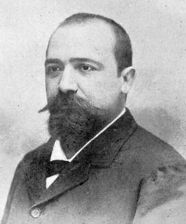

## Week 10 Calculus

>课程：[数学课程](/DPST1014/) &nbsp; [数学作业](/homework/DPST1014/)

?> mobius: [Week 10 Calculus](https://unsw.mobius.cloud/1520?gid=5455)

---

### Calc1231W10T1 - Integral test for convergence

##### Question 1

 _video_

##### Question 2

The integral test links the convergence of a sum to the convergence of an integral. Let $$\displaystyle \sum\limits_{k=1}^\infty a_k $$ be an infinite series of positive terms. Suppose that $f(x)$ is a continuous, positive and decreasing function where

 $f(k) = a_k$ for $k = 1,2,3,\cdots$

There are two cases to consider:

**i)** If $\displaystyle \int\limits_1^\infty f(x)\, dx $ is divergent, then $ \displaystyle\sum\limits_{k=1}^\infty a_k$ is <select><option> divergent </option></select> . This is shown in the first figure because the area of the rectangles is greater than the <select><option> infinite </option></select> area under the curve.

 

**ii)** If $\displaystyle\int\limits_1^\infty f(x)\, dx $ is convergent, then $\displaystyle\sum\limits_{k=1}^\infty a_k $ is <select><option> convergent </option></select> . This is shown in the second figure because the area of the rectangles is less than the <select><option> finite </option></select> area under the curve.

 

Actually, the second diagram only shows that $\displaystyle\sum\limits_{k=2}^\infty a_k $ is convergent. But this is equivalent to the statement that $\displaystyle\sum\limits_{k=1}^\infty a_k$ is convergent because the difference between these two sums is <select><option> finite </option></select> .

##### Question 3

We can use the integral test to determine if the series $$ \displaystyle\sum\limits_{n=1}^\infty {\frac {n}{ \left( {n}^{2}+1 \right) ^{3/2}}} \tag{1} $$ converges. First we take a continuous, positive and decreasing function $f: \mathbb R\to \mathbb R$ where $f(n) = {\frac {n}{ \left( {n}^{2}+1 \right) ^{3/2}}} $ for all $n = 1,2,3,\cdots$. Such a function is

 $f(x) = $ ` x/(x^2+1)^(3/2) `

Now for any positive $N$

 $\displaystyle \int_{1}^N f(x)\, dx = $ ` -1/sqrt(N^2+1)+1/sqrt(2) `

Then

 $ \displaystyle \int_1^\infty f(x) \, dx = \lim\limits_{N\to\infty} \int_1^N f(x) \, dx = $ ` 1/sqrt(2) ` . 

So the series  $(1)$ is <select><option> convergent </option></select>

**Note**: the Maple syntax for $\infty$ is **infinity** .

##### Question 4

We can use the integral test to determine if the series $$\displaystyle \sum\limits_{n=1}^\infty {\frac {n}{\sqrt {{n}^{2}+1}}} \tag{1} $$ converges. First we take a continuous, positive and decreasing function $f: \mathbb R\to \mathbb R$ where $f(n) = {\frac {n}{\sqrt {{n}^{2}+1}}}$ for all $n = 1,2,3,\cdots$ Such a function is

 $f(x) = $ ` x/sqrt(x^2+1) ` .

Now for any positive  $N$

 $\displaystyle \int_{1}^N f(x)\, dx = $ ` sqrt(N^2+1)-sqrt(2) ` .

Then

 $ \displaystyle \int_1^\infty f(x) \, dx = \lim\limits_{N\to\infty} \int_1^N f(x) \, dx = $ ` infinity `.

So the series  $(1)$ is <select><option> divergent </option></select>

**Note**: the Maple syntax for $\infty$ is **infinity** .

##### Question 5

An important application of the integral test is to $p$-series. Recall that the sum $$ \displaystyle \sum\limits_{n=1}^\infty \frac{1}{n^p} $$ converges precisely when $p \gt $ ` 1 ` .

We can check this fact by defining  $f(x) = x^{-p}$ for $x \geq 1$ . This function is (check all that apply):
 * [ ] negative
 * [ ] discontinuous
 * [ ] increasing
 * [x] positive
 * [x] continuous
 * [x] decreasing

Now, if $p \neq 1$ then

 $ \displaystyle \int\limits_1^N f(x) \, dx = $  ` N^(1-p)/(1-p)-1/(1-p) ` .

Hence the convergence or divergence of the integral $$\displaystyle I = \int\limits_1^\infty x^{-p}\, dx = \lim\limits_{N\to\infty} \int\limits_1^N x^{-p}\, dx $$ depends on $ p$ .

 - If $p \lt 1 \,$ the $I=$ ` infinity ` and the  $p$-series <select><option> diverges </option></select> by the integral test.
 - If $p \lt 1 \,$ the $I=$ ` -1/(1-p) ` and the  $p$-series <select><option> converges </option></select> by the integral test.
 - We analyse the remaining case $ p = 1$ in the next question.

**Note**: the Maple syntax for $\infty$ is **infinity** .

##### Question 6

Now we consider the case of a p-series with $p=1$  According to the integral test $$ \displaystyle\sum\limits_{n=1}^\infty \frac{1}{n} $$ converges precisely when $$ \displaystyle\int\limits_{1}^\infty \frac{1}{x} \, dx$$ converges. By definition

 $ \displaystyle\int\limits_{1}^N \frac{1}{x} \, dx$ ` ln(N) `

and so

 $\displaystyle\int\limits_{1}^\infty \frac{1}{x} \, dx = \lim\limits_{N\to\infty} \,\int\limits_{1}^N \frac{1}{x} \, dx = $ ` infinity `

Hence the sum diverges by the integral test.

This is the famous harmonic series, whose divergence was first discovered by Nicole Oresme (1323-1382).

 

His argument was that $$1 + \frac{1}{2} + \frac{1}{3} + \frac{1}{4} + \cdots $$ $$ = 1 + \frac{1}{2} + \left(\frac{1}{3} + \frac{1}{4}\right)+\left(\frac{1}{5} + \frac{1}{6}+ \frac{1}{7}+ \frac{1}{8}\right) + \cdots $$ $$ \geq 1 + \frac{1}{2} + \left(\frac{1}{4} + \frac{1}{4}\right)+\left(\frac{1}{8} + \frac{1}{8}+ \frac{1}{8}+ \frac{1}{8}\right) + \cdots $$ 

 $ = 1 + \frac{1}{2} + $ ` 1/2 ` $+$ ` 1/2 ` $ + \cdots $

and since this series diverges, so does the harmonic series.

---

### Calc1231W10T2 - The ratio test

##### Question 1

 _video_

##### Question 2

The ratio test is a simple, but sometimes inconclusive, critera to check the convergence or divergence of an infinite series.

---

<i>

**The Ratio Test**: Suppose that $\sum_{n=1}^\infty a_n$ is a series of real numbers, and that the limit_ $$r = \displaystyle \lim\limits_{n\to\infty} \left|\frac{a_{n+1}}{a_n}\right|$$ exists. Then
 - if $r < 1$ then $\sum_{n=1}^\infty a_n$ is convergent,
 - if $r > 1$ then $\sum_{n=1}^\infty a_n$ is divergent,
 - if $r = 1$ the test is inconclusive.

</i>

---

For example $\sum_{n=1}^\infty a_n$ where $a_n = 6^{-n}$ is a series where the limit

 $\displaystyle \lim\limits_{n\to\infty} \left|\frac{a_{n+1}}{a_n}\right| = $ ` 1/6 `

is less than one. So by the ratio test the series is convergent. In this case the ratio test guarantees the existence of the limit $ L$ : $$L = \sum\limits_{n=1}^\infty a_n.$$ But it gives no information as to the value of  $L$ . For this, we can use properties of a geometric series to evaluate

 $L = $ ` 1/5 `

##### Question 3

The ratio test tells you about the convergence or divergence of a series, provided the limiting ratio $\lim\limits_{n\to\infty}\left|\frac{a_{n+1}}{a_n}\right|=r$ exists and is not equal to $1$ . If $r=1$ the test is inconclusive and the series may converge or diverge. For example consider the series

 $\sum\limits_{n=1}^\infty a_n$ where $a_n = \frac1n.$

Because

 $ \left|\frac{a_{n+1}}{a_n}\right| = $ ` abs(n/(n+1)) `

then $$ r=\displaystyle \lim\limits_{n\to\infty} \left|\frac{a_{n+1}}{a_n}\right| = 1. $$ In this case, the ratio test has unfortunately given no information as to the convergence or divergence of this series.

Now consider the series

 $\displaystyle\sum\limits_{n=1}^\infty b_n$ where $b_n = \frac{1}{n^2}.$

Because

 $\left|\frac{b_{n+1}}{b_n} \right| = $ ` abs(n^2/(n+1)^2) `

then $$r=\displaystyle \lim\limits_{n\to\infty} \left|\frac{b_{n+1}}{b_n} \right| = 1.$$ Again, the ratio test tells us nothing about the convergence or divergence of this series.

So we see that the ratio test really is inconclusive. Both examples had the same $ r$ value but the first example <select><option> divergent, by the p-test </option></select> and the second example <select><option> converges, by the p-test </option></select>. In fact $$\displaystyle \sum\limits_{n=1}^\infty b_n = \frac{\pi^2}{6}.$$

##### Question 4

One of the most important parts of using the ratio test for the series $\sum_{n=1}^\infty a_n$ is calculating $$r =\displaystyle \lim\limits_{n\to\infty} \left|\frac{a_{n+1}}{a_n} \right|.$$ Find the value of  $r$ for the the following series:
 - if $a_n =\frac{{n}^{2}+n+1}{{n}^{2}+3\,n+3}$ then $r=$ ` 1 `

 - if $\displaystyle a_n = \left(\frac{4}{25}\right)^n \left({n}^{2}+n+1\right) $ then $r=$ ` 4/25 `

 - if $\displaystyle a_n = \frac{n}{4^n}$ then $r=$ ` 1/4 `

 - if $\displaystyle a_n =\frac{4^{n}}{n!} $ then $r=$ ` 0 `

##### Question 5

The following examples have been taken from sample final exams, which are available from the UNSW library.

---

**MATH1231 2012s2 Q4iib)** Determine whether each of the following series converges or diverges, stating any tests you use: $$\sum\limits_{n=1}^{\infty }{\frac{{{2}^{n}}+1}{{{3}^{n}}}}$$ **Answer**: let $a_n = n^4/n!$ . Since 

 $r =\displaystyle \lim\limits_{n\to\infty} \left|\frac{a_{n+1}}{a_n}\right| = $ ` 0 ` 

the series <select><option> convergent </option></select> by the ration test.

---

**MATH1231 2013s2 Q4ia)** Use appropriate tests to determine whether each of the following series converges or diverges: $$\displaystyle\sum\limits_{n=1}^\infty \frac{2^n+1}{3^n} $$ **Answer**: let $a_n = \displaystyle \frac{2^n+1}{3^n}$ . Since

 $r =\displaystyle \lim\limits_{n\to\infty} \left|\frac{a_{n+1}}{a_n}\right| = $ ` 2/3 ` 
 

the series <select><option> convergent </option></select> by the ration test.

---

**MATH1231 2014s2 Q1iiib)** Determine whether each of the following series converges or diverges, stating any tests you use: $$\displaystyle\sum\limits_{n=1}^\infty \frac{2}{2^n + 3^n} $$ **Answer**: let $a_n = \displaystyle \frac{2}{2^n + 3^n}$ . Since

 $r =\displaystyle \lim\limits_{n\to\infty} \left|\frac{a_{n+1}}{a_n}\right| = $ ` 1/3 ` 
 

the series <select><option> convergent </option></select> by the ration test.

##### Question 6

One of the most common uses of the ratio test is to find values of $ x$ such that the series $$\displaystyle\sum_{n=1}^\infty a_n $$ converges, where $a_n$ is a function of $x$.  For example, if $$a_n = \left( \frac{x}{4}\right)^n $$ this series will converge by the ratio test, provided $$\displaystyle\lim\limits_{n\to\infty}\left| \frac{a_{n+1}}{a_n} \right| < 1.$$ Let's rephrase this as an inequality in $\left|x\right|$ . Since

 $\displaystyle\left|\frac{a_{n+1}}{a_n}\right| = $ ` abs(x/4) ` 
 

then this series will converge by the ratio test provided $ \left|x\right|$ satisfies the inequality:

` abs(x)<4`
 

**Note**: the Maple syntax for the inequality $\left|x\right| < 10 $ is **abs(x)** $\mathtt{abs(x)} < 10$.

---

### Calc1231W10T3 - Convergence of series with positive and negative terms

##### Question 1

 _video_

##### Question 2

A series $$a_1 + a_2 + \cdots = \sum\limits_{n=1}^\infty a_n $$ is called **alternating** if the product of two consecutive terms is negative, that is $$a_n \times a_{n+1} < 0$$ Or, in other words, consecutive terms have different sign. Which of the following series are alternating?
 * [x] $-1 + 2 - 3 + 4 - 5 + 6 - \cdots$
 * [x] $1 - 2 + 3 - 4 + 5 - 6 + \cdots$
 * [x] $\sum\limits_{n=1}^\infty (-2)^n $
 * [ ] $1 + \frac12 -\frac14 -\frac18 +\frac1{16}+\frac1{32}- \cdots$
 * [ ] $\sum\limits_{n=1}^\infty (-n)^2 $

##### Question 3

When does a series converge? This can be a tricky problem. Even for an alternating series, this is not so obvious. The following series baffled many 18th century mathematicians: $$1 - 1 + 1 - 1 + 1 - 1 + \cdots .$$ Does it converge? One school of thought argued that we could arrange the terms of the series as follows $$ (1-1) + (1-1) + (1-1) + \cdots $$ so that the infinite sum is ` 0 ` . Others argued we could equally well arrange it in the form $$ 1+(-1+ 1)+(-1 + 1)+(-1 +1) + \cdots $$ so that the infinite sum is ` 1 ` . Others argued for a compromise using the partial sum  $s_n$ of the first  $n$ terms: $$s_n =\left\{\begin{array}{cl} 1 & n \, \text{ is odd, }\\ 0 & n \, \text{ is even.}\end{array}\right. $$ The infinite sum should be the average value of $ s_n$ , otherwise known as the Cesàro sum, which is

$\lim\limits_{n\to\infty} \frac{s_1 + s_2 + \cdots + s_n}{n} = $ ` 1/2 `
 

In this course, according to our definition of convergence, this series <select><option> diverges </option></select>

Ernesto Cesàro: 1859 - 1906.
 

##### Question 4

In the 18th century, Gottried Leibniz (the same of Calculus fame) came up with a simple criterion called the Alternating series test that applies to particular kinds of alternating series.

---

**Theorem: Alternating series test**

Suppose that  $a_1,a_2,a_3,\cdots$ is a sequence of real numbers such that

 &emsp;i) $a_n \gt 0$ for all $n \in \mathbb Z^+$ , which is to say the numbers $a_n$  are all positive,

 &emsp;ii) $a_n \geq a_{n+1}$ for all $n \in \mathbb Z^+$ , which is to say the numbers $a_n$ are **monotonically decreasing**, which means decreasing or equal,

 &emsp;iii) $\lim\limits_{n\to\infty} a_n = 0$ ，which is to say the numbers $a_n$ approach zero.

Then the alternating series $$\sum\limits_{n=1}^\infty (-1)^{n+1}a_n = a_{1}-a_{2}+a_{3}-a_{4}+a_{5}-a_{6}+\cdots$$ converges.

---

For example, consider the alternating series $$\frac{1}{3} - \frac{1}{3^2} + \frac{1}{3^3} - \cdots .$$ Let $a_n = $ ` 1/3^n ` . Then

 &emsp;i) this is a sequence of positive numbers: $a_n > $ ` 0 ` .

 &emsp;ii) this is a monotonically decreasing sequence, but proving this usually requires a little work. The best place to start working is from a statement we can all agree upon, such as $$1 > \frac{1}{3}.$$ Multiplying both sides of this inequality by ` 1/3^n ` gives $$\displaystyle a_n = \frac{1}{3^n} > \frac{1}{3^{n+1}} = a_{n+1}.$$

 &emsp;iii) finally

$\lim\limits_{n\to\infty} a_n = $ ` 0 ` .
 

Hence the series $$\displaystyle\sum\limits_{n=1}^\infty (-1)^{n+1}a_n = \frac{1}{3} - \frac{1}{3^2} + \frac{1}{3^3} - \cdots$$ converges by Leibniz's Alternating series test.

Gottfried Wilhelm von Leibniz: 1646 - 1716
 

##### Question 5

Suppose the series of positive and negative terms $$a_1 + a_2 + a_3 + a_4 + \cdots \quad (1) $$ converges. There are two types of convergence for this series, which are distinguished by the behaviour of series of positive terms $$\left|a_1\right| + \left|a_2\right| + \left|a_3\right| + \left|a_4\right| + \cdots. \quad (2) $$ If series $ (1)$ converges but series  $(2)$ diverges then we say that series  $(1)$ is conditionally convergent. Otherwise, when series $ (1)$ and  $(2)$ are both convergent we say that series $(1)$ is **absolutely convergent**.

Types of convergence

|series  $(1)$ is|series  $(2)$ is|series  $(1)$ iis called|
|:--:|:--:|:-:|
|Convergent|Divergent|Conditionally Convergent|
|Convergent|Convergent|Absolutely Convergent|

For example, consider the series $$\displaystyle \sum\limits_{n=1}^\infty (-1)^{n+1} \frac{1}{n} = 1 - \frac12 + \frac13 - \frac14 \cdots $$ which is an alternating version of the famous harmonic series.

To prove the series $1 - \frac12 + \frac13 - \frac14\cdots $ converges, we use Leibniz's Alternating series test.

Let $a_n = $ ` 1/n ` . Then

 &emsp;i) the terms $a_n, n \in \mathbb Z^+$ are all positive: $a_n \gt 0,$
 &emsp;ii) the terms are monotonically decreasing. This is because the sequence $1,2,3,\cdots$ is <select><option> monotonically increasing </option></select>  , and the reciprocal of a monotonically increasing sequence is <select><option> monotonically decreasing </option></select>

  &emsp;iii) 

$ \lim\limits_{n\to\infty} a_n = $ ` 0 ` .
 

 Hence by Leibniz's Alternating series test, the series converges. Because the harmonic series $1+\frac12+\frac13+\frac14+\cdots$ diverges, we say that $1-\frac12+\frac13-\frac14+\cdots$ is more than just convergent, it is <select><option> conditionally convergent </option></select> .

##### Question 6

In the previous question we saw two types of convergence. In contrast, there is only one type of divergence.

---

Theorem: Suppose $a_n$ is a sequence of real numbers (positve or negative). If the series $$\sum\limits_{n=1}^\infty a_n $$ is divergent, then the series $$\sum\limits_{n=1}^\infty \left|a_n\right| $$ is divergent.

---

Let's append this to our table, which gives a complete picture of the types of convergence and divergence.

Types of convergence and divergence

|**Series$\sum\limits_{n=1}^\infty a_n $is** | **Series$\sum\limits_{n=1}^\infty \left\|a_n\right\| $is**|**Series$\sum\limits_{n=1}^\infty a_n $is called**|
|:-:|:-:|:-:|
|Divergent|Divergent|Divergent|
|<del>Divergent</del>|<del>Convergent</del>|<strong>\*\*\*IMPOSSIBLE\*\*\*</strong>|
|Convergent|Divergent|Conditionally Convergent|
|Convergent|Convergent|Absolutely Convergent|

For example, the series $$\displaystyle\sum\limits_{n=1}^\infty a_n = 1 + \frac1{2} - \frac1{2^2} - \frac1{2^3} + \frac1{2^4} + \frac1{2^5} - \cdots $$ is not alternating, so Leibniz's alternating series test can not be applied. However the series of positive terms is a geometric series, and converges to

$\displaystyle \sum\limits_{n=1}^\infty \left|a_n\right| = 1 + \frac1{2} + \frac1{2^2} + \frac1{2^3} + \frac1{2^4} + \frac1{2^5} + \cdots = $ ` 2 ` .
 

Then using the table above, the series $\sum\limits_{n=1}^\infty a_n$ is <select><option> absolutely convergent </option></select> .

---

### Calc1231W10T4 - Maclaurin series

##### Question 1

 _video_

##### Question 2

A Maclaurin series for a function  $f$ is a special case of the Taylor series at the point $a=0.$ That is $$f^{(0)}(0) + \frac{f^{(1)}(0)}{1!} x+ \frac{f^{(2)}(0)}{2!}x^2 + \cdots $$ This kind of (possibly infinite) polynomial is often called a <i>power series</i>.

**Note**: Recall that $f^{(4)}(a)$ denotes the $ 4$th derivative of $ f$ evaluated at  $x=a$ , not $(f(a))^4$ Additionally, $ f^{(0)} (a) = f(a) $.

The most direct way to obtain a Maclaurin series is by calculating the derivatives of $ f$ and evaluating them at  $0$.

For example if  $f(x) = \cosh(x)$ , then

 - $f^{(1)}(x) = $ ` sinh(x) `

 - $f^{(2)}(x) = $ ` cosh(x) `

 - $f^{(3)}(x) = $ ` sinh(x) `
 

and so on.

Thus the first terms of the Maclaurin series for $\cosh(x)$ up to and including the degree  $6$ term is 

$p_6(x) = $ ` 1+x^2/2+x^4/(4!)+x^6/(6!) `

Colin Maclaurin 1698 - 1746
 

##### Question 3

Let $p_6(x)$ denote the Maclaurin series up to and including terms of degree  $6$ for a function  $f(x)$ .

 - If $ f(x) = \cos(x) $ then $p_6(x) = $ ` 1-x^2/(2!)+x^4/(4!)-x^6/(6!) `

 - If $f(x) = \sin(x) $ then $p_6(x) = $ ` x/(1)-x^3/(3!)+x^5/(5!) `

 - If $ f(x) = e^x $ then $p_6(x) = $ ` 1+x/(1!)+x^2/(2!)+x^3/(3!)+x^4/(4!)+x^5/(5!)+x^6/(6!) `

 - If $\displaystyle f(x) = \frac{1}{1-x} $ then $p_6(x) = $ ` 1+x+x^2+x^3+x^4+x^5+x^6 ` .

##### Question 4

Identify the functions $\cos(x),\sin(x),\exp(x)$ and $\ln(1+x)$ from their power series in powers of  $x$:

 - $ \displaystyle 1 + x + \frac{x^2}{2!} + \frac{x^3}{3!} + \cdots = $ ` exp(x) `

 - $ \displaystyle \sum\limits_{n=0}^\infty (-1)^n\frac{x^{2n}}{(2n)!} = $ ` cos(x) `

 - $ \displaystyle \sum\limits_{n=0}^\infty (-1)^n \frac{x^{2n+1}}{(2n+1)!} = $ ` sin(x) `

 - $ \displaystyle x - \frac{x^2}{2} + \frac{x^3}{3} - \frac{x^4}{4} + \cdots = $ ` ln(1+x) ` .

##### Question 5

Let's explore the sense in which $f(x) = e^x$ equals its series expansion about $a=0$.

By Taylor's theorem $$\displaystyle e^x = 1 + x + \frac{x^2}{2!} + \cdots + \frac{x^n}{n!} + R_{n+1}(x), $$ where $R_{n+1}(x)$ is the Lagrange form of the remainder, which can be written as

$R_{n+1}(x) = \frac{f^{(n+1)}(c)}{(n+1)!}x^{n+1} = $ ` exp(c)/((n+1)!)*x^(n+1) ` ,
 

where $ c$ is somewhere between $ 0$ and $ x$ . Suppose $ 0 \leq c \leq x $ ; then

` 1 ` $ \leq e^c \leq $ ` exp(x) ` .
 

Hence $$\displaystyle \frac{x^{n+1}}{(n+1)!} \leq R_{n+1}(x) \leq e^x\frac{x^{n+1}}{(n+1)!} $$ Since

$\displaystyle\lim\limits_{n\to\infty} \frac{x^{n+1}}{(n+1)!} = $ ` 0 ` ,
 

by the Pinching Theorem

$\lim\limits_{n\to\infty} R_{n+1}(x) = $ ` 0 ` .
 

So for all values of $ x$: $$\displaystyle e^x = \lim\limits_{n\to\infty} \left(1+x+\cdots +\frac{x^n}{n!} + R_{n+1}(x)\right) = 1 + x + \frac{x^2}{2!} + \cdots $$

**Note**: the Maple syntax for  $e^x$ is **exp(x)**.

##### Question 6

The following question was adapted from the MATH1231 2013s2 final exam Question 1 part vi.

---

**Question**: Let $f(x) = \ln  \left( 4\,{x}^{2}+3\,x+1 \right) $ The following MAPLE session may assist you with this question

&emsp;$\mathtt{> f:= x -> ln(4*x^2+3*x+1):}$

&emsp;$\mathtt{> taylor(f(x),x=0,5});$ $${3\,x-1/2\,{x}^{2}-3\,{x}^{3}+{\frac {31\,{x}^{4}}{4}}}+O({x^{5}}).$$ Write down the values of $f^{\prime\prime}(0)$ and $f^{\prime\prime\prime}(0)$

**Answer**:
 - $f^{\prime\prime}(0) = $ ` -1 `
 - $f^{\prime\prime\prime}(0) = $ ` -18 ` .

