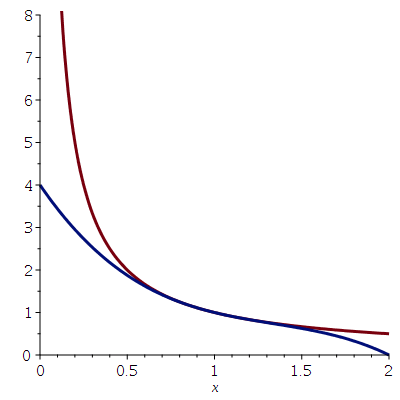

## Week 8 Calculus

>课程：[数学课程](/DPST1014/) &nbsp; [数学作业](/homework/DPST1014/)

?> mobius: [Week 8 Calculus](https://unsw.mobius.cloud/1520?gid=5453)

---

### Calc1231W8T1 - Taylor polynomial of a polynomial

##### Question 1

 _video_

##### Question 2

?>_随机题！需要补全题目才可出答案！_

For a differentiable function  $f$, it is possible to find a degree  $1$ polynomial which shares the  $0$ 'th and  $1$'st derivatives with  $f$ at $x=a$.

Here the  $0$'th derivative means "take the derivative zero times" - this is just the function value at  $x=a$, denoted by $f^{(0)}(a) = f(a)$.

 To construct such a polynomial for  $f(x)=x^2$  at  $x=$ <input style="width: 30px" v-model="i1" v-on:input="calsq1()"> , compute the derivatives we would like the polynomial to have:

  - $f^{(0)}(${{i1}}$) = $ <code> {{i1\*i1}} </code>
  - $f^{(1)}(${{i1}}$) = $ <code> {{i1\*2}} </code>

It is a simple matter to write the degree  $1$ polynomial which has these derivatives at  $x=$ {{i1}} . It is $$y = b + m(x-a) $$ where
 - $a = $ <code> {{i1}} </code>
 - $b = $ <code> {{i1\*i1}} </code>
 - $m = $ <code> {{i1\*2}} </code>

This line is also know as the [select all that apply]:

  - [x] Taylor Polynomial of degree  $1$  at $x =$ {{i1}}
  - [x] Tangent line at $x =$ {{i1}}
  - [ ] Taylor Polynomial of degree  {{i1}} at $x = 1$ 
  - [ ] Taylor Polynomial
  - [ ] Taylor Polynomial of degree $1$ .

 

##### Question 3

?>_随机题！需要补全题目才可出答案！_

 Let's take this up a notch and find a polynomial which shares the first three derivatives with a function  $f(x)$ at  $x=a$ . The process is very similar to the previous question, and results in a "tangent quadratic" which approximates the function near the point.

 Suppose we have $f(x)=x^3$  at  $x=$ <input style="width: 30px" v-model="i2" v-on:input="calsq1()"> . First calculate the derivatives we would like the polynomial to have:

  - $f^{(0)}(${{i2}}$) = $ <code> {{i2\*i2\*i2}} </code>
  - $f^{(1)}(${{i2}}$) = $ <code> {{i2\*i2\*3}} </code>
  - $f^{(2)}(${{i2}}$) = $ <code> {{i2\*6}} </code>

 The desired polynmoial is $$y = f^{(0)}(a) + f^{(1)}(a)(x-a) + \frac{f^{(2)}(a)}{2!}(x-a)^2. $$ Which in this case is

$y =$ <code> {{i2\*i2\*i2}}-{{i2\*i2\*3}}x+{{i2\*6}}/2x^2 </code>

##### Question 4

?>_随机题！需要补全题目才可出答案！_

 If a function  $f(x)$ has  $n$ derivatives at  $x=a$, then it has a "tangent polynomial" of degree $ n$ at  $x=a$. This polynomial is called the Taylor polynomial of degree $ n$ at $ x=a$, and denoted $p_n(x)$ .

 The Taylor polynomial is expressed in terms of powers of  $(x−a)$ as $$\displaystyle p_n(x) = \sum\limits_{k=0}^n \frac{f^{(k)}(a)}{k!} (x-a)^k.$$

 This polynomial has the special property that all the first  $n$ derivatives of $p_n(x)$ match the first $ n$ derivatives of the function  $f$ at $ x=a$. In other words, for $0 \leq k \leq n$ : $$f^{(k)}(a) = p_n^{(k)}(a).$$

 For example, $f(x)=$ <input style="width: 30px" v-model="i3" v-on:input="calsq1()"> $x^2+$ <input style="width: 30px" v-model="i4" v-on:input="calsq1()"> $x+$ <input style="width: 30px" v-model="i5" v-on:input="calsq1()"> $, n = 2$ let's find the degree $2$ Taylor polynomial $p_2(x)$ at $a = $ <input style="width: 30px" v-model="i6" v-on:input="calsq1()">

 - $f^{(0)}(${{i6}}$) = $ <code> {{i3\*i6\*i6+i4\*i6+parseInt(i5)}} </code>
 - $f^{(1)}(${{i6}}$) = $ <code> {{i3\*2\*i6+parseInt(i4)}} </code>
 - $f^{(2)}(${{i6}}$) = $ <code> {{i3\*2}} </code> .

 Then apply the formula above to deduce that

$p_2(x) = $ <code> {{i3}}x^2+{{i4}}x+{{i5}} </code>

##### Question 5

 Let's find the Taylor polynomial $p_3$  , which is a cubic approximation, to the hyperbola $$f(x) = \frac{1}{x}$$ about the point  $x=1$  .

 The first four derivatives are

 - $f^{(0)}(1) = $ ` 1 `
 - $f^{(1)}(1) = $ ` -1 `
 - $f^{(2)}(1) = $ ` 2 `
 - $f^{(3)}(1) = $ ` -6 ` .

Hence the approximation is

$p_3(x) = $ ` -x^3+4x^2-6x+4 ` .

This cubic approximation (blue) and hyperbola (red) are plotted below. Notice that the approximation is generally less accurate as we move away from $x=1$ .

##### Question 6

?>_随机题！需要补全题目才可出答案！_

Give an example of a degree three polynomial  $f$ which has the degree two Taylor polynomial

$p_2(x) =$ <input style="width: 30px" v-model="i3" v-on:input="calsq1()"> $ +$ <input style="width: 30px" v-model="i4" v-on:input="calsq1()"> $\,{x}^{2}$

at  $x=0$ .

$f(x) = $ <code> x^3+{{i4}}x^2+{{i3}} </code>

Give an example of a degree three polynomial  $g$ which has the degree two Taylor polynomial

$q_2(x) =$ <input style="width: 30px" v-model="i1" v-on:input="calsq1()"> $+$ <input style="width: 30px" v-model="i2" v-on:input="calsq1()"> $\, \left( x-1 \right) ^{2}$

at  $x=1$ .

  $g(x) = $ <code> {{i2\*2}}/3x^3-{{i2}}x^2+{{(parseInt(i1)+parseInt(i2))\*3-i2*2}}/3 </code>

---

### Calc1231W8T2 - Taylor polynomial of a function

##### Question 1

 _video_

##### Question 2

If the first  $n$ derivatives of a function  $f$ all exist at $ x=a$ , then the Taylor polynomial  $p_n$ of degree $ n$ about  $a$ is

 $$\displaystyle p_n(x) = f^{(0)}(a) + f^{(1)}(a)(x-a) + \frac{f^{(2)}(a)}{2!} (x-a)^2 + \cdots + \frac{f^{(n)}(a)}{n!} (x-a)^n .$$

**Note**: $f^{(n)}(a)$ denotes the $ n$ th derivative of $ f$ evaluated at $ x=a$, with $ f^{(0)} (a) = f(a) $ .

Suppose $a = \displaystyle \frac{\pi}{2}$ and $f(x) = \sin(x)$ . Then 

 - $f^{(0)}\left(\frac{\pi}{2}\right) = $ ` 1 `
 - $f^{(1)}\left(\frac{\pi}{2}\right) = $ ` 0 `
 - $f^{(2)}\left(\frac{\pi}{2}\right) = $ ` -1 `
 - $f^{(3)}\left(\frac{\pi}{2}\right) = $ ` 0 `

Since $f^{(4)}(x) = f(x) = \sin(x)$ , the pattern repeats itself after $ n=4$ .

##### Question 3

The Taylor polynomial of degree $ 5$  for  $f(x) = \sin(x)$  about  $\displaystyle\frac{\pi}2$  is equal to

$p_{5}(x) = $ ` 1-(x-Pi/2)^2/2+1/24*(x-Pi/2)^4 `

The Taylor polynomials $p_n(x)$ for $ n=1,2,3,4$ and  $5$ are pictured in the GeoGebra app below. Which looks like the best approximation to $\sin(x)$  near $\frac{\pi}{2}$ ? <select><option> The Taylor polynomial of degree 4 </option></select>

<!--iframe height="396px" scrolling="no" src="https://www.geogebra.org/material/iframe/id/QAntYCSY/width/647/height/396/border/888888/rc/false/ai/false/sdz/false/smb/false/stb/false/stbh/true/ld/false/sri/false/at/auto" style="border:0px;" width="647px"></iframe-->

**Note**: the Maple syntax for $\pi$ is Pi.

##### Question 4

?>_随机题！需要补全题目才可出答案！_

Use the Taylor polynomial of degree 2 for $\ln(x)$  near $x =1$ $$p_2(x) = (x-1) - \frac{1}{2}(x-1)^2$$ to find a rational approximation to $\ln($ <input style="width: 30px" v-model="i5" v-on:input="calsq1()"> $/$ <input style="width: 30px" v-model="i6" v-on:input="calsq1()"> $) .$

$\ln($ {{i5}}/{{i6}} $) \approx $ <code> 1/{{i6}}-1/2*1/{{i6}}^2 </code>

Now use the Taylor polynomial of degree 3 for $\sin(x)$ near $x=0$ $$p_3(x) = x - \frac{1}{6}x^3$$ to find a rational approximation to $\sin($ <input style="width: 30px" v-model="i7" v-on:input="calsq1()"> $/$ <input style="width: 30px" v-model="i8" v-on:input="calsq1()"> $)$

$\sin($ {{i7}}/{{i8}} $) \approx $ <code> 1/{{i8}}-1/6*1/{{i8}}^3 </code>

##### Question 5

The Taylor polynomial of degree $ 3 $ for $f(x) = \ln(1+x)$ about $\displaystyle x = 0$ exists, and is equal to

$p_{3}(x) = $ ` x-x^2/2+x^3/3 `

 The first few Taylor polynomials for $\ln(1+x)$ near $x=0$ are shown in the GeoGebra app below; they are reasonable approximations to $\ln(1+x)$ provided we choose $\left|x\right| \lt $ ` 1 `.

<!--iframe height="366px" scrolling="no" src="https://www.geogebra.org/material/iframe/id/GDzdBCuZ/width/548/height/366/border/888888/rc/false/ai/false/sdz/false/smb/false/stb/false/stbh/true/ld/true/sri/true/at/auto" style="border:0px;" width="548px"></iframe-->

##### Question 6

The Taylor polynomialw of degrees $1,\cdots,5$ for $f(x) = \ln(x)$ about $\displaystyle x = 1$ are shown in the GeoGebra app below, along with their polynomial equations.

<!--iframe height="436px" scrolling="no" src="https://www.geogebra.org/material/iframe/id/yTBh5tvC/width/628/height/436/border/888888/rc/false/ai/false/sdz/true/smb/false/stb/false/stbh/true/ld/false/sri/true/at/auto" style="border:0px;" width="628px"></iframe-->

These Taylor polynomial have an incremental nature. For example, the degree $ 6 $ Taylor polynomial for $ f(x) $ about $ x=1 $ is

$p_6(x) = p_5(x) + $ ` -(x-1)^6/6 `

---

### Calc1231W8T3 - Lagrange formula for the remainder

##### Question 1

 _video_

##### Question 2

The Taylor polynomial is a nice simple way to approximate a function. However simplicity comes at the cost of accuracy. Lagrange's form for the remainder gives crude but easy-to-calculate bounds for this accuracy.

By Taylor's theorem, given a point $x=a$ and a function  $f$ with $n+1$ continuous derivatives we can write $$f(x)=p_n(x)+R_{n+1}(x),$$ where $p_n$ is the  $n$ th degree Taylor polynomial about $ x=a$ , and the **remainder term** is given by the integral $$R_{n+1}(x)=\frac{1}{n!}\displaystyle\int_a^x f^{(n+1)}(t)(x-t)^{n}dt.$$ This is exactly the error between $ f$ and $p_n$ , but it is difficult to look at, and difficult to compute. Another expression for the remainder term is **Lagrange's form for the remainder** $$\displaystyle R_{n+1}(x)=f^{(n+1)}(c)\frac{(x-a)^{n+1}}{(n+1)!} ,$$ for some $c$ between  $a$ and  $x$. If we can find a bound for $f^{(n+1)}(c)$  then this can be used to bound the remainder term $R_{n+1}(x).$

For example, consider $ x $ in the range  $[-0.01,0].$ If $f(x)=e^x$ , then the 3rd Talyor polynomial for $ f $ about $x=0$ is

$p_3(x)=$ ` 1+x+x^2/2+x^3/6 ` .

Lagrange's form for the reminder term is $$R_4(x)=f^{(4)}(c) \frac{x^4}{4!}$$ where

$f^{(4)}(c) = $ ` e^c ` (a function of  c ).

Where $ c $  is a real number where $-0.01 \leq x \leq c \leq 0.$ The maximum value of $f^{(4)}(c)$ is $1$, which is achieved when

$c=$ ` 0 `

Using this we can bound the error term

$R_4(x)\leq$ ` x^4/(4!) `

##### Question 3

Consider the function $f(x) = x^3$ and its relation to the degree  $2$ Taylor polynomia $p_2(x)$ at  $x=1$ : $$p_2(x) = 1 +3(x-1)+3(x-1)^2.$$ By Taylor's theorem $$f(x) = p_2(x) + R_3(x).$$ The Lagrange form of the remainder gives $$R_3(x) = f^{(3)}(c)\frac{(x-1)^3}{3!}$$ where $ c $ is between ` 1 ` and $ x $ . But

$f^{(3)}(c) = $ ` 6 `

This is a special case where the Lagrange form of the remainder can be calculated exactly:

$R_3(x) = $ ` (x-1)^3 `

##### Question 4

<!--iframe height="360px" scrolling="no" src="https://www.geogebra.org/material/iframe/id/NF5V6hh8/width/528/height/360/border/888888/rc/false/ai/false/sdz/true/smb/false/stb/false/stbh/true/ld/false/sri/true/at/auto" style="border:0px;" width="528px"></iframe-->

Suppose you have an unknown mystery function  $f(x)$ . The GeoGebra app above does not show the function  $f(x)$ , but it does show (in blue) the  $n$ th degree Taylor polynomial $p_n(x)$ for $ f(x)$ about the point $ x=0$ . The mystery function $ f(x)$ lies somewhere in the grey shaded area, which is the area between the functions $$\displaystyle p_n(x)-\frac{|x|^{n+1}}{(n+1)!}$$

**i)** What is the smallest value of  $n$ such that $p_n(x)$ has three stationary points?

$n = $ ` 4 `

**ii)** What is our best guess for $f(\pi)$ <select><option> -1 </option></select>

**iii)** What is our best guess for $f\left(-\pi/2\right)$ <select><option> 0 </option></select>

**iv)** Ah ha! The mystery function is 

$f(x)=$ ` cos(x) ` .

##### Question 5

<!--iframe height="360px" scrolling="no" src="https://www.geogebra.org/material/iframe/id/NF5V6hh8/width/528/height/360/border/888888/rc/false/ai/false/sdz/true/smb/false/stb/false/stbh/true/ld/false/sri/true/at/auto" style="border:0px;" width="528px"></iframe-->

Hopefully you solved the mystery and discovered that the Taylor polynomials $p_n(x)$ were for  $f(x)=cos(x)$ about the point  $x=0.$ But where did those helpful grey functions come from? The Lagrange form for the remainder! This is $$\displaystyle R_{n+1}(x)=f^{(n+1)}(c)\frac{x^{n+1}}{(n+1)!}$$ for some  $c$ between  $0$ and $ x$. Notice that $f^{(n+1)}(x) = \pm \cos(x) \text{ or } \pm \sin(x)$ so

$\left|f^{(n+1)}(c)\right|\leq$ ` 1 `

Using this we can bound the remainder term by $$\displaystyle \left|R_{n+1}(x)\right| \leq \frac{|x|^{n+1}}{(n+1)!}.$$ Hence $$p_n(x)-\frac{|x|^{n+1}}{(n+1)!} \leq \cos(x)\leq p_n(x)+\frac{|x|^{n+1}}{(n+1)!}.\quad \quad (1)$$ Let's use this to calculate some values of  $\cos(2)$

**i)** Rounded to 3 decimal places $$p_4(2)=-0.333.$$ Our bound on Lagrange's form for the remainder gives us (rounded to 3 decimal places) $$\frac{2^5}{5!} =  0.267.$$ So, using equation  $(1)$:

` -0.6 ` $ \leq \cos(2) \leq $ ` -0.066 `

This does not tell us much about the value of $\cos(2)$ .

 **ii)** A better approximation to $\cos(2)$ will be given by the 8th degree Taylor polynomial (rounded to 5 decimal places) $$p_8(2)=-0.41587.$$ And Lagrange's form for the remainder gives us the bound (rounded to 5 decimal places) $$\frac{2^9}{9!} = 0.00141 $$ which is quite small. So, using equation $(1)$ :

` -0.41728 `  $\leq \cos(2) \leq $ ` -0.41446 `

These bounds agree in the first two decimal places! It is not possible to round this number since the third digit of $\cos(2)$ is not clear from this analysis. But we do know the value of $\cos(2)$ in the first two decimal places:

$\cos(2) = $ ` -0.41 ` (truncated to two decimal places).

**Note:** The decimal $0.abc\cdots$ truncated to two decimal places is $0.ab.$

##### Question 6

Consider the integral $$I=\displaystyle\int_0^1 e^{-x^2}\,dx.$$ But don't consider it for too long... this integral is impossible to evaluate exactly. 

We can use the Taylor polynomial for $e^{-x^2}$ at $x=0$ of degree $4$:

$p_4(x) = $ ` 1-x^2+x^4/2 `

Integrating Taylor polynomial we get

$\displaystyle \int_0^1 p_4(x) dx = $ ` 23/30 ` .

We find this is a pretty close to Maple's numerical calculation of the integral $$I =  0.7468241330$$ So this simple polynomial calculation gets us to within <select><option> 3 </option></select> percent of the this value of $I$.

---

### Calc1231W8T4 - classifying stationary points

##### Question 1

 _video_

##### Question 2

The differentiable function $f(x)$ is said to have a **stationary point** at $x=a$ when $$f^{(1)}(a) = 0.$$ The nature of a stationary point depends upon when the function has the next non-zero derivative. From the Calculus notes, Corollary 4.2.6, we find the following criterion.

---

**Classification of Stationary Points**

<i>

Suppose that $f^{(1)}(a) = 0$ and $n \geq 1$ is the smallest positive integer for which $f^{(n)}(a) \neq 0.$Then

  - if  $n$ is odd, then  $f$ has a horizontal point of inflexion at  $x=a$ ,
  - if  $n$ is even and $f^{(n)}(a) > 0$ then $f$ has a local minimum at $x=a$ ,
  - if  $n$ is even and $f^{(n)}(a) < 0$ then $f$ has a local maximum at $x=a$ .

</i>

---

For example, consider the function $x^2$ . Either by calculating the derivatives, or reading them off the degree $2$ Taylor polynomial for $x^2$ at $x=0$ $$0 + 0x + 1 x^2 = f^{(0)}(0)+f^{(1)}(0)x+\frac{f^{(2)}(0)}{2!}x^2,$$ we find that
 - $f^{(0)}(0) = $ ` 0 `
 - $f^{(1)}(0) = $ ` 0 `
 - $f^{(2)}(0) = $ ` 2 `

Then the smallest positive integer for which $f^{(n)}(0) \neq 0$ is $n =$ ` 2 `. By applying the Classification of Stationary Points result above, we deduce that $x^2$ has a <select><option> local minimum </option></select> at $x = 0$

**Brain teaser:** what does the classification of stationary points tell you about the nature of the stationary points of $ y=0$ ?

##### Question 3

The polynomial $$f(x) = {x}^{5}-2\,{x}^{4}-2\,{x}^{3}+8\,{x}^{2}-7\,x+2$$ has a stationary point at  $x=1$ .  This is because

$f^{(1)}(1) = $ ` 0 `

Calculate the higher derivatives:

 - $ f^{(2)}(1) = $ ` 0 `
 - $f^{(3)}(1) = $ ` 0 `
 - $f^{(4)}(1) = $ ` 72 ` .

So the smallest positive integer $n\gt 1$ for which $f^{(n)}(1) \neq 0$ is

$ n = $ ` 4 ` .

Hence the function has a <select><option> local minimum </option></select>  at $ x=1$ .

##### Question 4

?>_随机题！需要补全题目才可出答案！_

The polynomial 

$f(x) = {x}^{6}-$ <input style="width: 30px" v-model="i10" v-on:input="calsq1()"> $\,{x}^{5}+\,{x}^{4}-\,{x}^{2}+\,x-1$

has a stationary point at  $x=1$ .  This is because

$f^{(1)}(1) = $ ` 0 `

Calculate the higher derivatives:
 - $f^{(2)}(1) = $ ` 0 `
 - $f^{(3)}(1) = $ ` 0 `
 - $f^{(4)}(1) = $ ` 0 `
 - $f^{(5)}(1) = $ <code> {{i10\*5\*4\*3}} </code> .

So the smallest positive integer $n \gt 1$ for which $f^{(n)}(1) \neq 0$ is

$n = $ ` 5 ` .

Hence the function has a <select><option> horizontal point of inflexion </option></select>  at $ x=1$ .

##### Question 5

?>_随机题！需要补全题目才可出答案！_

Suppose that an unspecified function $ f(x)$ has the degree  $7$ Taylor polynomial at  $x=0$ :

$p_{7}(x) = -\,{x}^{7}-\,{x}^{6}-\,{x}^{5}-$ <input style="width: 30px" v-model="i11" v-on:input="calsq1()"> $\,{x}^{4}.$

Because $$ p_{7}(x) = \sum\limits_{k=0}^{7} f^{(k)}(0)\frac{x^k}{k!} $$ you can read off the value of the derivatives of $f(x)$ at $x=0$ by looking at the coefficients of $\frac{x^k}{k!}$ as follows:
 - the coefficient of $\displaystyle\frac{x^1}{1!}$ in $p_7(x)$ is $f^{(1)}(0) = $ ` 0 `
 - the coefficient of $\displaystyle\frac{x^2}{2!}$ in $p_7(x)$ is $f^{(2)}(0) = $ ` 0 `
 - the coefficient of $\displaystyle\frac{x^3}{3!}$ in $p_7(x)$ is $f^{(3)}(0) = $ ` 0 `
 - the coefficient of $\displaystyle\frac{x^4}{4!}$ in $p_7(x)$ is $f^{(4)}(0) = $ <code> -{{i11\*4\*3\*2}} </code>

And so without differentiating, we see that the smallest positive integer $n \gt 1$ for which $f^{(n)}(0) \neq 0$ is

$n = $ ` 4 ` .

Hence the function has a <select><option> local maximum </option></select>  at $ x=1$ .

##### Question 6

?>_随机题！需要补全题目才可出答案！_

The following question has been adapted from the last question of the final exam for MATH1231 from 2014 session 2. The last question is usually harder!

---

Question: Let $ f(x)$ be a function satisfying 

$f(0) = 0, \quad f^\prime(0) =$ <input style="width: 30px" v-model="i12" v-on:input="calsq1()"> $, \quad f^{\prime\prime}(0) = -4$

and

$\left|f^{(3)}(x)\right| \leq $ <input style="width: 30px" v-model="i13" v-on:input="calsq1()"> for $0 \leq x \leq 1$ .

Find the Taylor polynomial of degree  $2$ of  $f$ at $ x=0$ and then find $$\lim\limits_{x\to 0^+} \frac{ x - f(x)}{x^2}. $$

---

**Answer**: The Taylor polynomial of degree $2$ of $f$ at $x=0$ is

$p_2(x) = $ <code> {{i12}}x-2x^2 </code> .

By the Lagrange formula for the remainder we know that

$\displaystyle R_3(x) = \frac{f^{(3)}(c)}{3!}x^3 $  for some $c \in [0,x]$ .

Since

$\left|\frac{f^{(3)}(c)}{3!}\right|\leq $ <code> {{i13/6}} </code>  ,

we deduce that

$\lim\limits_{x\to 0^+} \frac{x - f(x)}{x^2} = $ ` 2 `

---

### Maple1231W8T5 - Programming in Maple

##### Question 1

The series $$10 + 38 + 66 + \cdots + \ell $$ where $\ell$ is the   $n$ th term, is an arithmetic series. Suppose that the values of  $n$ and  $\ell$ have already been entered to a Maple worksheet.

Select all the single-line Maple Codes below which output the sum of this series.

 - [x] s:=0: for i from 10 to $\ell$ by 28 do s:=s+i end do: s;
 - [x] s:= 0: for i from 0 to  $n$-1 do s:=s+ 10 + i*28 end do: s;
 - [x] s:=10: for i from 2 to  $n$ do s:=s + 10 + (i-1)*28 end do: s;
 - [ ] s:= 10: for i from 2 to  $n$ do s:=s+ 10 + i*28 end do: s;
 - [x] s:=0: for i from $\ell$ to 10  by -28 do s:=s+i end do: s;
 - [ ] for i from 10 to $\ell$ by 28 do s:=0: s:=s+i end do: s;

##### Question 2

<!-- panels:start -->
<!-- div:left-panel -->

**Type 1**

The Maple code below defines a procedure  $f$ that takes a single argument  $n$ and returns
 - $n^2 4 e^n$ &emsp; if &emsp; $n^2 > 120$;
 - $n^3 + e^n$ &emsp; if &emsp; $50 < n^2 \leq 120$;
 - $n^3$ &emsp; if &emsp; $n^2 \leq 50$ .

Select the correct items from the drop down menus to complete the Maple code.

 f := proc(n)

  |&emsp;&emsp; if n^2 > 120 then

  |&emsp;&emsp;|&emsp;&emsp; return <select><option> n^2-4\*exp(n) </option></select>
 
  |&emsp;&emsp; elif n^2 > 50 then

  |&emsp;&emsp;|&emsp;&emsp; return <select><option> n^3+exp(n) </option></select>

  |&emsp;&emsp; else

  |&emsp;&emsp;|&emsp;&emsp; return <select><option> n^3 </option></select>

  |&emsp;&emsp; end if

end proc;

<!-- div:right-panel -->

**Type 2**

The Maple code below defines a procedure  $f$ that takes a single argument  $n$ and returns
 - $n^5$ &emsp; if &emsp; $n^2 > 80$;
 - $n^3 - 4 e^n$ &emsp; if &emsp; $50 < n^2 \leq 80$;
 - $n^2+2 e^n$ &emsp; if &emsp; $n^2 \leq 50$ .

Select the correct items from the drop down menus to complete the Maple code.

 f := proc(n)

  |&emsp;&emsp; if n^2 > 80 then

  |&emsp;&emsp;|&emsp;&emsp; return <select><option> n^5 </option></select>
 
  |&emsp;&emsp; elif n^2 > 50 then

  |&emsp;&emsp;|&emsp;&emsp; return <select><option> n^3-4\*exp(n) </option></select>

  |&emsp;&emsp; else

  |&emsp;&emsp;|&emsp;&emsp; return <select><option> n^2+2\*exp(n) </option></select>

  |&emsp;&emsp; end if

end proc;

<!-- panels:end -->

##### Question 3

?>_随机题！需要补全题目才可出答案！_

**(a)**

The skeleton "for loop" below is used to evaluate the sum 

$ \sum_{n=10}^{27} \sin(\frac{k}{n})$ for k from 3 to 30

Select the correct item from each drop down box so that the output from the loop contains exactly 28 lines and displays the sum for each integer value of k from 3 to 30.

for <select><option> k </option></select> from <select><option> 3 </option></select> to <select><option> 30 </option></select>

do

|&emsp;&emsp; <select><option> evalf(add(sin(k/n),n=10..27)) </option></select>

end do;

---

**(b)**

The terms of a sequence  $a_n$  are generated by the recurrence relation

$a_{n+1} = a_n +$ <input style="width: 30px" v-model="i1" v-on:input="calsq1()"> $a_{n-1} + a_{n-2}$ for $n = 3, 4, 5, ...$ 

Using your Maple worksheet, write a for loop to find the value of  $a$ <input style="width: 30px" v-model="i2" v-on:input="calsq1()"> given that

$a_1 =$ <input style="width: 30px" v-model="i3" v-on:input="calsq1()"> $, a_2 =$ <input style="width: 30px" v-model="i4" v-on:input="calsq1()"> and $a_3 =$ <input style="width: 30px" v-model="i5" v-on:input="calsq1()">

> **一次性完整复制**下面**全部**到Maple出答案

 <code> restart;f := proc(m) local a, i; a[1] := {{i3}}; a[2] := {{i4}}; a[3] := {{i5}}; for i from 4 to m do a[i] := a[i - 1] + {{i1}}\*a[i - 2] + a[i - 3]; end do; return a[m]; end proc;"\&darr;\&#x4E0B;\&#x9762;\&#x662F;\&#x7B54;\&#x6848;\&darr;";f({{i2}}); </code>

##### Question 4

?>_随机题！需要补全题目才可出答案！_

Find  $x$ <input style="width: 50px" v-model="i6" v-on:input="calsq1()"> given that

$x_0=$ <input style="width: 50px" v-model="i7" v-on:input="calsq1()">

$x_1=$ <input style="width: 50px" v-model="i8" v-on:input="calsq1()">

$x_n=$ <input style="width: 80%" v-model="i9" v-on:input="calsq1()">

*注： $x_{(n-1)}$需要写成* x[n-1] *这样的格式*

> **一次性完整复制**下面**全部**到Maple出答案

 <code>  restart;f := proc(m) local x, n;x[0] := {{i7}};x[1] := {{i8}};for n from 2 to m do x[n] := {{i9}};end do;end proc;"\&darr;\&#x4E0B;\&#x9762;\&#x662F;\&#x7B54;\&#x6848;\&darr;";f({{i6}}); </code>

##### Question 5

?>_随机题！需要补全题目才可出答案！_

A simple iteration procedure with $a_0 = 0$ and $$a_{n+1} = \sin((1+\frac{1}{x} a_n)^2), n \geq 0 .$$ is being used to find an approximate solution to the equation $x = \sin((1+\frac{1}{a} x)^2) .$

Select the correct expressions from the drop down menus to define a procedure which takes a positive integer m and uses a for loop to calculate $a_m$ . The procedure should return $a_m$ if $|a_m - a_{m-1}| < 10^{-11}$ and $-1$ otherwise. All calculations are done using 30 significant figures.

 Digits := 30; 
<select><option> f := proc(m) </option></select> 
 |&emsp;&emsp; local a,i; 
 |&emsp;&emsp; a[0] := 0; 
 |&emsp;&emsp; for i from <select ><option> 1 </option></select> to <select ><option> m </option></select> do 
 |&emsp;&emsp;|&emsp;&emsp; <code> a[i] := evalf(sin((1+a[i-1]/ <input style="width: 30px" v-model="i13" v-on:input="calsq1()"> )^2)); </code> 
 |&emsp;&emsp; end do; 
 |&emsp;&emsp; if <input style="width: 80%" v-model="i10" v-on:input="calsq1()"> then 
 |&emsp;&emsp;|&emsp;&emsp; <select ><option> a[m] </option></select>  
 |&emsp;&emsp; else 
 |&emsp;&emsp;|&emsp;&emsp; <select ><option> -1 </option></select> 
 |&emsp;&emsp; end if 
 end proc;

 Use this procedure to calculate  $f($ <input style="width: 30px" v-model="i11" v-on:input="calsq1()"> $)$  and  $f($ <input style="width: 30px" v-model="i12" v-on:input="calsq1()"> $)$  and enter your answers in the box below as decimal approximations correct to 30 significant figures. To prevent typing errors, you can copy and paste your answers from your Maple worksheet.

 The value of $f(${{i11}}$)$ is

 The value of $f(${{i12}}$)$ is

> **一次性完整复制**下面**全部**到Maple出答案

 
 <code> restart;Digits := 30;f := proc(m) local a,i;a[0] := 0;for i from 1 to m do a[i] := evalf(sin((1+a[i-1]/{{i13}})^2));end do;if {{i10}} then a[m];else -1; end if end proc;"\&darr;\&#x4E0B;\&#x9762;\&#x662F;\&#x7B54;\&#x6848;\&darr;"; f({{i11}}); f({{i12}}); </code>
 

