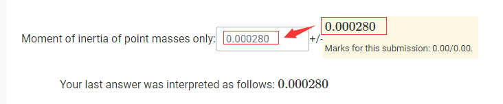

!>请以unsw学校官网为准，这里只提供参考！ 

>如信息有问题，请立即[与我联系](/help/?id=关于我)！

# Rotational Inertia Online Lab

## Theoretical Problems

### Question 1

_Marked out of 1.00_

<!-- tabs:start -->

#### **原题**

Write an expression in terms of the total mass $M=M_1+M_2$ for the moment of inertia of two point masses $M_1$ and $M_2$ both located a distance $R$ from the pivot point.

  $I=$ <input style="width: 70px">

#### **解析**

* $I=$ `M*R^2`

<!-- tabs:end -->

### Question 2

_Marked out of 1.00_

<!-- tabs:start -->

#### **原题**

You are going to calculate the moment of inertia of a ring with mass $M$, inner radius $R_1$ and outer radius $R_2$. Assume the ring has a uniform density and a height $h$.

Write an expression for the density of the ring.

  $ρ=$ <input style="width: 70px">

This example was provided in the lab manual:

For the ring is similar but you will need to use the $ρ$ you calculated above and change the limits on the integral.

What is the lower limit on the integral?

  lower limit $=$ <input style="width: 70px">

What is the upper limit on the integral?

  upper limit $=$ <input style="width: 70px">

Complete the integration for the ring to calculate the moment of inertia. Do not include ρ as a variable in your answer.

  $I  =$ <input style="width: 70px">

#### **解析**

* $ρ=$ `M/(Pi*(R_2^2-R_1^2)*h)` 
* lower limit $=$ `R_1`
* upper limit $=$ `R_2`
* $I  =$ `M*((R_2^2+R_1^2)/2)`

<!-- tabs:end -->

---

## Part 1: Rotational Inertia of Point Masses

### Information

Watch this video showing the experiment being conducted. The first video shows the two point masses and a metal barrotating. The falling object (attached to the string) is a 5g mass carrier and a 50 g mass.

<video src="https://unsw.cdn.t.bigtomcat.com/unsw_docs/2022/2022T2/2022T2_DPST1021/video/Rotational%20inertia%20two%20point%20masses_1080p.mp4" controls controlslist="nodownload" width="30%" height="30%" poster="/homework/DPST1021/work/work08_Lab_Rotational_Inertia/file/Rotational%20inertia%20two%20point%20masses.jpg">此处应该有个视频，但是你现在用的浏览器好像不支持哦！换个浏览器试试</video>

The next video shows the **just the bar** rotating (we have removed the hanging masses). The falling object (attached to the string) is a 5g mass carrier and a 10 g mass.

<video src="https://unsw.cdn.t.bigtomcat.com/unsw_docs/2022/2022T2/2022T2_DPST1021/video/Rotational%20inertia%20bar%20alone_1080p.mp4" controls controlslist="nodownload" width="30%" height="30%" poster="/homework/DPST1021/work/work08_Lab_Rotational_Inertia/file/Rotational%20inertia%20bar%20alone.jpg">此处应该有个视频，但是你现在用的浏览器好像不支持哦！换个浏览器试试</video>

### Question 3

_Marked out of 1.00_

<!-- tabs:start -->

#### **原题**

For the second experiment, why would we use just a 10g mass, instead of the 50g mass from the first experiment?

  Select one:

  <input type="checkbox"> A. The bar has a higher rotational inertia without the point masses, so we need to use a smaller mass in order for the acceleration to not be too large.

  <input type="checkbox"> B. The bar has a lower rotational inertia without the point masses, so we need to use a smaller mass in order for the acceleration to not be too large.

  <input type="checkbox"> C. To that we have two data points for comparison - one with 50g hanging mass, one with 10g hanging mass.

  <input type="checkbox"> D. Because the hanging mass has to be exactly the same as the mass of the spinning object; without the point masses, we need to reduce the mass on the hanger.

#### **解析**

*  - [x] The bar has a lower rotational inertia without the point masses, so we need to use a smaller mass in order for the acceleration to not be too large.

<!-- tabs:end -->

### Question 4

_Marked out of 1.00_

<!-- tabs:start -->

#### **原题**

For this question, consider a diagram of the experiment setup when viewed from the side:

  

The hanging mass has a mass of 'm'.

Which of the following diagrams **correctly identifies the forces on the hanging mass and string, in the correct directions?**

  Select one:

  <input type="checkbox">A.  

  <input type="checkbox">B.  

  <input type="checkbox">C.  

  <input type="checkbox">D.  

#### **解析**

* - [x]   

<!-- tabs:end -->

### Question 5

_Marked out of 1.00_

<!-- tabs:start -->

#### **原题**

Match the following terms and their description, with reference to the experimental apparatus.

  Select one:

  The rate at which the bar (or the bar with two masses) is rotating. Measured in radians per second.  <select class="select custom-select custom-select ml-1" id="menuq12840472:6_sub0" name="q12840472:6_sub0"><option selected="selected" value="0">Choose...</option><option value="1">Angular Acceleration</option><option value="2">Linear Velocity</option><option value="3">Angular Velocity</option><option value="4">Linear Acceleration</option></select>

  The rate at which the bar (or the bar with two masses) is increasing in rotational speed. (i.e. how quickly it is getting faster) Measured in radians per second squared.  <select class="select custom-select custom-select ml-1" id="menuq12840472:6_sub0" name="q12840472:6_sub0"><option selected="selected" value="0">Choose...</option><option value="1">Angular Acceleration</option><option value="2">Linear Velocity</option><option value="3">Angular Velocity</option><option value="4">Linear Acceleration</option></select>

  The rate at which the hanging mass falls. Measured in metres per second.  <select class="select custom-select custom-select ml-1" id="menuq12840472:6_sub0" name="q12840472:6_sub0"><option selected="selected" value="0">Choose...</option><option value="1">Angular Acceleration</option><option value="2">Linear Velocity</option><option value="3">Angular Velocity</option><option value="4">Linear Acceleration</option></select>

  The rate at which the hanging mass increases in falling speed. Measured in meters per second squared.  <select class="select custom-select custom-select ml-1" id="menuq12840472:6_sub0" name="q12840472:6_sub0"><option selected="selected" value="0">Choose...</option><option value="1">Angular Acceleration</option><option value="2">Linear Velocity</option><option value="3">Angular Velocity</option><option value="4">Linear Acceleration</option></select>

#### **解析**

  The rate at which the bar (or the bar with two masses) is rotating. Measured in radians per second.  <select disabled><option>Angular Velocity</option></select>

  The rate at which the bar (or the bar with two masses) is increasing in rotational speed. (i.e. how quickly it is getting faster) Measured in radians per second squared.  <select disabled><option><option selected>Angular Acceleration</option></select>

  The rate at which the hanging mass falls. Measured in metres per second.  <select disabled><option selected>Linear Velocity</option></select>

  The rate at which the hanging mass increases in falling speed. Measured in meters per second squared.  <select disabled><option selected>Linear Acceleration</option></select>

<!-- tabs:end -->

### Question 6

_Marked out of 3.00_

<!-- tabs:start -->

#### **原题**

The tables below present information collected during the laboratory exercise. Complete the table by calculating the missing numbers. Make sure that you think about how many significant figures (and decimal places) to give the moment of inertia to, though you will not lose marks for this in this question. You do not need to round your answers as you go, keep all the digits for your working. Note that the units are given in the left hand column. Assume g=9.797/ms−2 with negligible uncertainty. Many of the uncertainties will be calculated for you. When you press "check" the uncertainties will appear, press check as you go.

Theoretical rotational inertia data

||Value|Uncertainty|
|:--|:--|:--|
|Total Point Mass (g)| **174.6** | **0.1**|
|Distance of point masses from pivot, R (mm)| **165.7**| **2.0**|
|Moment of inertia ($kgm^2$)|<input style="width: 70px">|<input style="width: 70px">|

Experimental rotational inertia data

<table border="1" id="yui_3_17_2_1_1656519874613_442"> <tbody id="yui_3_17_2_1_1656519874613_441"> <tr> <td style="text-align: left;" colspan="2">&nbsp;</td> <td style="text-align: left;" colspan="2">Point masses and bar&nbsp;</td> <td style="text-align: left;" colspan="2">Bar alone&nbsp;</td> </tr> <tr> <td style="text-align: left;" colspan="2">&nbsp;</td> <td style="text-align: left;" colspan="1">&nbsp;Value</td> <td style="text-align: left;" colspan="1">&nbsp;Uncertainty</td> <td style="text-align: left;" colspan="1">&nbsp;Value</td> <td style="text-align: left;" colspan="1">&nbsp;Uncertainty</td> </tr> <tr> <td style="text-align: left;" colspan="2">Hanging total mass (g)</td> <td style="text-align: left;"><mn>50.0</mn><mo>+</mo><mn>5.0</mn></math>" role="presentation" style="position: relative;"><nobr aria-hidden="true">50.0+5.0</nobr></td> <td style="text-align: left;">&nbsp; <mn>1.4</mn></math>" role="presentation" style="position: relative;"><nobr aria-hidden="true">1.4</nobr>&nbsp;&nbsp;</td> <td style="text-align: left;"><mn>10.0</mn><mo>+</mo><mn>5.0</mn></math>" role="presentation" style="position: relative;"><nobr aria-hidden="true">10.0+5.0</nobr></td> <td style="text-align: left;">&nbsp; <mn>0.4</mn></math>" role="presentation" style="position: relative;"><nobr aria-hidden="true">0.4</nobr>&nbsp;&nbsp;</td> </tr> <tr id="yui_3_17_2_1_1656519874613_440"> <td style="text-align: left;" rowspan="4"> 
Slope (angular&nbsp;
 
acceleration rad/s2)
 </td> <td style="text-align: left;">Trial 1</td> <td style="text-align: left;"><mrow class=&quot;MJX-TeXAtom-ORD&quot;><mn>1.327</mn></mrow></math>" role="presentation" style="position: relative;"><nobr aria-hidden="true">1.327</nobr></td> <td style="text-align: left;" id="yui_3_17_2_1_1656519874613_439">&nbsp;</td> <td style="text-align: left;"><mn>2.345</mn></math>" role="presentation" style="position: relative;"><nobr aria-hidden="true">2.345</nobr></td> <td style="text-align: left;">&nbsp;</td> </tr> <tr> <td style="text-align: left;">Trial 2</td> <td style="text-align: left;"><mrow class=&quot;MJX-TeXAtom-ORD&quot;><mn>1.317</mn></mrow></math>" role="presentation" style="position: relative;"><nobr aria-hidden="true">1.317</nobr></td> <td style="text-align: left;">&nbsp;</td> <td style="text-align: left;"><mn>2.492</mn></math>" role="presentation" style="position: relative;"><nobr aria-hidden="true">2.492</nobr></td> <td style="text-align: left;">&nbsp;</td> </tr> <tr> <td style="text-align: left;">Trial 3</td> <td style="text-align: left;"><mrow class=&quot;MJX-TeXAtom-ORD&quot;><mn>1.313</mn></mrow></math>" role="presentation" style="position: relative;"><nobr aria-hidden="true">1.313</nobr></td> <td style="text-align: left;">&nbsp;</td> <td style="text-align: left;"><mn>2.502</mn></math>" role="presentation" style="position: relative;"><nobr aria-hidden="true">2.502</nobr></td> <td style="text-align: left;">&nbsp;</td> </tr> <tr> <td style="text-align: left;">Average</td> <td style="text-align: left;"><input type="text" name="q12840472:7_ans3" id="q12840472:7_ans3" size="11" style="width: 9.1em" autocapitalize="none" spellcheck="false" class="algebraic" value=""> 

</td> <td style="text-align: left;"><input type="text" name="q12840472:7_ans4" id="q12840472:7_ans4" size="11" style="width: 9.1em" autocapitalize="none" spellcheck="false" class="algebraic" value=""> 

</td> <td style="text-align: left;"><input type="text" name="q12840472:7_ans5" id="q12840472:7_ans5" size="11" style="width: 9.1em" autocapitalize="none" spellcheck="false" class="algebraic" value=""> 

</td> <td style="text-align: left;"><input type="text" name="q12840472:7_ans6" id="q12840472:7_ans6" size="11" style="width: 9.1em" autocapitalize="none" spellcheck="false" class="algebraic" value=""> 

</td> </tr> <tr id="yui_3_17_2_1_1656519874613_444"> <td style="text-align: left;" colspan="2">Radius of pulley (mm)</td> <td style="text-align: left;" id="yui_3_17_2_1_1656519874613_443"><mn>15.1</mn></math>" role="presentation" style="position: relative;"><nobr aria-hidden="true">15.1</nobr></td> <td style="text-align: left;">&nbsp; <mn>0.1</mn></math>" role="presentation" style="position: relative;"><nobr aria-hidden="true">0.1</nobr>&nbsp;&nbsp;</td> <td style="text-align: left;"><mn>15.1</mn></math>" role="presentation" style="position: relative;"><nobr aria-hidden="true">15.1</nobr></td> <td style="text-align: left;">&nbsp; <mn>0.1</mn></math>" role="presentation" style="position: relative;"><nobr aria-hidden="true">0.1</nobr>&nbsp;&nbsp;</td> </tr> <tr> <td style="text-align: left;" colspan="2">Linear acceleration (ms-2)</td> <td style="text-align: left;"><input type="text" name="q12840472:7_ans7" id="q12840472:7_ans7" size="11" style="width: 9.1em" autocapitalize="none" spellcheck="false" class="algebraic" value=""> 

</td> <td style="text-align: left;">&nbsp;</td> <td style="text-align: left;"><input type="text" name="q12840472:7_ans11" id="q12840472:7_ans11" size="11" style="width: 9.1em" autocapitalize="none" spellcheck="false" class="algebraic" value=""> 

</td> <td style="text-align: left;">&nbsp;</td> </tr> <tr> <td style="text-align: left;" colspan="2">Tension (N)</td> <td style="text-align: left;"><input type="text" name="q12840472:7_ans8" id="q12840472:7_ans8" size="11" style="width: 9.1em" autocapitalize="none" spellcheck="false" class="algebraic" value=""> 

</td> <td style="text-align: left;">&nbsp;</td> <td style="text-align: left;"><input type="text" name="q12840472:7_ans12" id="q12840472:7_ans12" size="11" style="width: 9.1em" autocapitalize="none" spellcheck="false" class="algebraic" value=""> 

</td> <td style="text-align: left;">&nbsp;</td> </tr> <tr> <td style="text-align: left;" colspan="2">Torque (Nm)</td> <td style="text-align: left;"><input type="text" name="q12840472:7_ans9" id="q12840472:7_ans9" size="11" style="width: 9.1em" autocapitalize="none" spellcheck="false" class="algebraic" value=""> 

</td> <td style="text-align: left;">&nbsp;</td> <td style="text-align: left;"><input type="text" name="q12840472:7_ans13" id="q12840472:7_ans13" size="11" style="width: 9.1em" autocapitalize="none" spellcheck="false" class="algebraic" value=""> 

</td> <td style="text-align: left;">&nbsp;</td> </tr> <tr> <td style="text-align: left;" colspan="2">Moment of inertia (kgm2)</td> <td style="text-align: left;"><input type="text" name="q12840472:7_ans10" id="q12840472:7_ans10" size="11" style="width: 9.1em" autocapitalize="none" spellcheck="false" class="algebraic" value=""> 

</td> <td style="text-align: left;">&nbsp;</td> <td style="text-align: left;"><input type="text" name="q12840472:7_ans14" id="q12840472:7_ans14" size="11" style="width: 9.1em" autocapitalize="none" spellcheck="false" class="algebraic" value=""> 

</td> <td style="text-align: left;">&nbsp;</td> </tr> </tbody> </table>

Moment of inertia of point masses only: <input style="width: 70px"> +/-	

#### **解析**

||Value|Uncertainty|
|:--|:--|:--|
|Total Point Mass (g)| <input style="width: 60px" v-model="i1" v-on:input="calsq1()"> | <input style="width: 30px" v-model="i2" v-on:input="calsq1()"> |
|Distance of point masses from pivot, R (mm)|<input style="width: 60px" v-model="i3" v-on:input="calsq1()"> | <input style="width: 30px" v-model="i4" v-on:input="calsq1()"> |
|Moment of inertia ($kgm^2$)|<code>{{a1}}</code>|<code>{{a2}}</code> _（这个空可能会报错）_|

||Point masses and bar||Bar alone||
|:--|:--|:--|:--|:--|
||Value|Uncertainty|Value|Uncertainty|
|Hanging total mass ($g$)|50.0+5.0|1.4|10.0+5.0|0.4|
|Trial 1|<input style="width: 60px" v-model="i5" v-on:input="calsq2()">||<input style="width: 60px" v-model="i8" v-on:input="calsq2()">||
|Trial 2|<input style="width: 60px" v-model="i6" v-on:input="calsq2()">||<input style="width: 60px" v-model="i9" v-on:input="calsq2()">||
|Trial 3|<input style="width: 60px" v-model="i7" v-on:input="calsq2()">||<input style="width: 60px" v-model="i10" v-on:input="calsq2()">||
|Average|<code>{{a3}}</code>|<code>{{a4}}</code>|<code>{{a5}}</code>|<code>{{a6}}</code>|
|Radius of pulley ($mm$)|15.1|0.1|15.1|0.1|
|Linear acceleration ($ms^{-2}$)|<code>{{a7}}</code>||<code>{{a9}}</code>||
|Tension ($N$)|`0.54`||`0.11` _（这个空可能会报错）_||
|Torque ($Nm$)|`0.0081`||`0.0022`||
|Moment of inertia ($kgm^2$)|<code>{{a8}}</code>||<code>{{a10}}</code>||

Moment of inertia of point masses only: `这个空 点check会出答案` +/-

  _示意图：_
  

<!-- tabs:end -->

---

## Part 2: Rotational Inertia of Disk and Ring

### Information

Watch these videos showing the ring and disk as the hanging mass is released.

Disk:

<video src="https://unsw.cdn.t.bigtomcat.com/unsw_docs/2022/2022T2/2022T2_DPST1021/video/Rotational%20inertia%20disk_1080p.mp4" controls controlslist="nodownload" width="30%" height="30%" poster="/homework/DPST1021/work/work08_Lab_Rotational_Inertia/file/Rotational%20inertia%20disk.jpg">此处应该有个视频，但是你现在用的浏览器好像不支持哦！换个浏览器试试</video>

Ring:

<video src="https://unsw.cdn.t.bigtomcat.com/unsw_docs/2022/2022T2/2022T2_DPST1021/video/Rotational%20inertia%20ring_1080p.mp4" controls controlslist="nodownload" width="30%" height="30%" poster="/homework/DPST1021/work/work08_Lab_Rotational_Inertia/file/Rotational%20inertia%20ring.jpg">此处应该有个视频，但是你现在用的浏览器好像不支持哦！换个浏览器试试</video>

### Question 7

_Marked out of 1.00_

<!-- tabs:start -->

#### **原题**

Correctly match the following graph titles to their expected shape.

    <select class="select custom-select custom-select ml-1" id="menuq12840472:9_sub0" name="q12840472:9_sub0"><option selected="selected" value="0">Choose...</option><option value="1">Angular Acceleration (of Disk or Ring) vs Time</option><option value="2">Position of hanging mass vs Time</option><option value="3">Angular Velocity (of Disk or Ring) vs Time</option></select>

    <select class="select custom-select custom-select ml-1" id="menuq12840472:9_sub0" name="q12840472:9_sub0"><option selected="selected" value="0">Choose...</option><option value="1">Angular Acceleration (of Disk or Ring) vs Time</option><option value="2">Position of hanging mass vs Time</option><option value="3">Angular Velocity (of Disk or Ring) vs Time</option></select>

    <select class="select custom-select custom-select ml-1" id="menuq12840472:9_sub0" name="q12840472:9_sub0"><option selected="selected" value="0">Choose...</option><option value="1">Angular Acceleration (of Disk or Ring) vs Time</option><option value="2">Position of hanging mass vs Time</option><option value="3">Angular Velocity (of Disk or Ring) vs Time</option></select>

#### **解析**

    <select disabled><option selected>Angular Acceleration (of Disk or Ring) vs Time</option></select>

    <select disabled><option selected>Angular Velocity (of Disk or Ring) vs Time</option></select>

    <select disabled><option selected>Position of hanging mass vs Time</option></select>

<!-- tabs:end -->

### Question 8

_Marked out of 1.00_

<!-- tabs:start -->

#### **原题**

Which of the following shows the correct relationship between the linear acceleration ($a$) of the hanging mass $m$ and the tension force ($T$) in the string?

  Select one:

  <input type="checkbox"> a. $F=ma$

  <input type="checkbox"> b. $a = \frac{mg-T}{m}$

  <input type="checkbox"> c. $a = \frac{m-T}{g}$

  <input type="checkbox"> d. $a = Tg - mg$

#### **解析**

* - [x] $a = \frac{mg-T}{m}$

<!-- tabs:end -->

### Question 9

_Marked out of 3.00_

<!-- tabs:start -->

#### **原题**

Now, we are going to use a simulation to practice the method of measurement of moment of inertia that we would use in real life.

In brief, we will need to use the equation $τ=Iα$, measuring torque τ and rotational acceleration α to determine the rotational Inertia $I$. We will be using the following simulation:

<iframe src="https://www.geogebra.org/material/iframe/id/650399/width/1034/height/656/border/888888/rc/false/ai/false/sdz/false/smb/false/stb/false/stbh/true/ld/false/sri/true/at/auto" scrolling="no" width="1034" height="656" data-gtm-yt-inspected-4="true"> </iframe>

If the simulation doesn't work, you can CLICK HERE to load it.

To begin with, set the **mass distribution to 'Solid Sphere'** and the **simulation type to 'Falling Mass'.**

Unlike in the previous case, where you had to do all the calculations, the simulation auto does some of these calculations. As such, we'll be taking multiple measurements in order to determine the moment of inertia of our object.

**Set your pully radius to 1.53 metres. Set your pulley mass to 9.5 kg.**

What is the moment of inertia of your solid sphere, in kg m/s^2 ?

<input style="width: 70px">

**To Measure:**

1) Set your falling mass to be the value in the relevant row of the table. 

2) Record the **net torque, the angular acceleration and linear acceleration** in the table.

3) Calculate the moment of inertia of the system using the net torque and the angular acceleration. 

<table border="1"> <tbody> <tr> <td><strong>Mass</strong></td> <td><strong>Net Torque&nbsp;</strong>(N.m)</td> <td><strong>Angular Acceleration&nbsp;</strong><mo stretchy=&quot;false&quot;>(</mo><msup><mtext>rads/s</mtext><mn>2</mn></msup><mo stretchy=&quot;false&quot;>)</mo></math>" role="presentation" style="position: relative;"><nobr aria-hidden="true">(rads/s2)</nobr></td> <td><strong>Linear Acceleration&nbsp;</strong>&nbsp;<mo stretchy=&quot;false&quot;>(</mo><msup><mtext>ms</mtext><mrow class=&quot;MJX-TeXAtom-ORD&quot;><mo>&amp;#x2212;</mo><mn>2</mn></mrow></msup><mo stretchy=&quot;false&quot;>)</mo></math>" role="presentation" style="position: relative;"><nobr aria-hidden="true">(ms−2)</nobr></td> <td><strong>Rotational Inertia&nbsp;&nbsp;</strong><mo stretchy=&quot;false&quot;>(</mo><msup><mtext>kgms</mtext><mrow class=&quot;MJX-TeXAtom-ORD&quot;><mo>&amp;#x2212;</mo><mn>2</mn></mrow></msup><mo stretchy=&quot;false&quot;>)</mo></math>" role="presentation" style="position: relative;"><nobr aria-hidden="true">(kgms−2)</nobr></td> </tr> <tr> <td><mrow class=&quot;MJX-TeXAtom-ORD&quot;><mn>1.7</mn></mrow></math>" role="presentation" style="position: relative;"><nobr aria-hidden="true">1.7</nobr> kg</td> <td><input type="text" name="q12840472:11_ans2" id="q12840472:11_ans2" size="16.5" style="width: 13.6em" autocapitalize="none" spellcheck="false" class="numerical" value=""> 

&nbsp;</td> <td><input type="text" name="q12840472:11_ans3" id="q12840472:11_ans3" size="16.5" style="width: 13.6em" autocapitalize="none" spellcheck="false" class="numerical" value=""> 

&nbsp;</td> <td><input type="text" name="q12840472:11_ans4" id="q12840472:11_ans4" size="16.5" style="width: 13.6em" autocapitalize="none" spellcheck="false" class="algebraic" value=""> 

&nbsp;</td> <td><input type="text" name="q12840472:11_ans5" id="q12840472:11_ans5" size="16.5" style="width: 13.6em" autocapitalize="none" spellcheck="false" class="numerical" value=""> 

&nbsp;</td> </tr> <tr> <td><mrow class=&quot;MJX-TeXAtom-ORD&quot;><mn>4.72</mn></mrow></math>" role="presentation" style="position: relative;"><nobr aria-hidden="true">4.72</nobr> kg</td> <td><input type="text" name="q12840472:11_ans6" id="q12840472:11_ans6" size="16.5" style="width: 13.6em" autocapitalize="none" spellcheck="false" class="numerical" value=""> 

</td> <td><input type="text" name="q12840472:11_ans7" id="q12840472:11_ans7" size="16.5" style="width: 13.6em" autocapitalize="none" spellcheck="false" class="numerical" value=""> 

</td> <td><input type="text" name="q12840472:11_ans8" id="q12840472:11_ans8" size="16.5" style="width: 13.6em" autocapitalize="none" spellcheck="false" class="numerical" value=""> 

&nbsp;</td> <td><input type="text" name="q12840472:11_ans9" id="q12840472:11_ans9" size="16.5" style="width: 13.6em" autocapitalize="none" spellcheck="false" class="numerical" value=""> 

&nbsp;</td> </tr> <tr> <td><mrow class=&quot;MJX-TeXAtom-ORD&quot;><mn>4.82</mn></mrow></math>" role="presentation" style="position: relative;"><nobr aria-hidden="true">4.82</nobr> kg</td> <td><input type="text" name="q12840472:11_ans10" id="q12840472:11_ans10" size="16.5" style="width: 13.6em" autocapitalize="none" spellcheck="false" class="numerical" value=""> 

</td> <td><input type="text" name="q12840472:11_ans11" id="q12840472:11_ans11" size="16.5" style="width: 13.6em" autocapitalize="none" spellcheck="false" class="numerical" value=""> 

</td> <td><input type="text" name="q12840472:11_ans12" id="q12840472:11_ans12" size="16.5" style="width: 13.6em" autocapitalize="none" spellcheck="false" class="numerical" value=""> 

</td> <td><input type="text" name="q12840472:11_ans13" id="q12840472:11_ans13" size="16.5" style="width: 13.6em" autocapitalize="none" spellcheck="false" class="numerical" value=""> 

</td> </tr> </tbody> </table>

Using your three 'measurements' of $I$, calculate the average value below;

 Average $I$ <input style="width: 70px">

 #### **解析**

---

  
<em>编写不易, 如果对你有帮助的话请我喝杯</em>🥤<em>叭 o(TヘTo)</em>

  

---

Set your pully radius to <input style="width: 60px" v-model="i1" v-on:input="calsq1()"> metres. Set your pulley mass to <input style="width: 60px" v-model="i2" v-on:input="calsq1()"> kg.

What is the moment of inertia of your solid sphere, in kg m/s^2 ? <code>{{a1}}</code>

|Mass|Net Torque ($N.m$)|	Angular Acceleration ($rads/s^2$)|Linear Acceleration  ($ms^{−2}$)|Rotational Inertia  ($kgms^{−2}$)|
|:--|:--|:--|:--|:--|
|<input style="width: 60px" v-model="i3" v-on:input="calsq1()">|<code>{{a2}}</code>|<code>{{a3}}</code>|<code>{{a4}}</code>|<code>{{a5}}</code>|

_（表格三行通用）_

Average $I$ <code>{{a5}}</code>

<!-- tabs:end -->

---

_*声明：本文的题目内容来自moodle，视频来自YouTube，本人仅用于学习和参考使用，题目内容和视频内容未进行商业用途！如有侵权，请告知！_

