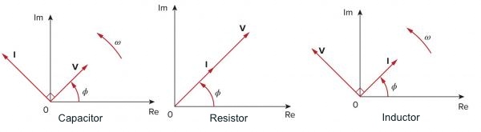

## Quiz 8 - AC Analysis I

>课程：[电信手册](/DPST1081/) &nbsp; [电信作业](/homework/DPST1081/)

?> Quiz在这: [Quiz 8 - AC Analysis I](https://moodle.telt.unsw.edu.au/mod/quiz/view.php?id=5198536)

---

### 题目

##### Question 1

Differentiating a sinusoid is equivalent to mutliplying its corresponding phasor by 𝑗𝜔.

 Select one:

  - [x] True
  - [ ] False

##### Question 2

An capacitor behaves as a short circuit in high frequencies.

 Select one:

  - [x] True
  - [ ] False

##### Question 3

A function with frequency of $1 Hz$ has a shorter period than a function with frequency of $1 rad/s$.

 Select one:

  - [x] True
  - [ ] False

##### Question 4

A phasor is a complex number that represents the amplitude and phase of a sinusoid.

 Select one:

  - [x] True
  - [ ] False

##### Question 5

The impedance of a resistor is equal to its resistance.

 Select one:

  - [x] True
  - [ ] False

##### Question 6

Impedance $𝐙$ of a circuit is the ratio of the phasor voltage $𝐕$ to the current phasor $𝐈$.

 Select one:

  - [x] True
  - [ ] False

##### Question 7

An inductor behaves as a short circuit in high frequencies.

 Select one:

  - [ ] True
  - [x] False

##### Question 8

The imaginary part of the impedance is called

 Select one:

  - [ ] a. resistance
  - [x] b. reactance
  - [ ] c. admittance
  - [ ] d. susceptance
  - [ ] e. conductance

##### Question 9

A function that repeats itself after fixed intervals is .....

 Select one:

  - [ ] a. a harmonic function.
  - [ ] b. a reactive function.
  - [x] c. a periodic function.
  - [ ] d. a phasor.

##### Question 10

The unit of impedance is .....

 Select one:

  - [ ] a. Farad
  - [ ] b. Henry
  - [x] c. Ohm
  - [ ] d. Siemens

##### Question 11

A series RLC circuit has 
<math xmlns="http://www.w3.org/1998/Math/MathML">
  <mi>R</mi>
</math>
 $=75 Ω$,
 <math xmlns="http://www.w3.org/1998/Math/MathML">
  <msub>
    <mi>X</mi>
    <mi>L</mi>
  </msub>
</math>
$=50 Ω$, and 
<math xmlns="http://www.w3.org/1998/Math/MathML">
  <msub>
    <mi>X</mi>
    <mi>C</mi>
  </msub>
</math>
$=−75 Ω$. The impedance of the circuit is:

 Select one:

  - [ ] a. 75 + 𝑗125 Ω
  - [x] b. 75 − 𝑗25 Ω
  - [ ] c. 75 − 𝑗125 Ω
  - [ ] d. 25 + 𝑗75 Ω
  - [ ] e. 75 + 𝑗25 Ω

##### Question 12

Complete the following graph by drag the terms "**Leading Direction**" and "**Lagging Direction**"" and dropping them next to the corresponding arrows showing counter clockwise and clockwise directions on the right hand side close to the real-axis.

 

##### Question 13

Match the following phasor diagrams with their circuit elements. Drag the name of the circuit element and drop it beneath the real-axis of the corresponding phasor diagram.

 

##### Question 14

Calculate the reactance of a $2$-$H$ inductor at frequency of $10$ $Hz$.

Hint: Provide only the numerical answer in decimal format.

 Answer: ` 125.66 `

##### Question 15

What is the amplitude of the current through a $20$-$mH$ inductor when the voltage applied across its terminals is 𝑣(𝑡)$=48cos(377+20°)$ $V$? 

Hint: Provide both the numerical answer in decimal format and the proper unit using standard SI unit symbols.

 Answer: ` 6.366A `

##### Question 16

What is the phase in **degrees** of the current through a $20$-$mH$ inductor when the voltage applied across its terminals is 𝑣(𝑡)$=48cos(377+20°)$ $V$? 

Hint: Provide only the numerical answer in decimal format.

 Answer: ` -70 `

##### Question 17

A series RC circuit has $|\textbf{V}_R|=12 V$ as the magnitude of the phasor voltage across the resistor and $|\textbf{V}_C|=9$ as the magnitude of the phasor voltage across the capacitor. The magnitude of the supply voltage in volts is equal to

(Provide only the numerical answer in decimal format.)

**Hint**: Use voltage division.

 Answer: ` 15 `

##### Question 18

What is the phase of the voltage 𝑣(𝑡) in **degrees** in the following circuit.

Hint: Provide only the numerical answer in decimal format.

 

 Answer: ` -18.44 `

##### Question 19

Find the amplitude of 𝑣(𝑡) in the following circuit.

Hint: Provide both the numerical answer in decimal format and the proper unit using standard SI unit symbols.

 

 Answer: ` 72.723V `

##### Question 20

Calculate the <u>**resistance**</u> of the following circuit in **ohms**. 

Hint: Provide only the numerical answer in decimal format.

 

 Answer: ` 51.0976 `

##### Question 21

Calculate the <u>**reactance**</u> of the following circuit in **ohms**. 

Hint: Provide only the numerical answer in decimal format.

 

 Answer: ` 9.878 `

##### Question 22

What is the amplitude of the voltage 
<math xmlns="http://www.w3.org/1998/Math/MathML">
  <msub>
    <mi>v</mi>
    <mi>o</mi>
  </msub>
  <mo stretchy="false">(</mo>
  <mi>t</mi>
  <mo stretchy="false">)</mo>
</math>
 in the following circuit.

Hint: Provide both the numerical answer in decimal format and the proper unit using standard SI unit symbols.

 

 Answer: ` 17.143V `

##### Question 23

Determine the resistance of the impedance 
<math xmlns="http://www.w3.org/1998/Math/MathML">
  <msub>
    <mi>Z</mi>
    <mi>T</mi>
  </msub>
</math>
 in **Ohms** of the following circuit.

Hint: Provide only the numerical answer in decimal format.

 

 Answer: ` 6.83 `

##### Question 24

If the supply voltage 
<math xmlns="http://www.w3.org/1998/Math/MathML">
  <msub>
    <mi>v</mi>
    <mi>s</mi>
  </msub>
  <mo stretchy="false">(</mo>
  <mi>t</mi>
  <mo stretchy="false">)</mo>
</math>
$ = 20 \sin(100$𝑡$ - 40°)V$, what is the amplitude of the current 
<math xmlns="http://www.w3.org/1998/Math/MathML">
  <msub>
    <mi>I</mi>
    <mi>x</mi>
  </msub>
</math>
?

Hint: Provide only the numerical answer in decimal format.

 

 Answer: ` 0.43 `

